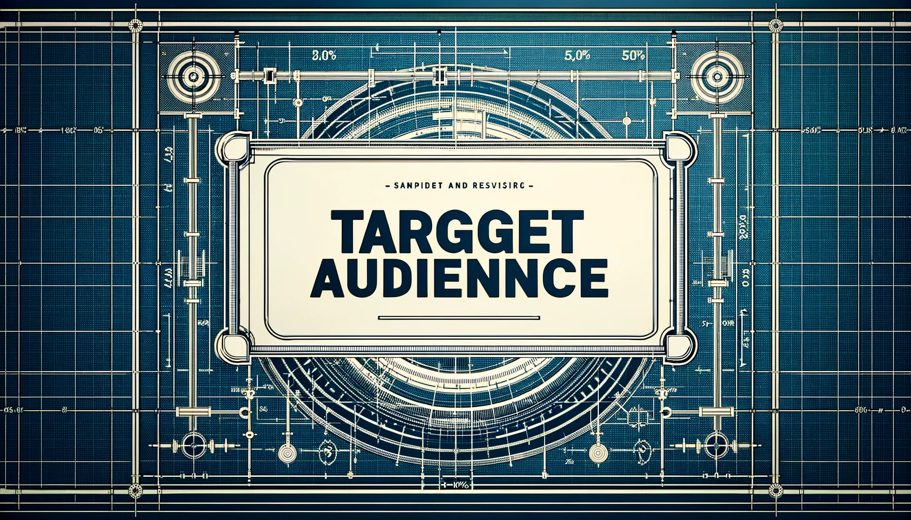

# 适用人群

## 适用群体

- 教育领域的教师和学生： 鉴于 myCobot 320 Pi 在教育研究方面的潜力，它特别适合中等和高等教育机构的 STEM 课程和机器人项目。教师可以利用 myCobot 320 Pi 设计实用课程，学生则可以通过它学习编程、机器人控制理论和人工智能基础知识。

- 研究人员： 研究人员可以利用 myCobot 320 Pi 进行机器人技术、人工智能和自动化实验研究中的原型开发和测试。它的灵活性和可扩展性使其成为研究实验室的理想选择。

- 商业演示和营销专业人员： 企业可将 myCobot 320 Pi 用作展览或活动中的演示工具，有效吸引观众的注意力，展示公司的技术实力和创新产品。

- 个人爱好者和自学者： 对于对机器人技术感兴趣的个人而言，无论其技术背景如何，myCobot 320 Pi 都能为他们提供一个方便且价格合理的平台，用于学习和探索编程、机器人技术和人工智能应用。

---

[← 上一页](../1-ProductIntroduction/1.1-设计理念.md) | [下一页 →](../1-ProductIntroduction/1.3-应用场景.md)
