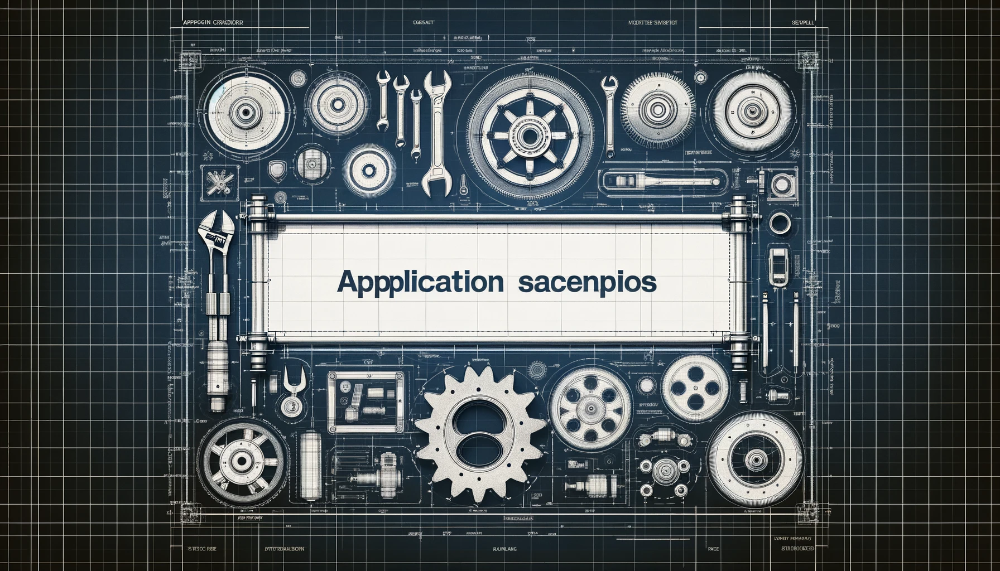

# 应用场景

## 推荐应用场景

- 在教育领域： 使用 myCobot 320 Pi 进行编程教学、机器人设计和制造以及跨学科科学研究项目，激发学生的创新思维和解决问题的能力。

- 科研方面： 将 myCobot 320 Pi 作为研究工具，用于机器人技术、人工智能和自动化领域的前沿研究，进行算法测试、数据收集和模型验证。

- 商业演示： 对 myCobot 320 Pi 进行编程，使其执行抓人眼球的任务或模拟实际工作流程，以展示技术创新并提升品牌影响力。

- 个人学习和娱乐： 个人用户可以通过 myCobot 320 Pi 学习基础编程、机器人控制，甚至机器学习和人工智能的高级概念，还可以将其作为个人项目或爱好。

- 为方便客户参考，我们提供了以下详细的应用场景表，涵盖了一些常见的应用场景。需要注意的是，这并不意味着 myCobot 320 Pi 仅限于这些应用；您可以将其用于任何其他适用场景：

| 用户群体               | 应用场景                                                      | 目标和作用                                                                                    |
| :--------------------- | :------------------------------------------------------------ | :-------------------------------------------------------------------------------------------- |
| 教育领域的教师和学生   | - STEM 教育  - 机器人项目  - 跨学科研究项目           | - 提高学生对技术的兴趣  - 增强动手能力和解决问题的能力  - 促进创新思维和团队精神  |
| 研究人员               | - 原型开发  - 实验研究  - 算法测试和验证          | -加快研究进展  - 沟通理论与实践  - 推进技术创新                                   |
| 商业演示和营销专业人员 | - 展览展示  - 技术演示  - 品牌推广                | - 吸引潜在客户和投资者  - 展示公司的技术实力和创新产品  - 提升品牌影响力          |
| 个人爱好者和自学者     | - 编程学习  - 机器人技术探索  - 人工智能基础知识  | - 提高个人技能和知识水平  - 实现自我教育和发展  - 探索机器人技术和人工智能的潜力  |

---

[← 上一页](../1-ProductIntroduction/1.2-适用人群.md) | [下一页 →](../1-ProductIntroduction/1.4-周边配件/1.4-周边配件.md)
