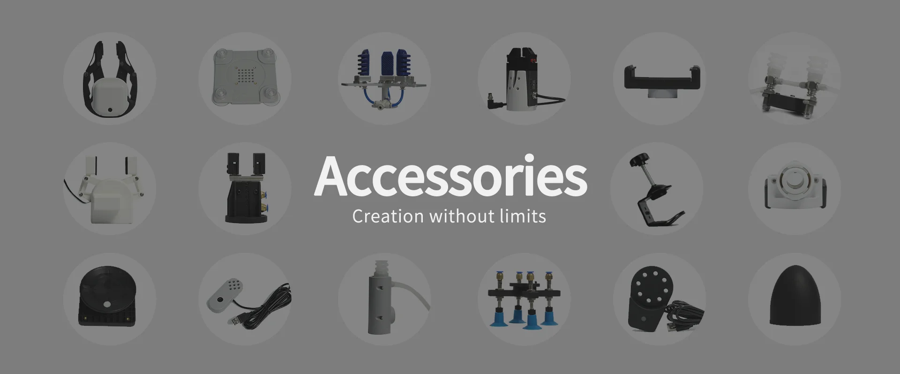

# Accessories & Tools

## Design Concept
In the real world, different accessories can enhance a robot's capabilities in various ways. For instance, attachments like grippers, sensors, and tools can assist robots in performing a wide range of tasks, thereby increasing their versatility and flexibility. 

Elephant Robotics is dedicated to enabling everyone to easily use robots alongside these accessories, liberating users from the complexity of selecting the right accessories and enabling a swift start to robot utilization.

## Types of Accessories
To meet the demands of customers in various scenarios, we have designed various types of accessories, including grippers, suction cups, camera modules, and other gripping devices, to enable users to directly select the suitable end-effectors.

### Gripper

- [Adaptive Gripper](../../1-ProductIntroduction/1.4-AccessoriesTools/1.4.1-Gripper/1-AdaptiveGripper.md) 
The upgrade adaptive gripper provides greater clamping force, and supports multiple programming environments, suitable for various industrial robotic arms.

- [Electric Parallel Gripper](../../1-ProductIntroduction/1.4-AccessoriesTools/1.4.1-Gripper/2-ElectricGripper.md) 
The compact structure and multiple connecting holes make the gripper meet different installation conditions. It supports IO and serial port control, suitable for various industrial robotic arms.

- [Air Parallel Grippers](../../1-ProductIntroduction/1.4-AccessoriesTools/1.4.1-Gripper/3-PneumaticGripper.md) 
Driven by gas and working with solenoid valve, it is convenient to be controlled and the fingertip of the gripper can be exchanged for users' secondary development.

- [Air Flexible Gripper](../../1-ProductIntroduction/1.4-AccessoriesTools/1.4.1-Gripper/4-FlexibleGripper.md) 
The fingertips are made of rubber and rely on air pressure to deform for grasping objects. Pneumatic grippers have a wide range of applications, and they are favored for their softness, adaptability, and efficiency. These advantages make them powerful tools in automation and robotics applications, capable of effectively handling various types of objects and tasks.

### Pump Cup
- [Module Suction Cup](../../1-ProductIntroduction/1.4-AccessoriesTools/1.4.2-PumpCup/1-ModuleSuctionCup.md) 
By operating on the principle of vacuum suction, it can be employed on flat and regular surfaces. Featuring a modular design, users can freely determine the number of suction cups, making it convenient for user development and usage.

### Camera

- [Camera Module](../../1-ProductIntroduction/1.4-AccessoriesTools/1.4.3-Camera/1-CameraModulePro.md) 
It provides standard HD camera and USB standard interface. USB interface can be used with a variety of PC equipment. The international standard installation interface is used to fix the camera on robot. It can be used in machine vision, image recognition and other applications.

### Holder
- [Pro Pen Holder](../../1-ProductIntroduction/1.4-AccessoriesTools/1.4.4-Other/1-PenHolderPro.md) 
It supports up and down 15mm large stroke expansion, effectively increase the stability. It can be used in writing, painting and other applications.

- [Pro Phone Holder](../../1-ProductIntroduction/1.4-AccessoriesTools/1.4.4-Other/2-PhoneHolderPro.md)
It can hold a variety of mobile phones with simple structure and easy installation and disassembly.

----
[← Previous Page](../../1-ProductIntroduction/1.3-ApplicationScenario.md) | [Next Chapter →](../../myCobot320-docs/2-ProductFeature/README.md)