# **myCobot Pro Adaptive Gripper**

> **Compatible models:** myCobot 320, myCobot Pro 630


## Specifications

| **name**                 | **myCobotPro Adaptive Gripper Black and White** |
| ----------------------------- | ----------------------------------------------- |
| Material                      | Photosensitive resin + nylon                    |
| process technology            | 3D printing                                     |
| clamping rangeclamp size      | 0-90mm                                          |
| clamp force                   | 1000 grams                                      |
| Repeatability precision       | 0.5 mm                                          |
| service life lifetime         | 1 year                                          |
| drive mode drive              | electric                                        |
| Transmission modetransmission | gear+connecting rod                             |
| size                          | 158x105x55mm                                    |
| weightweight                  | 350 grams                                       |
| Fixed method fixed            | screw fixed                                     |
| Use environment requirements  | Temperature and pressure                        |
| control interface control     | Serial port/IO control                          |
| Applicable equipment          | ER myCobot 320 series, ER myCobot Pro 600       |

## Use for Gripping Objects

**Introduction**

- A gripper is a robotic component that can function like a human hand. It has the advantages of complex structure, firm grasping of objects, not easy to drop, and easy operation.

- The gripper kit includes gripper connecting wires and flanges, and controls the end effector of the robotic arm through a programmable system to realize functions such as object grabbing and multi-point positioning. Gripper can be used in all development environments, such as ROS, Arduino, Roboflow, etc.

**working principle**

- Driven by a motor, the finger surface of the gripper makes a linear reciprocating motion to realize the opening or closing action. The acceleration and deceleration of the electric gripper is controllable, the impact on the workpiece can be minimized, the positioning point is controllable, and the clamping is controllable .

**Applicable object**

- small cube

- small ball

- long object

Mall link:

- [Taobao](https://shop504055678.taobao.com)
- [shopify](https://shop.elephantrobotics.com/)

## How to use

1. Installing <br>
<iframe width="738" height="415" src="https://www.youtube.com/embed/RPKjV0IuP5E" title="myCobot Pro Accessories | The new gripper for myCobot Pro 600" frameborder="0" allow="accelerometer; autoplay; clipboard-write; encrypted-media; gyroscope; picture-in-picture; web-share" allowfullscreen></iframe>

If the video fails to load, please click the link below to view the video.
[Installing Vidio](https://www.youtube.com/watch?v=RPKjV0IuP5E)

### **Installation and use**

- gripper mounting：

**Structural installation：**
  
1. Align the spacer with the hole at the end of the arm and tighten with the screws：  
  
   
2. Align the screw holes in the gripper with the holes around the gasket and tighten with the fine screws.：  


  - electrical connection：
    > Take care to do this with the robotic arm powered off.
    1. Align the m8 cable with the connector of the robot arm, note that the connector has a notch and the connecting cable has a corresponding protrusion, confirm the direction and then insert it and tighten it:
       
    2. Insert the gripper control connector, again paying attention to the orientation of the notch:
       

<br>

### **myCobot Pro 320 Instructions for use**

#### Programming development (python)：

  > Programming and development of the gripper using python:
  > [python environment download](../../../7-ApplicationBasePython/7.1_download.md)

  1. Create a new python file:  
     Right click on the desired file path to create a new python file:  
     

     > The file name can be changed as needed

     

  2. Perform function programming:
     

     > The code is as follows:

     ```python
     from pymycobot.mycobot import MyCobot
     import time

     # Initialise a MyCobot object
     mc = MyCobot("COM3", 115200)

     # Setting the gripper to 485 mode
     mc.set_gripper_mode(0)
     # Controls gripper open-close-open:
     # Using the gripper status interface 0 is open, 1 is closed
     mc.set_gripper_state(0, 80)
     time.sleep(3)
     mc.set_gripper_state(1, 80)
     time.sleep(3)
     mc.set_gripper_state(0, 80)
     time.sleep(3)

     # For more information on using the interface, see the python API.
     ```

  3. Save the file and close it, right-click on an empty space in the folder to open a command line terminal

     

     Input:

     ```bash
     python gripper.py
     ```

     

     > You can see the gripper open-close-open

#### Programming Development (myblockly):

  > Programming and development of the gripper using myblockly:
  > [myblockly download](../../../5-BasicApplication/5.2-ApplicationUse/5.2.1-myblockly/320pi/2-install_uninstall.md)

- **Port Passthrough Mode Method 1:**

   1. After confirming that the structural and electrical connections are complete, start the arm and open the myblockly software when the graphical interface appears.  
      
   2. Modify the baud rate to 115200.
      
   3. Find `Gripper` in the list on the left and select the `Set Gripper Mode` module.  
   4. Drag and drop under the `init` module and select `Transparent Transmission`.
      
   5. In `Loops`, select `repeat` module.
      
   6. Set the times to `3 times`.
      
   7. In `Gripper`, select the `Set Gripper State` module, put it in the `repeat` module, set it to open at 20 speed, and the gripper type to Adaptive Gripper.
      
      
   8. In `Time`, find the `Sleep` module and set the time to 2s, the purpose is to give the gripper time to make a movement.
      
      
   9. In `Gripper`, select the `Set Gripper State` module, put it in the `repeat` module, set it to close at 20 speed, and the gripper type to Adaptive Gripper.
      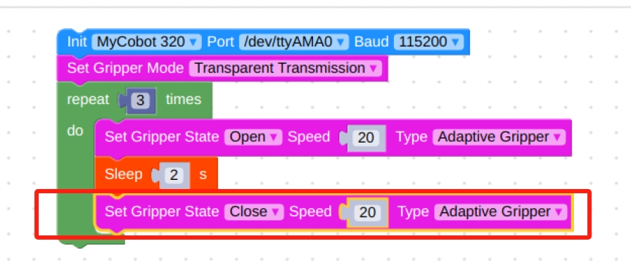
   10. In `Time`, find the `Sleep` module and set the time to 2s, the purpose is to give the gripper time to make a movement.
      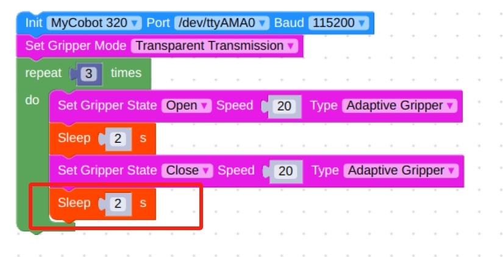
   11. Final flowchart and code.
      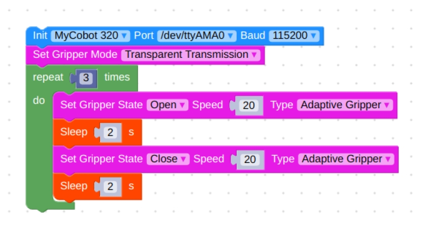

         ```python
         from pymycobot.mycobot import MyCobot
         import time

         mc = MyCobot('/dev/ttyAMA0', 115200)
         mc.set_gripper_mode(0)
         for count in range(3):
            mc.set_gripper_state(0,20,1)
            time.sleep(2)
            mc.set_gripper_state(1,20,1)
            time.sleep(2)
         ```
   12. Click on the green running icon in the upper right corner to see the gripper `open-close-open` in motion.

- **Port Passthrough Mode Method 2:**
   1. The process framework is the same as method 1, except that the `Set Gripper Mode` module is replaced by `Set Gripper Value`.
      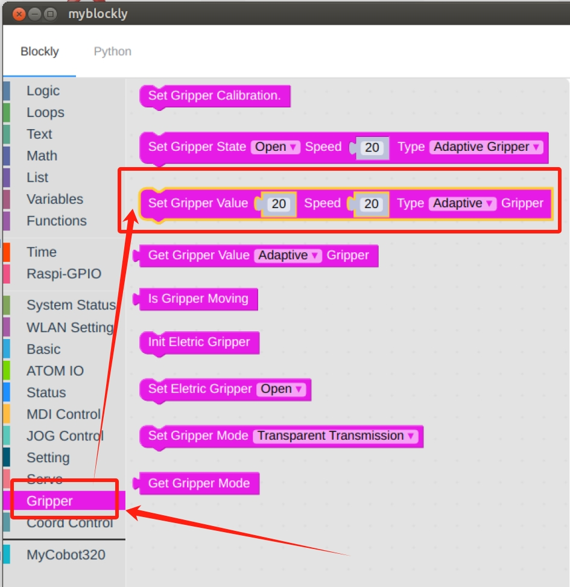
   2. Final flowchart and code.
      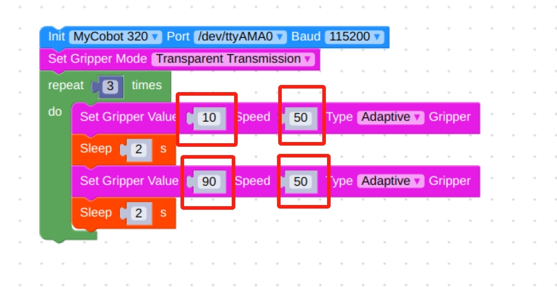

         ```python
         from pymycobot.mycobot import MyCobot
         import time

         mc = MyCobot('/dev/ttyAMA0', 115200)
         mc.set_gripper_mode(0)
         for count in range(3):
            mc.set_gripper_value(10,50,1)
            time.sleep(2)
            mc.set_gripper_value(90,50,1)
            time.sleep(2)
         ```

- **IO Control Mode:**
   > Note: When switching back to IO mode from pass-through mode, you need to power off and restart the machine before you can use IO mode normally.  
   1. Setting the `Set Gripper Mode` module to Port Mode.
      
   2. Again select the `repeat` module and loop through it three times.
      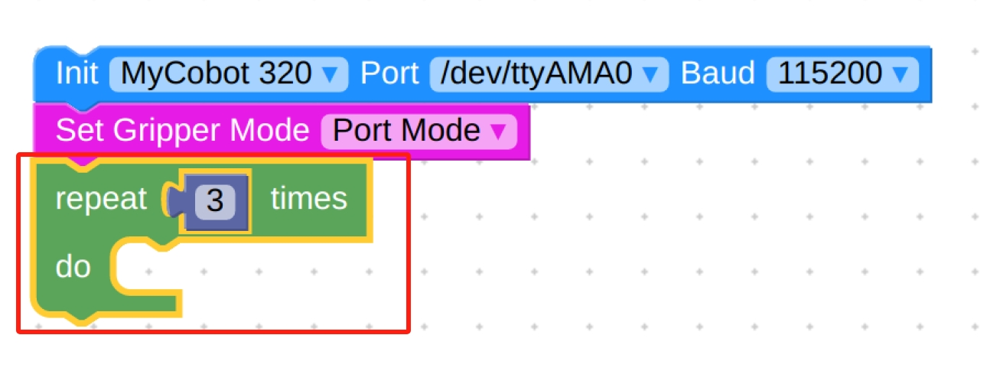
   3. In `ATOM IO` select the `Setting IO value` module.
      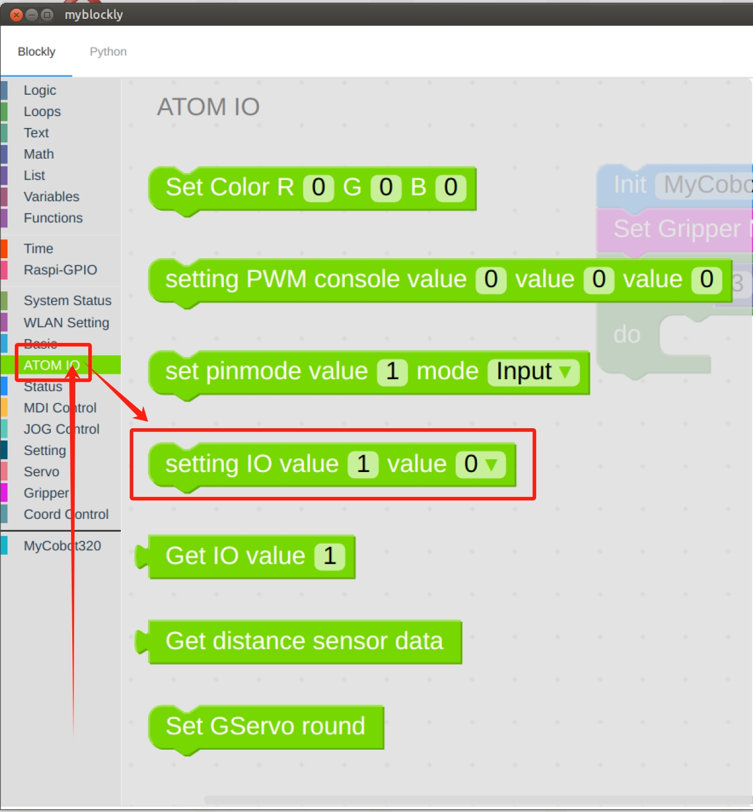
   4. Set the IO port to 33 with a value of 0.
      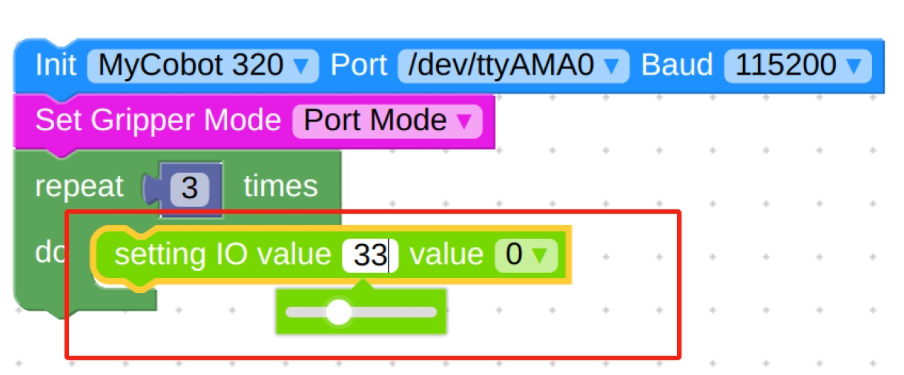
   5. In `Time` select the `Sleep` module.
      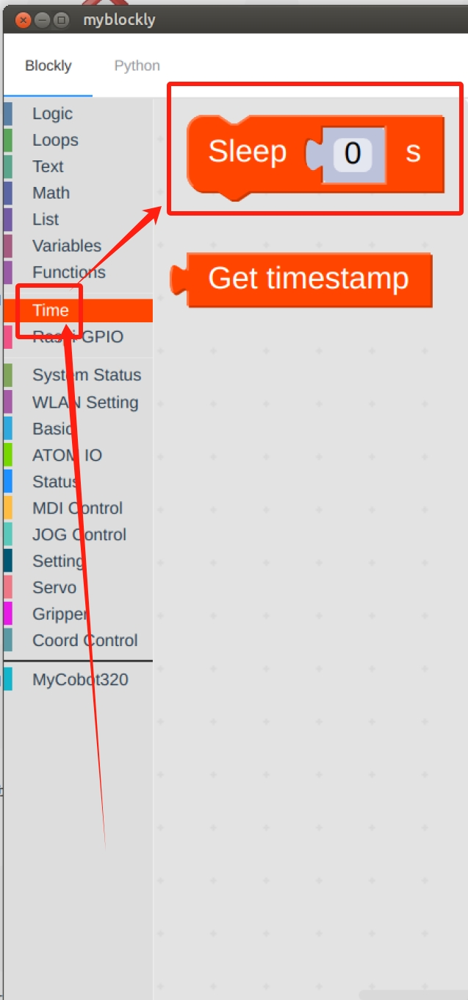
   6. Setting time to 2s.
      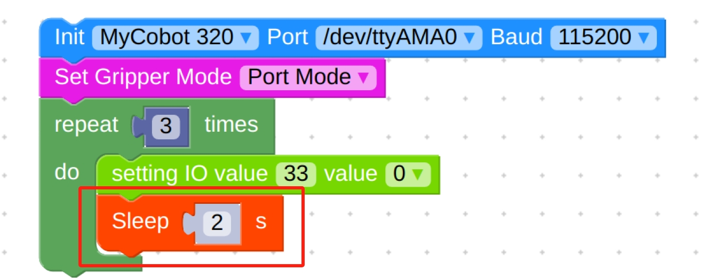
   7. Repeat the selection of the `Setting IO value` and `Sleep` modules, noting the change of IO number and the change of value.
      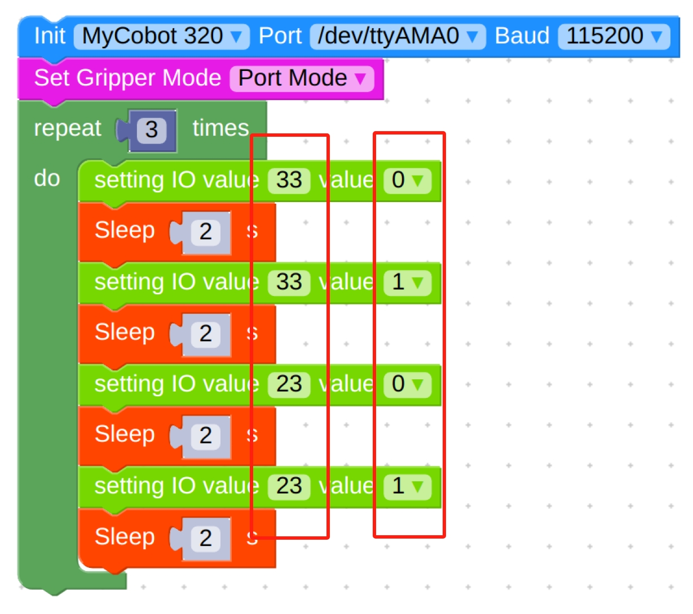
   8. Final flowchart and code.
      
         ```python
         from pymycobot.mycobot import MyCobot
         import time

         mc = MyCobot('/dev/ttyAMA0', 115200)
         mc.set_gripper_mode(1)
         for count in range(3):
            mc.set_digital_output(33, 0)
            time.sleep(2)
            mc.set_digital_output(33, 1)
            time.sleep(2)
            mc.set_digital_output(23, 0)
            time.sleep(2)
            mc.set_digital_output(23, 1)
            time.sleep(2)
         ```

---

[← Accessories Tools Page](../1.4-AccessoriesTools.md#gripper)
| [Next Page →](../1.4.1-Gripper/2-ElectricGripper.md)
