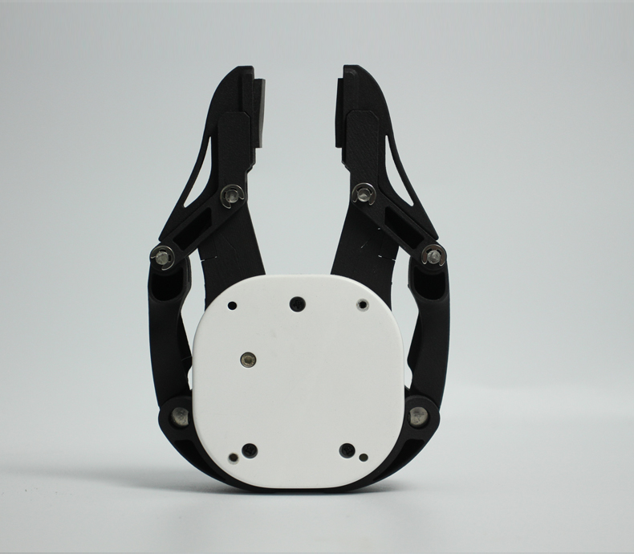
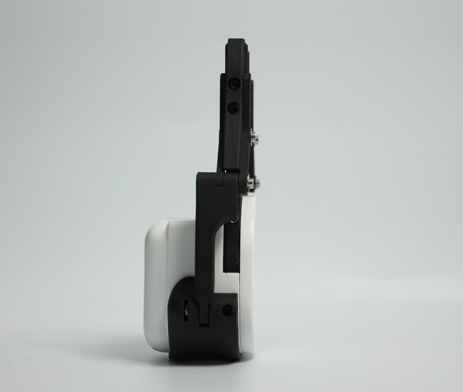

# myCobotPro 自适应夹爪

> **兼容型号：** myCobot 320、myCobot Pro 600

  

## 规格

| **名称**     | **myCobotPro 自适应抓取器 黑白款**      |
| ------------ | --------------------------------------- |
| 材料         | 光敏树脂 + 尼龙                         |
| 工艺技术     | 3D 打印                                 |
| 夹取范围     | 0-90 mm                                 |
| 夹紧力       | 1000 grams                              |
| 重复性精度   | 0.5 mm                                  |
| 使用寿命     | 1 年                                    |
| 驱动模式     | 电驱动                                  |
| 变速箱模式   | 齿轮+连接杆                             |
| 尺寸         | 158x105x55mm                            |
| 重量         | 350 grams                               |
| 固定方法     | 螺丝固定                                |
| 使用环境要求 | 温度和压力                              |
| 控制接口     | 串行端口/IO 控制                        |
| 适用设备     | ER myCobot 320 系列、ER myCobot Pro 600 |

## 用于抓取物体

**引言**

- 机械手是一种能像人手一样工作的机器人部件。它具有结构复杂、抓取物体牢固、不易掉落、操作简便等优点。

- 抓手套件包括抓手连接线和法兰，通过可编程系统控制机械臂的末端效应器，实现抓取物体和多点定位等功能。抓手可用于所有开发环境，如 ROS、Arduino、Roboflow 等。

**工作原理**

- 在电机的驱动下，机械手的手指表面做直线往复运动，实现打开或关闭动作。电动机械手的加减速可控，对工件的冲击最小，定位点可控，夹紧可控。

**适用对象**

- 小方块

- 小球

- 长条物体

购买链接:

- [淘宝](https://shop504055678.taobao.com)
- [shopify](https://shop.elephantrobotics.com/)

## 如何使用

1 安装  

<iframe width="560" height="315" src="https://www.youtube.com/embed/RPKjV0IuP5E" title="myCobot Pro Accessories | The new gripper for myCobot Pro 600" frameborder="0" allow="accelerometer; autoplay; clipboard-write; encrypted-media; gyroscope; picture-in-picture; web-share" allowfullscreen></iframe>

如果视频无法加载，请点击下面的链接观看视频。
[安装视频](https://www.youtube.com/watch?v=RPKjV0IuP5E)

---

[← 周边配件页面](../README.md#gripper)
| [下一页 →](../1.4.1-Gripper/2-ElectricGripper.md)
