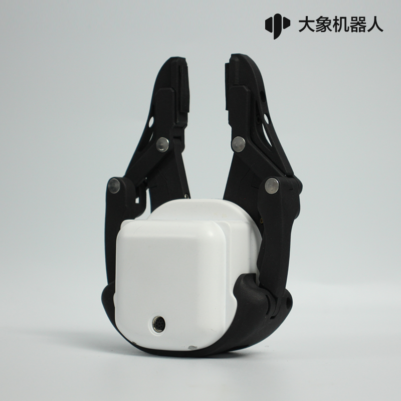

# **myCobotPro Adaptive Gripper**

> **Compatible models:** myCobot 320, myCobot Pro 600

## Specifications

| **name name**                 | **myCobotPro Adaptive Gripper Black and White** |
| ----------------------------- | ----------------------------------------------- |
| Material                      | Photosensitive resin + nylon                    |
| process technology            | 3D printing                                     |
| clamping rangeclamp size      | 0-90mm                                          |
| clamp force                   | 1000 grams                                      |
| Repeatability precision       | 0.5 mm                                          |
| service life lifetime         | 1 year                                          |
| drive mode drive              | electric                                        |
| Transmission modetransmission | gear+connecting rod                             |
| size                          | 158x105x55mm                                      |
| weightweight                  | 350 grams                                       |
| Fixed method fixed            | screw fixed                                     |
| Use environment requirements  | Temperature and pressure                        |
| control interface control     | Serial port/IO control                          |
| Applicable equipment          | ER myCobot 320 series, ER myCobot Pro 600       |

## Use for Gripping Objects

**Introduction**

- A gripper is a robotic component that can function like a human hand. It has the advantages of complex structure, firm grasping of objects, not easy to drop, and easy operation.

- The gripper kit includes gripper connecting wires and flanges, and controls the end effector of the robotic arm through a programmable system to realize functions such as object grabbing and multi-point positioning. Gripper can be used in all development environments, such as ROS, Arduino, Roboflow, etc.

**working principle**

- Driven by a motor, the finger surface of the gripper makes a linear reciprocating motion to realize the opening or closing action. The acceleration and deceleration of the electric gripper is controllable, the impact on the workpiece can be minimized, the positioning point is controllable, and the clamping is controllable .

**Applicable object**

- small cube

- small ball

- long object

Mall link: 

-   [Taobao](https://shop504055678.taobao.com)
-   [shopify](https://shop.elephantrobotics.com/)

## How to use
1 Installing  

<iframe width="560" height="315" src="https://www.youtube.com/embed/RPKjV0IuP5E" title="myCobot Pro Accessories | The new gripper for myCobot Pro 600" frameborder="0" allow="accelerometer; autoplay; clipboard-write; encrypted-media; gyroscope; picture-in-picture; web-share" allowfullscreen></iframe>

If the video fails to load, please click the link below to view the video.
[Installing Vidio](https://www.youtube.com/watch?v=RPKjV0IuP5E)

<!-- 2 Development with SDK  
-   [Blockly]()     
-   [Python]()
-   [C++]() -->

----
[← Accessories Tools Page](../1.4-AccessoriesTools.md#gripper)
 | [Next Page →](../1.4.1-Gripper/2-ElectricGripper.md)
