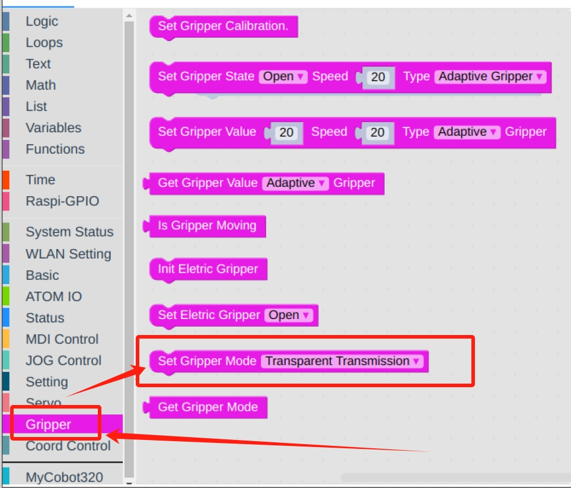

# **myCobotPro 自适应夹爪**

> **兼容型号：** myCobot 320、myCobot Pro 600

## 产品图片

  


## 规格

| **名称**     | **myCobotPro 自适应抓取器 黑白款**      |
| :----------- | :-------------------------------------- |
| 材料         | 光敏树脂 + 尼龙                         |
| 工艺技术     | 3D 打印                                 |
| 夹取范围     | 0-90 mm                                 |
| 夹紧力       | 1000 grams                              |
| 重复性精度   | 0.5 mm                                  |
| 使用寿命     | 1 年                                    |
| 驱动模式     | 电驱动                                  |
| 变速箱模式   | 齿轮+连接杆                             |
| 尺寸         | 158x105x55mm                            |
| 重量         | 350 grams                               |
| 固定方法     | 螺丝固定                                |
| 使用环境要求 | 常温常压                                |
| 控制接口     | 串行端口/IO 控制                        |
| 适用设备     | ER myCobot 320 系列、ER myCobot Pro 600 |

## 用于抓取物体

### 引言

- 机械手是一种能像人手一样工作的机器人部件。它具有结构复杂、抓取物体牢固、不易掉落、操作简便等优点。

- 抓手套件包括抓手连接线和法兰，通过可编程系统控制机械臂的末端效应器，实现抓取物体和多点定位等功能。抓手可用于所有开发环境，如 ROS、Arduino、Roboflow 等。

### 工作原理

- 在电机的驱动下，机械手的手指表面做直线往复运动，实现打开或关闭动作。电动机械手的加减速可控，对工件的冲击最小，定位点可控，夹紧可控。

### 适用对象

- 小方块

- 小球

- 长条物体

购买链接:

- [淘宝](https://shop504055678.taobao.com)
- [shopify](https://shop.elephantrobotics.com/)

### 安装使用

- 夹爪安装：

  - 结构安装：

    1. 将垫片对准机械臂末端孔位，配合螺丝拧紧：
       

    2. 将夹爪的螺丝孔对准垫片四周的孔位，配合细螺丝拧紧：
       

  - 电气连接：
    > 注意在机械臂断电状态下进行。
    1. 将 m8 线对准机械臂的接口，注意接口处有缺口，连接线有对应突起，确认方向后插入，并拧紧：
       
    2. 插入夹爪控制接口，同样注意缺口的方向：
       

<br>

- 编程开发（python）：

  > 使用 python 对夹爪进行编程开发：
  > [python 环境下载](../../../10-ApplicationBasePython/10.1_320_PI-ApplicationPython/1_download.md)

  - 新建 python 文件：  
    在想要的文件路径下右键新建 python 文件：  
    

    > 文件名字可以根据需要修改

    

  - 进行功能编程：
    

    > 代码如下：

    ```python
    from pymycobot.mycobot import MyCobot
    from pymycobot import PI_PORT, PI_BAUD  # 当使用树莓派版本的mycobot时，可以引用这两个变量进行MyCobot初始化
    import time

    # 初始化一个MyCobot对象
    mc = MyCobot(PI_PORT, 115200)

    #设置夹爪为485模式
    mc.set_gripper_mode(0)
    # 控制夹爪打开-关闭-打开：
    #使用夹爪状态接口0为张开，1为关闭
    mc.set_gripper_state(0, 80)
    time.sleep(3)
    mc.set_gripper_state(1, 80)
    time.sleep(3)
    mc.set_gripper_state(0, 80)
    time.sleep(3)

    # 详细接口使用可以查看python API
    ```

- 保存文件并关闭，在文件夹空白处右键打开命令行终端

  

  输入：

  ```bash
  python gripper.py
  ```

  

> 可以看到夹爪打开-关闭-打开

- 编程开发（myblockly）：

  > 使用 myblockly 对夹爪进行编程开发：
  > [myblockly 下载](../../../5-BasicApplication/5.2-ApplicationUse/myblockly/320pi/2-install_uninstall.md)  
  > 注意使用 myblockly 开发前，需要先用 python 程序运行过`mc.set_gripper_mode(0)`，将夹爪设置为 485 模式。

  1. 确认结构及电气连接都完成后，启动机械臂，出现图形界面后打开 myblockly 软件  
     
  2. 修改波特率为 115200  
     
  3. 在左侧列表找到 `夹爪`，选择`设置夹爪值`模块  
     
  4. 拖动模块连接在`初始化mycobot`模块下面，根据需要修改张开的程度和速度，这里都设置为`70`  
     
  5. 在`时间`，选择`睡眠`模块  
     
  6. 设置时间为 `2 秒`，目的是留出夹爪运动时间  
     
  7. 重复选择一次`设置夹爪值`和`睡眠`模块，将`设置夹爪值`张开程度改为`0`  
     
     
  8. 在左侧列表找到 `夹爪`，选择`设置夹爪值`模块
     
  9. 修改状态为`打开`，速度为`70`
     
  10. 点击右上角的绿色运行图标，可以看到夹爪`打开-关闭-打开`的运动状态

<br>

- 安装过程视频演示
<iframe width="560" height="315" src="https://www.youtube.com/embed/RPKjV0IuP5E" title="myCobot Pro Accessories | The new gripper for myCobot Pro 600" frameborder="0" allow="accelerometer; autoplay; clipboard-write; encrypted-media; gyroscope; picture-in-picture; web-share" allowfullscreen></iframe>

如果视频无法加载，请点击下面的链接观看视频。  
[安装视频](https://www.youtube.com/watch?v=RPKjV0IuP5E)

---

[← 周边配件页](../README.md#gripper)
| [下一页 →](../1.4.1-Gripper/2-ElectricGripper.md)
