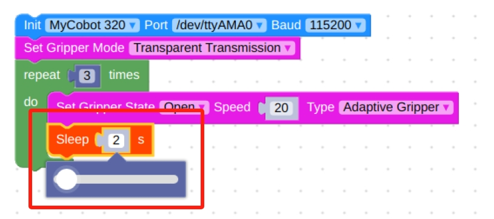

# **myCobotPro Adaptive Gripper**

> **Compatible models:** myCobot 320, myCobot Pro 600


## Specifications

| **name name**                 | **myCobotPro Adaptive Gripper Black and White** |
| ----------------------------- | ----------------------------------------------- |
| Material                      | Photosensitive resin + nylon                    |
| process technology            | 3D printing                                     |
| clamping rangeclamp size      | 0-90mm                                          |
| clamp force                   | 1000 grams                                      |
| Repeatability precision       | 0.5 mm                                          |
| service life lifetime         | 1 year                                          |
| drive mode drive              | electric                                        |
| Transmission modetransmission | gear+connecting rod                             |
| size                          | 158x105x55mm                                    |
| weightweight                  | 350 grams                                       |
| Fixed method fixed            | screw fixed                                     |
| Use environment requirements  | Temperature and pressure                        |
| control interface control     | Serial port/IO control                          |
| Applicable equipment          | ER myCobot 320 series, ER myCobot Pro 600       |

## Use for Gripping Objects

**Introduction**

- A gripper is a robotic component that can function like a human hand. It has the advantages of complex structure, firm grasping of objects, not easy to drop, and easy operation.

- The gripper kit includes gripper connecting wires and flanges, and controls the end effector of the robotic arm through a programmable system to realize functions such as object grabbing and multi-point positioning. Gripper can be used in all development environments, such as ROS, Arduino, Roboflow, etc.

**working principle**

- Driven by a motor, the finger surface of the gripper makes a linear reciprocating motion to realize the opening or closing action. The acceleration and deceleration of the electric gripper is controllable, the impact on the workpiece can be minimized, the positioning point is controllable, and the clamping is controllable .

**Applicable object**

- small cube

- small ball

- long object

Mall link:

- [Taobao](https://shop504055678.taobao.com)
- [shopify](https://shop.elephantrobotics.com/)

## How to use

1 Installing <br>

<iframe width="560" height="315" src="https://www.youtube.com/embed/RPKjV0IuP5E" title="myCobot Pro Accessories | The new gripper for myCobot Pro 600" frameborder="0" allow="accelerometer; autoplay; clipboard-write; encrypted-media; gyroscope; picture-in-picture; web-share" allowfullscreen></iframe>

If the video fails to load, please click the link below to view the video.
[Installing Vidio](https://www.youtube.com/watch?v=RPKjV0IuP5E)

**Installation and use**

- Gripper mounting：

  - Structural installation：

    1. Align the spacer with the hole at the end of the arm and tighten with the screws：
       

    2. Align the screw holes in the jaws with the holes around the gasket and tighten with the fine screws.：
       

  - electrical connection：
    > Take care to do this with the robotic arm powered off.
    1. Align the m8 cable with the connector of the robot arm, note that the connector has a notch and the connecting cable has a corresponding protrusion, confirm the direction and then insert it and tighten it:
       
    2. Insert the jaw control connector, again paying attention to the orientation of the notch:
       

<br>

**myCobot Pro 320 Instructions for use**

- Programming development (python)：

  > Programming and development of the jaws using python:
  > [python environment download](../../../7-ApplicationBasePython/7.1_download.md)

  1. Create a new python file:  
     Right click on the desired file path to create a new python file:  
     

     > The file name can be changed as needed

     

  2. Perform function programming:
     

     > The code is as follows:

     ```python
     from pymycobot.mycobot import MyCobot
     import time

     # Initialise a MyCobot object
     mc = MyCobot("COM3", 115200)

     # Setting the jaws to 485 mode
     mc.set_gripper_mode(0)
     # Controls jaws open-close-open:
     # Using the jaw status interface 0 is open, 1 is closed
     mc.set_gripper_state(0, 80)
     time.sleep(3)
     mc.set_gripper_state(1, 80)
     time.sleep(3)
     mc.set_gripper_state(0, 80)
     time.sleep(3)

     # For more information on using the interface, see the python API.
     ```

  3. Save the file and close it, right-click on an empty space in the folder to open a command line terminal

     

     Input:

     ```bash
     python gripper.py
     ```

     

     > You can see the jaws open-close-open

- Programming Development (myblockly):

  > Programming and development of the jaws using myblockly:
  > [myblockly download](../../../5-BasicApplication/5.2-ApplicationUse/myblockly/320pi/2-install_uninstall.md)  
  > Note that before developing with myblockly, you need to have run `mc.set_gripper_mode(0)` with a python program to set the jaws to 485 mode.

  1. After confirming that the structural and electrical connections are complete, start the arm and open the myblockly software when the graphical interface appears.  
     
  2. Modify the baud rate to 115200
     
  3. Find `Jaws` in the list on the left and select the `Set Jaw Value` module.
     
  4. The drag module is attached under the `initialise mycobot` module, modify the degree of spread and speed as required, here it is set to `70`.
     
  5. In `Time`, select `Sleep` module
     
  6. Set the time to `2 seconds` to allow time for the jaws to move.  
     
  7. Repeat the selection of the `Set Jaw Value` and `Sleep` modules to change the `Set Jaw Value` opening level to `0`.  
     
     
  8. Find `Jaws` in the list on the left and select the `Set Jaw Value` module.
     
  9. Modify status to `open' and speed to `70'.
     
  10. Click on the green running icon in the upper right corner to see the jaws `open-close-open` in motion

<!-- 2 Development with SDK
-   [Blockly]()
-   [Python]()
-   [C++]() -->

---

[← Accessories Tools Page](../1.4-AccessoriesTools.md#gripper)
| [Next Page →](../1.4.1-Gripper/2-ElectricGripper.md)
