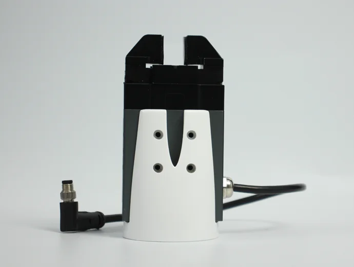
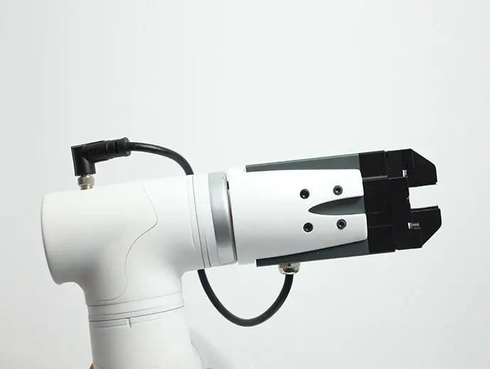

# **电动夹爪**

> **兼容型号：** myCobot 320、myCobot Pro 600

## 产品图片

## 规格

| **名称**     | **mycobotpro 电动夹爪**             |
| :----------- | :---------------------------------- |
| 模型         | myCobotPro_Gripper_PGE_8            |
| 材料         | 金属 + 7500 尼龙                    |
| 夹取范围     | 0-14mm                              |
| 夹紧力       | 2-5N                                |
| 重复性精度   | 1mm                                 |
| 使用寿命     | 一年                                |
| 驱动模式     | 电驱动                              |
| 传动方式     | 齿条和小齿轮 + 交叉滚柱导轨         |
| 尺寸         | 97×62×31mm                          |
| 重量         | 460g                                |
| 固定方法     | 螺丝固定                            |
| 使用环境要求 | 常温常压                            |
| 控制接口     | 串行端口/IO 控制                    |
| 适用设备     | ER myCobot 320 ，ER myCobot Pro 600 |

## 用于抓取物体

**引言**

- PGE 系列是工业用薄型平行电动夹爪，数字代表夹爪的最大夹持力。夹爪配有一对平行指尖，在运动过程中对称运行。夹爪的主体结构为光滑的矩形结构，体积小，节省安装空间。它有 5 个安装孔，可满足设备的不同安装条件。

- 响应速度快，抓取频率高，并配有 8 核通信接口，主要实现对物体的夹紧或卡住，适用于相对较轻的物体。

**工作原理**

- 电机驱动齿轮齿条和交叉滚柱导轨，实现夹爪的打开或关闭动作。电动夹爪的定位点是可控的，夹持也是可控的。

**适用对象**

- 体积小于夹紧行程

- 重量小于最大夹紧重量

- 自定义指尖可扩展更多应用

## Product parameters

**运行环境**

| **周围环境** | **图解说明** |
| :----------- | :----------- |
| 规程         | RS-485       |
| 工作电压     | 24V          |
| 额定电流     | 0.25A        |
| 峰值电流     | 0.5A         |
| 保护程度     | IP40         |
| 建议的环境   | 0-40℃        |

## 购买链接

购买链接:

- [淘宝](https://shop504055678.taobao.com)
- [shopify](https://shop.elephantrobotics.com/)

## 如何使用

1 安装夹爪:  

- 对于电动机械手，将其插入顶部的 485 接口，如下图所示:  
    

[← 周边配件页](../README.md#gripper) | [下一页 →](../1.4.1-Gripper/3-PneumaticGripper.md)
