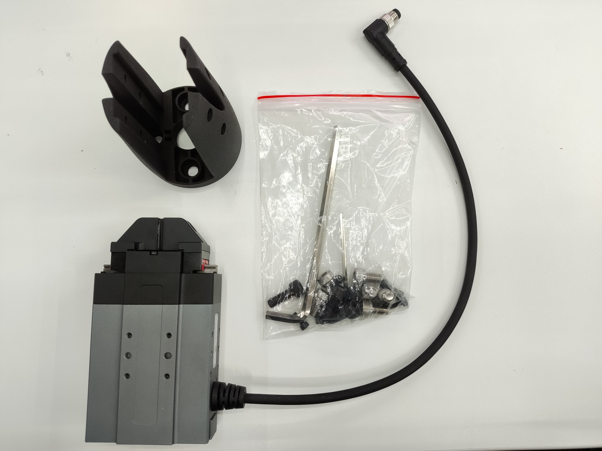
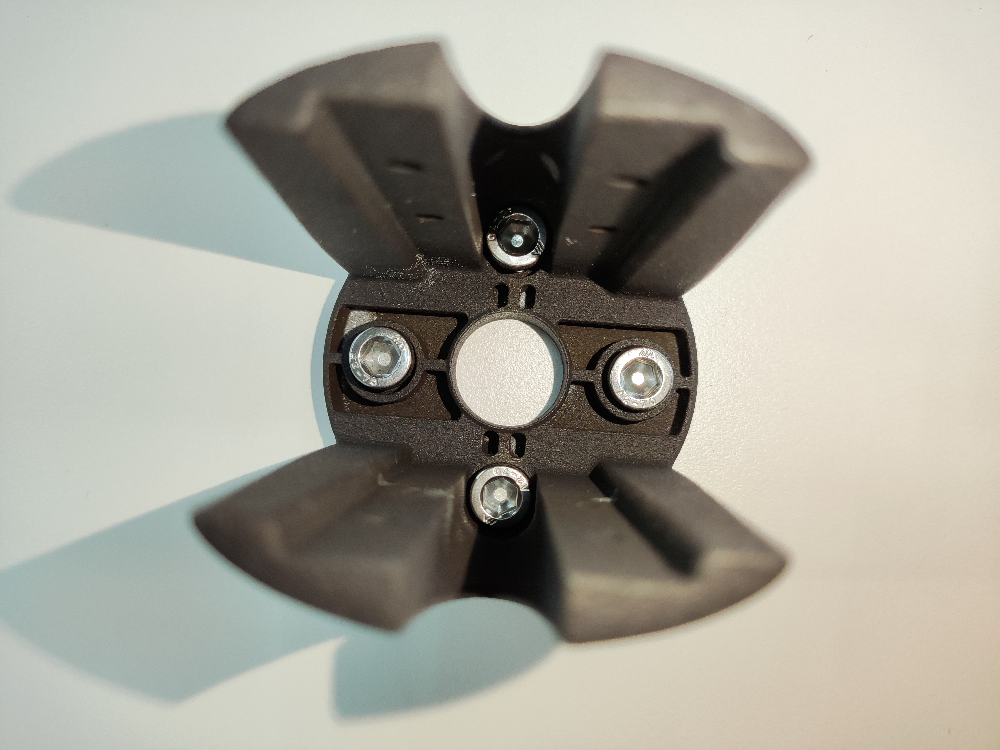
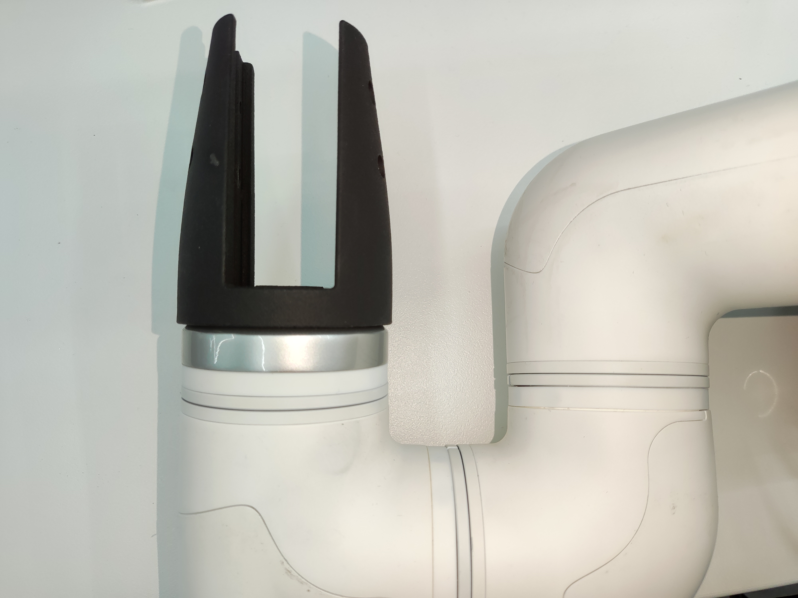
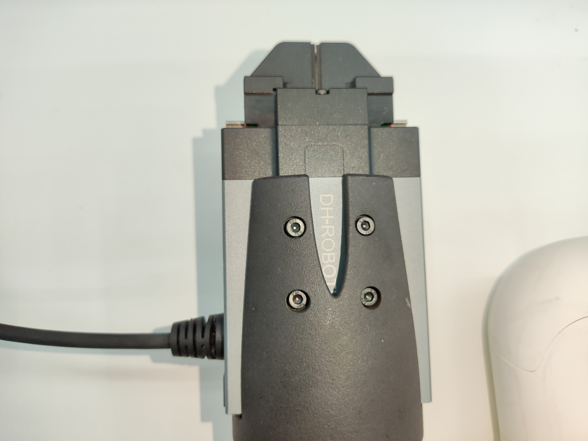
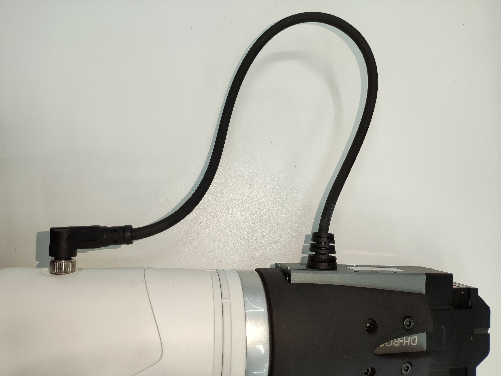

# Electric Gripper

> **Compatible models:** myCobot 320, myCobot Pro 600

## Product icon


## Specifications:

| **name**                     | **mycobot Pro Electric Gripper**     |
| ---------------------------- | ------------------------------------ |
| Model model                  | myCobotPro_Gripper_PGE_8             |
| craft                        | Metal + 7500 Nylon                   |
| Clamping rangeClamp size     | 0-14mm                               |
| Clamp force                  | 2-5N                                 |
| Repeatability precision      | 1mm                                  |
| Lifetime                     | one year                             |
| drive mode drive             | electric                             |
| transfer method              | Rack and pinion + cross roller guide |
| size                         | 97×62×31mm                           |
| weightweight                 | 460g                                 |
| Fixed method Fixed           | screw fixed                          |
| Use environment requirements | Temperature and pressure             |
| control interface control    | Serial port/IO control               |
| Applicable equipment         | ER myCobot 320 ，ER myCobot Pro 600  |

## Use for Gripping Objects

**Introduction**

- PGE series are industrial thin parallel electric grippers, and the numbers represent the maximum clamping force of the grippers. The gripper is equipped with a pair of parallel fingertips, which run symmetrically during the movement. The main structure of the gripper is a smooth rectangular structure, which is small in size and saves installation space. It has 5 mounting holes to meet different installation conditions of the equipment.

- Quick response, high grabbing frequency, and equipped with an 8-core communication interface, mainly to achieve clamping or stuck objects, suitable for relatively light objects.

**working principle**

- The motor drives the rack and pinion and the cross roller guide to realize the opening or closing action of the gripper. The positioning point of the electric gripper is controllable and the clamping is controllable.

**Applicable object**

- The volume is smaller than the clamping stroke

- The weight is less than the maximum clamping weight

- Custom fingertips can expand more items

## Product parameters


**operating environment**

| **surroundings**        | **illustrate** |
| ----------------------- | -------------- |
| Protocol                | RS-485         |
| Operating Voltage       | 24V            |
| rated current           | 0.25A          |
| peak current            | 0.5A           |
| degree of protection    | IP40           |
| Recommended environment | 0-40℃          |

## Mall link

Mall link:

- [Taobao](https://shop504055678.taobao.com)
- [shopify](https://shop.elephantrobotics.com/)

<!-- - [Shopify](https://shop-elephantrobotics-com.translate.goog/collections/mycobot-pro-600/products/electric-parallel-gripper?_x_tr_sl=auto&_x_tr_tl=zh-CNhttps://item.taobao.com/item.htm?spm=a1z10.5-c-s.0.0.6945364bve0QX4&id=667084571424) -->

## How to use

1 Installing the gripper: <br>

- For an electric gripper, insert it into the 485 interface on the top, as shown in the following figure: <br>
   <br>

**Installation and use**

- Check that the kit is complete: screws, hexagonal spanner, clamping jaws with connecting wires, clamping jaws with arm end fixing device
  

- Clamping jaws mounted:

  - Structural installation:

    1. Place the short screws into the holes in the fixture:
       

    2. Align the screws with the four screw holes on the end of the robot arm and tighten:
       

    3. Insert the motorised jaws into the fixture and tighten with fine screws on both sides, eight in total:
       

  - Electrical Connections:

    1. Plug the 485 cable into the robot arm control connector:
       <br>

       
       <br>

**Instructions for use:**<br>

```python
from pymycobot.mycobot import MyCobot
import time

# Initialise a MyCobot object
mc = MyCobot("COM3", 115200)

# Can control the clamping jaws to open and strike - close and open:
mc.set_eletric_gripper(0)
time.sleep(3)
mc.set_eletric_gripper(1)
time.sleep(3)
mc.set_eletric_gripper(0)
time.sleep(3)
```

<!-- 2 Development with SDK
-   [Blockly]()
-   [Python]()
-   [C++]() -->

[← Accessories Tools Page](../1.4-AccessoriesTools.md#gripper) | [Next Page →](../1.4.1-Gripper/3-PneumaticGripper.md)
