# **Pneumatic gripper**

**Compatible models:** myCobot 320, myCobot Pro 630

**product icon**

 <br>

**Specifications:**

| **name**                     | **mycobot320 pneumatic gripper**                       |
| ---------------------------- | ------------------------------------------------------ |
| Model model                  | myCobotPro_Gripper_Air_10                              |
| craft                        | Metal + 7500 Nylon                                     |
| Clamping rangeClamp size     | 0-8mm                                                  |
| Clamp force                  | Outer diameter 34N Inner diameter 45N                  |
| Repeatability precision      | ±0.01mm                                                |
| Lifetime                     | one year                                               |
| drive mode drive             | pneumatic                                              |
| transfer method              | Piston cylinder                                        |
| size                         | 67.3×38×23.6mm                                         |
| weightweight                 | 180g                                                   |
| Fixed method Fixed           | screw fixed                                            |
| Use environment requirements | Temperature and pressure                               |
| control interface control    | I/O control                                            |
| Applicable equipment         | ER myCobot 320 M5 ER myCobot 320 Pi ER myCobot Pro 600 |

## Use for Gripping Objects

**Introduction**

- Pneumatic grippers, also known as pneumatic fingers or pneumatic grippers, are actuators that use compressed air as power to grip or grab workpieces. It is small in size, light in weight, compact in appearance, capable of single- and two-way grabbing, automatic centering, high repeatability, and automatic control of the magnetic switch.

- Pneumatic gripper set includes gripper flange, air pump, φ8 air pipe, φ6 air pipe, φ8-6 quick connector, solenoid valve and cables. Its main function is to replace human grasping work, which can effectively improve production efficiency and work safety. An external suction pump is required.

**working principle**

- Single piston: the axis drives the crank, and the air claw is driven by the piston to open and close. A corresponding crank groove is respectively arranged on the two claw pieces. In order to reduce the frictional resistance, the claw piece and the body are connected by a steel ball slide rail structure.

- Double piston: It is operated by two pistons, and each piston is connected with a pneumatic finger by a roller and a double crank to form a special drive unit. Realize that the pneumatic fingers always move axially to the center, and each finger cannot move independently. Parallel gripper cylinder If the finger moves in the opposite direction, the previously compressed piston is in the exhausted state, while the other piston is in the compressed state.

**Applicable object**

- The volume is smaller than the clamping stroke

- The weight is less than the maximum clamping weight

- Custom fingertips can expand more items

## Mall link

- [Taobao](https://shop504055678.taobao.com)
- [shopify](https://shop.elephantrobotics.com/)

<!-- - [Shopify](https://shop-elephantrobotics-com.translate.goog/collections/mycobot-pro-600/products/air-parallel-grippers-air-compressor?_x_tr_sl=auto&_x_tr_tl=zh-CN) -->

## How to use

1 Installing the gripper: <br>

 <br>

 <br>

**Installation and use**

- It needs to be used with an air compressor:
  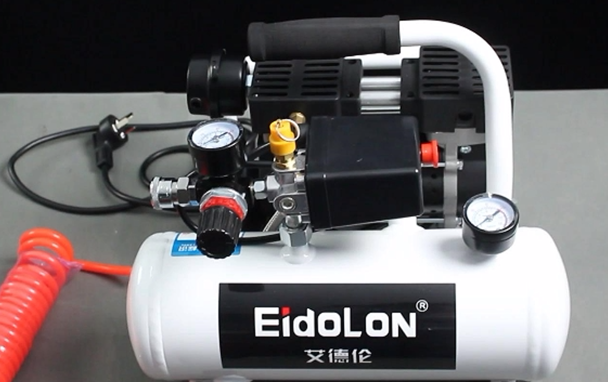

  1. Insert the black plug into the row of plugs;

  2. Insert the matching red hose into the connector on the machine:  
     
  3. The red button is the on/off switch, pulling it outwards turns it on, pressing it back turns the machine off:
     

- gripper mounted:

  1. Connect the other end of the red hose from the air compressor to the solenoid valve connection:
     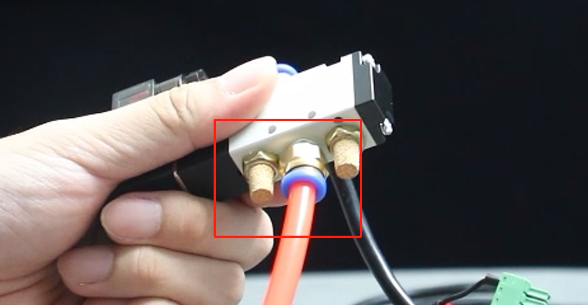
  2. The other end of the solenoid valve will be unscrewed another port for the activation of the gripper to control the opening and closing of the use:
     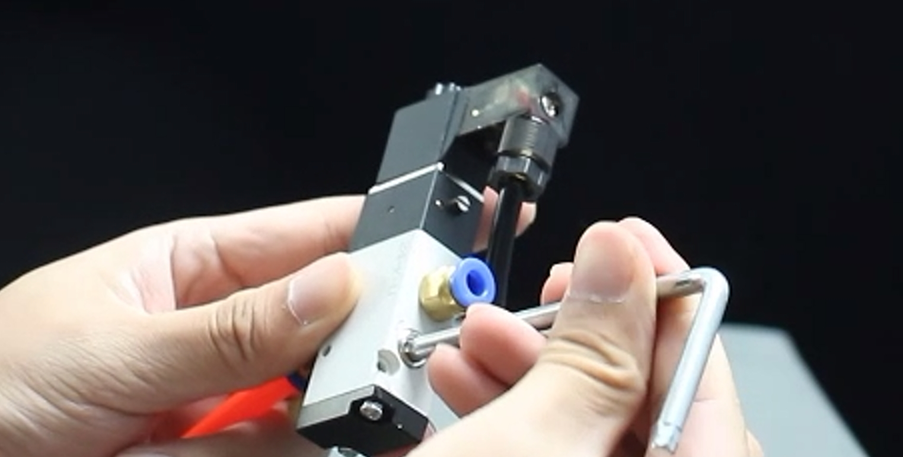
     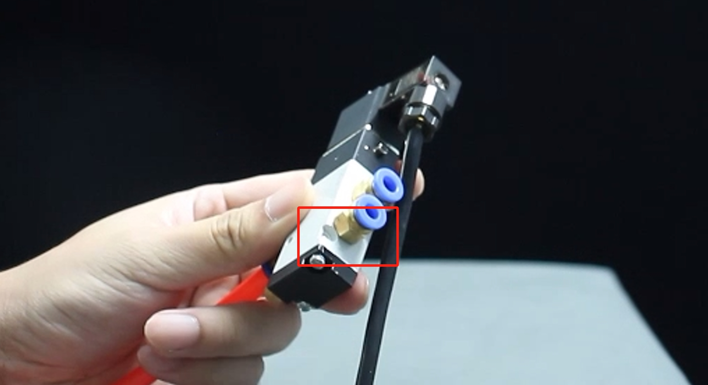
  3. Use the two matching clear hoses with one end connected to the two ports of the solenoid valve:
     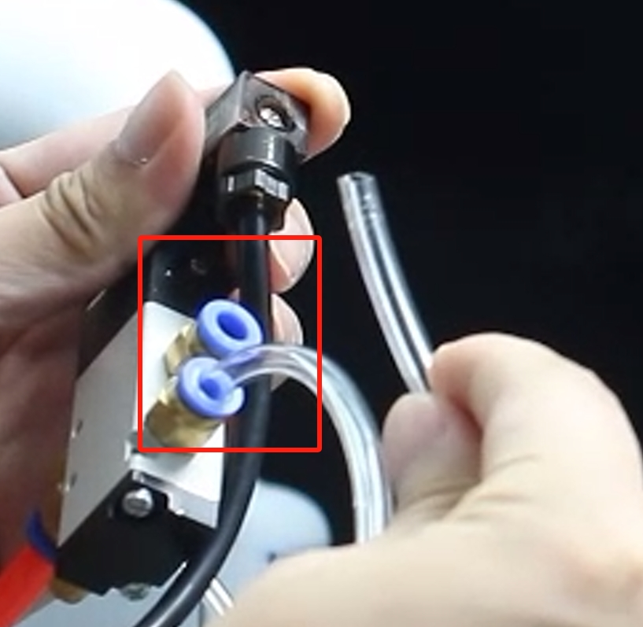
  4. The other end of the transparent hose is connected to the two connections of the gripper:
     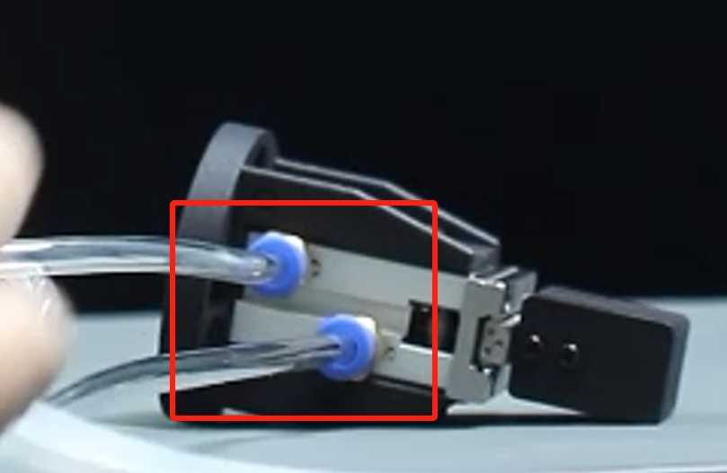
  5. Secure the gripper to the end of the arm with the matching screws:
     

- Electrical Connections:

  1. Connect the black wire to the GND of the robot arm base, and the red wire to any one of OUT1~OUT6, and change the pin number of the subsequent programme according to the selected interface, here we use OUT1:
     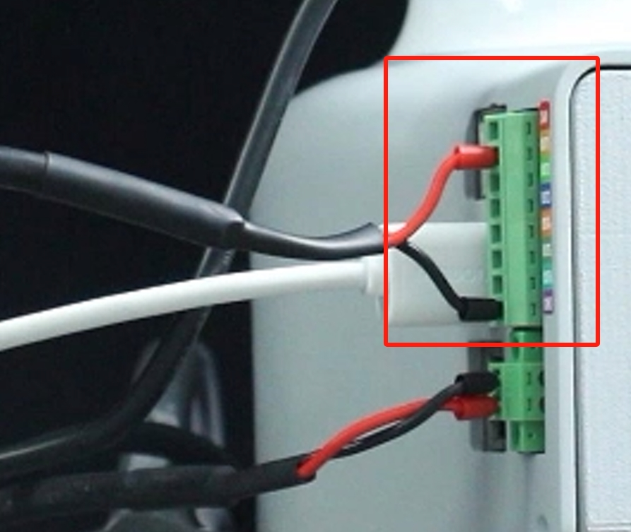

- Software-driven testing:

  > To test if the gripper are available after installation, use myBlockly.
  > [myblockly 下载](../../../5-ProgramingApplication-myblockly-uiflow-mind/5.1-myblockly/5.1.1-myBlocklyFirstUse.md#myblockly下载安装)

   1. After confirming that the structural and electrical connections are complete, start the arm and open the myblockly software when the graphical interface appears:
      
   2. Modify the baud rate to 115200:
      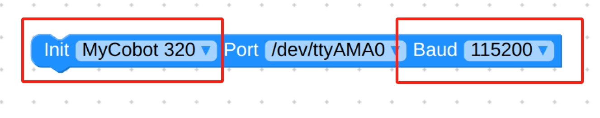
   3. Find `Base` in the list on the left and select the `Set Pin Out` module:
      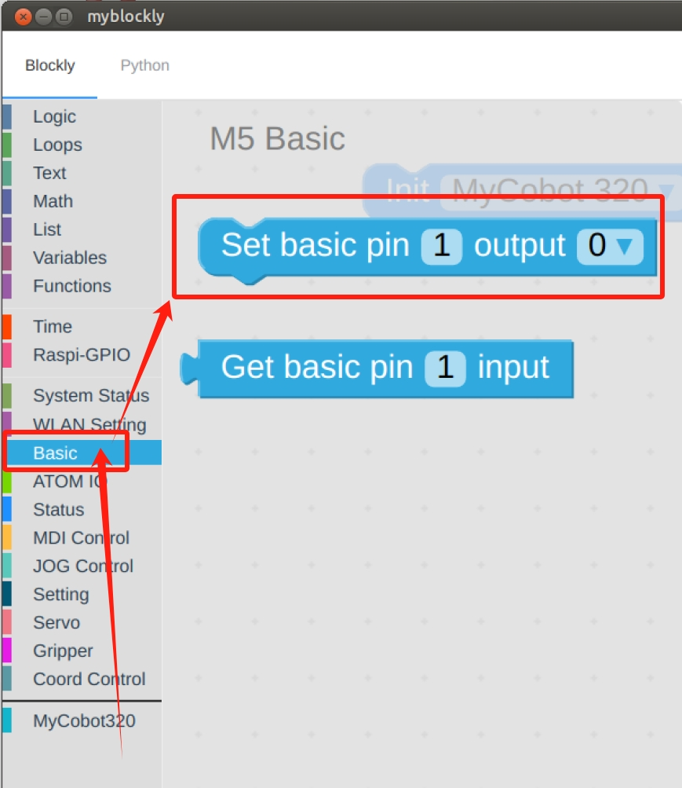
   4. Set `pin number` to `1` and `output` to `0`:
      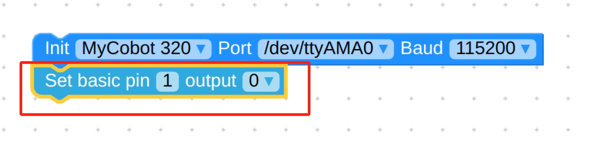
   5. Find `Time` and select the `Sleep` module:
      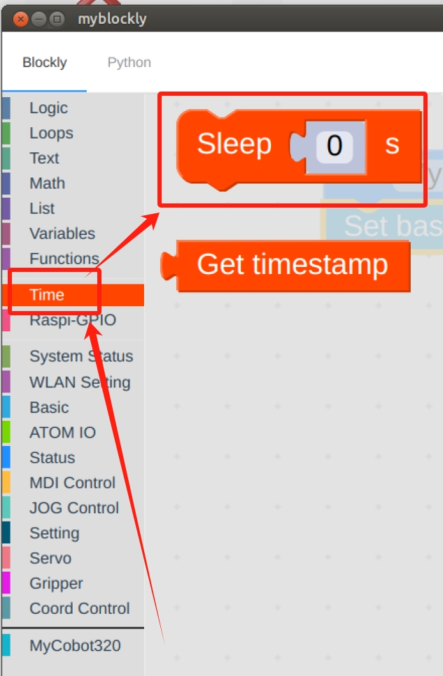
   6. Set the time as desired, here it is set to `2s`:
      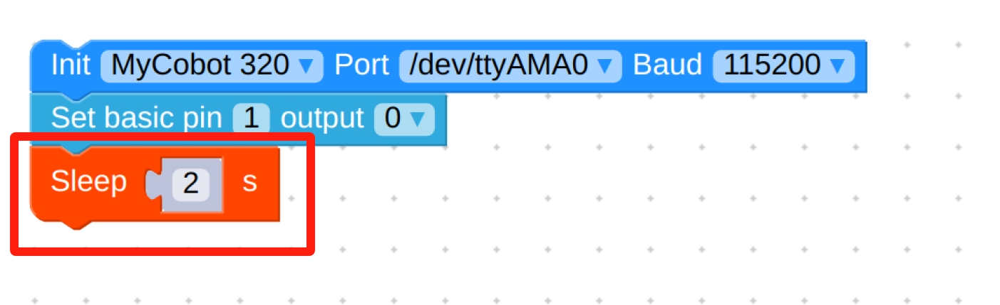
   7. Repeat the above steps for the final setup as follows:
      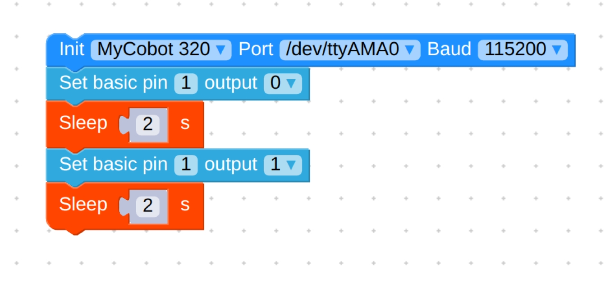
   8. Final code:
      ```python
      from pymycobot.mycobot import MyCobot
      import time

      mc = MyCobot('/dev/ttyAMA0', 115200)
      mc.set_basic_output(1, 0)
      time.sleep(2)
      mc.set_basic_output(1, 1)
      time.sleep(2)
      ```
   9. Click on the green run button in the top right corner to see the gripper close-open once.

- Programming Development:

  > Programming the gripper using python
  > [python environment download](../../../7-ApplicationBasePython/7.1_download.md)

  1. Create a new python file:  
     Right click on the desired file path to create a new python file:  
     

     > The file name can be changed as needed

     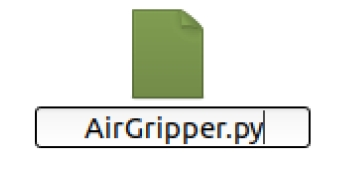

  2. Perform function programming:
     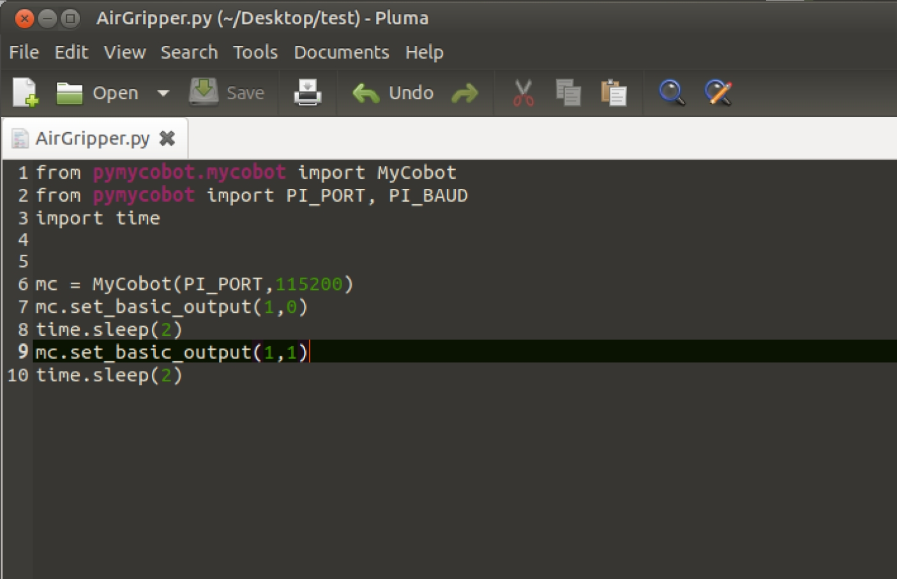

     > The code is as follows:

     ```python
     from pymycobot.mycobot import MyCobot
     import time

     # Initialise a MyCobot object
     mc = MyCobot("COM3", 115200)

     # Controls gripper closed-open:
     # Using the gripper status interface 0 is open, 1 is closed
     mc.set_basic_output(1, 0)
     time.sleep(1)
     mc.set_basic_output(2, 1)
     time.sleep(1)
     mc.set_basic_output(1, 1)
     time.sleep(1)
     mc.set_basic_output(2, 0)
     time.sleep(1)

     # For more information on using the interface, see the python API.
     ```

  3. Save the file and close it, right-click on an empty space in the folder to open a command line terminal

     

     Input:

     ```bash
     python AirGripper.py
     ```

     

     > gripper can be seen closed-open

---

[← Accessories Tools Page](../1.4-AccessoriesTools.md#gripper) | [Next Page →](../1.4.1-Gripper/4-FlexibleGripper.md)
