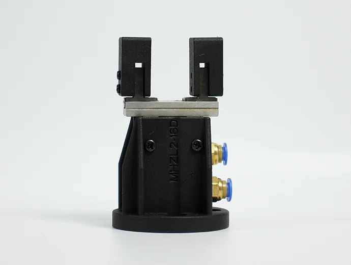
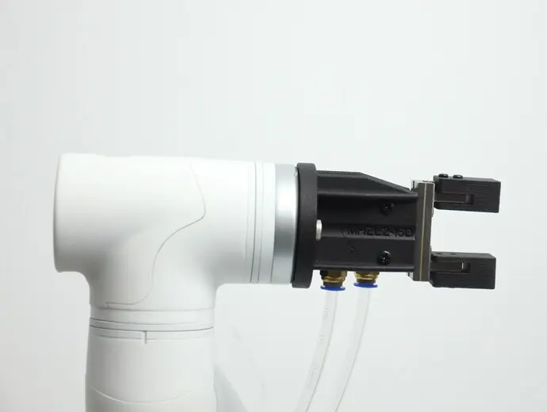

# **气动夹爪**

> **兼容型号：** myCobot 320, myCobot Pro 600

## 产品图片

  

## 规格

| **名称**     | **mycobot320 气动夹爪**                                |
| :----------- | :----------------------------------------------------- |
| 模型         | myCobotPro_Gripper_Air_10                              |
| 材料         | 金属 + 7500 尼龙                                       |
| 夹取范围     | 0-8mm                                                  |
| 夹紧力       | 外径 34N 内径 45N                                      |
| 重复性精度   | ±0.01mm                                                |
| 使用寿命     | 一年                                                   |
| 驱动模式     | 气动                                                   |
| 传输方式     | 活塞缸                                                 |
| 尺寸         | 67.3×38×23.6mm                                         |
| 重量         | 180g                                                   |
| 固定方法     | 螺丝固定                                               |
| 使用环境要求 | 温度和压力                                             |
| 控制接口     | 输入/输出控制                                          |
| 适用设备     | ER myCobot 320 M5 ER myCobot 320 Pi ER myCobot Pro 600 |

## 用于抓取物体

**引言**

- 气动夹爪又称气动手指或气动夹钳，是一种利用压缩空气作为动力抓取或抓取工件的执行器。它体积小、重量轻、外形紧凑，能够实现单向和双向抓取、自动对中、高重复精度和自动控制磁性开关。

- 气动夹爪套件包括夹爪法兰、气泵、φ8 气管、φ6 气管、φ8-6 快速接头、电磁阀和电缆。其主要功能是代替人力抓取工作，可有效提高生产效率和工作安全性。需要外接吸气泵。

**工作原理**

- 单活塞：轴驱动曲柄，气爪由活塞驱动开合。两个爪片上分别布置有相应的曲柄槽。为减小摩擦阻力，爪片与机身之间采用钢珠滑轨结构连接。

- 双活塞：由两个活塞控制，每个活塞通过一个滚轮和一个双曲柄与一个气动指连接，形成一个特殊的驱动单元。需要注意的是，气动指始终向中心轴向移动，每个气动指不能独立移动。

- 平行钳形气缸：如果气动指朝相反方向移动，则先前被压缩的活塞处于排气状态，而另一个活塞处于压缩状态。

**适用对象**

- 体积小于夹紧行程

- 重量小于最大夹紧重量

- 自定义指尖可扩展更多用法

## 购买链接

- [淘宝](https://shop504055678.taobao.com)
- [shopify](https://shop.elephantrobotics.com/)

## 如何使用

1 安装夹具:  

  

  

[← 周边配件页](../README.md#gripper) | [下一页 →](../1.4.1-Gripper/4-FlexibleGripper.md)
