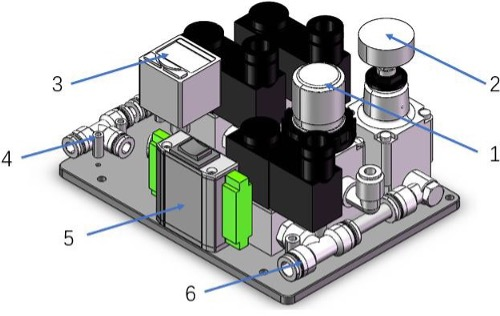
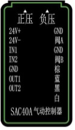

# 柔性抓取器专业版

> **兼容型号:** myCobot 320, myCobot Pro 600

## 产品图片

  

## 规格

**夹具**

| **图片**     |  |
| :----------- | :--------------------------------------------------------------------------------------------------------------------------------------------- |
| 材料         | 金属                                                                                                                                           |
| 夹取范围     | 36-136mm                                                                                                                                       |
| 夹紧力       | 垂直 600g 包裹 1080g                                                                                                                           |
| 重复性精度   | 0.5 mm                                                                                                                                         |
| 使用寿命     | 1 year                                                                                                                                         |
| 驱动模式     | 气动                                                                                                                                           |
| 变速箱模式   | 形变                                                                                                                                           |
| 尺寸         | 170x128x195mm                                                                                                                                  |
| 重量         | 365 grams                                                                                                                                      |
| 固定方法     | 螺丝固定                                                                                                                                       |
| 使用环境要求 | 常温常压                                                                                                                                       |
| 控制接口     | SAC40A 气动控制器                                                                                                                              |
| 适用设备     | ER myCobot 320 series, ER myCobot Pro 600                                                                                                      |

**控制器**

| **图片**    |        |
| :---------- | :---------------------------------------------------------------------------------------------------------------------------------------------------- |
| 电源        | 24V 1.5A                                                                                                                                              |
| 控制方式    | IO                                                                                                                                                    |
| 气源压力    | > 0.4 MPA                                                                                                                                             |
| 流量        | > 40 L/MIN                                                                                                                                            |
| IO          |    |
| Value State | IN1: HIGH & IN2: LOW = 关闭夹爪   IN1: LOW & IN2: HIGH = 开启夹爪   注意 ⚠️：使用 IO 控制时，确保将上述三档拨动开关设置在中间位置。             |
| 船型开关    | 三档拨动开关                                                                                                                                          |
| 正压        | 夹爪关闭                                                                                                                                              |
| 负压        | 夹爪打开                                                                                                                                              |

## 用于抓取物体

**引言**

- 传统的工业吸盘需要吸住材料的平面。在越来越多的工作条件下，吸盘表面很容易损坏面板或部件。触感柔软的抓手可捏住边缘，轻松抓住面板，不留痕迹，也不会损坏面板，确保产品表面不受破坏。提高成品率。

- 柔性夹爪采用模块化设计，重量轻，可根据面板尺寸自由排列组合。

- 传统油缸的夹紧力一般较大，且力难以控制。夹持面板的边缘容易受到挤压和翘曲。弹性夹爪的单指夹紧力精确可控，不会夹住易碎工件。

**工作原理**

- 软爪是一种创新的仿生软爪，由研究人员模仿海星的胳膊和腿的形状研制而成。软爪的 "手指 "由柔性高分子硅胶材料制成，可以通过充气弯曲变形。它能像海星一样自适应地覆盖目标物体，并能完成对特殊形状和易碎物体的柔性无损抓取。

**适用对象**

- 合理大小范围内的任何形状的物体

## 购买链接:

- [淘宝](https://shop504055678.taobao.com)
- [shopify](https://shop.elephantrobotics.com/)

## 如何使用

1 安装:  

- 气动回路连接和压力调整：在连接到软机械手柄之前，先调节正压（出口可暂时用指尖堵住，确保正压严格小于 100KPA，以免手指受伤）。

- 用于连接和调节气动回路：首先，在连接软质机械手柄之前设定正压。用指尖暂时堵住出气口，防止空气溢出，确保正压严格控制在 100KPA 以下，以免手指受伤。

- **连接气源**：将气源连接至端口 6（入口），确保压力高于 0.4MPA 且流量超过 40 L/min。
- **连接软机械手柄**：将软机械手柄连接到端口 4（出口）。
- **通电**：为连接 5 供电。
- **调整正压**：使用切换开关选择正压。根据压力表调节调节器，直至达到所需压力。
- **切换至负压**：负压调节时，拉起调节器盖，旋转至设定值，然后向下按以锁定。

特别提醒 ⚠️：关于压力保持，正压和负压都可以在启动 0.5 秒后保持，使机械抓手保持其预设压力。这种方法非常节能，特别是因为持续保持负压会消耗更多空气。此外，它还能防止在意外断电或断气的情况下失去对物体的抓力，确保操作的可靠性。

[← 周边配件页](../README.md#gripper) | [下一页 →](../1.4.2-PumpCup/1-ModuleSuctionCup.md)
