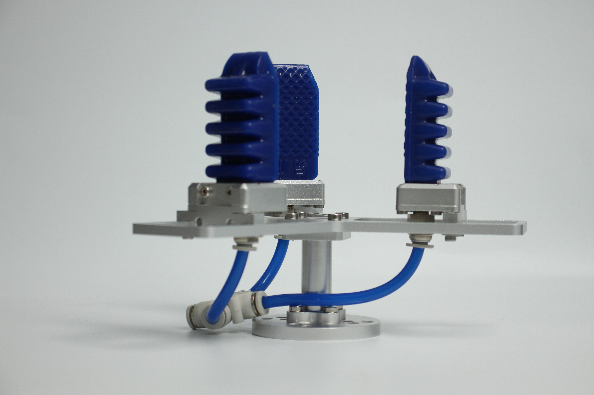

# Flexible Gripper Pro

> **Compatible models:** myCobot 320, myCobot Pro 600

## Product Icon

  

## Specifications
**Gripper**
| Picture          |              |
| ----------------------------- | ----------------------------------------- |
| Material                      | Metal                                     |
| clamping rangeclamp size      | 36-136mm                                  |
| clamp force                   | Vertical 600g wrap 1080g                  |
| Repeatability precision       | 0.5 mm                                    |
| service life lifetime         | 1 year                                    |
| drive mode drive              | pneumatic                                 |
| Transmission modetransmission | deformation                               |
| size                          | 170x128x195mm                             |
| weightweight                  | 365 grams                                 |
| Fixed method fixed            | screw fixed                               |
| Use environment requirements  | Temperature and pressure                  |
| control interface control     | SAC40A Pneumatic Controller                             |
| Applicable equipment          | ER myCobot 320 series, ER myCobot Pro 600 |

**Controller**
| **Picture**    |        |
| -------------- | ------------------- |
|Power  | 24V 1.5A   |
|Controller| IO |
| Air Source Pressure | > 0.4 MPA      |
| Flow Rate          | > 40 L/MIN     |
| IO|     |
|Value State | IN1: HIGH & IN2: LOW = Close Gripper   IN1: LOW & IN2: HIGH = Open Gripper   Caution ⚠️: When using IO control, ensure the three-position toggle switch above is set to the middle position. |
|船型开关|The term "船型开关" translates to "toggle switch," specifically referring to a three-position toggle switch.|
|正压|Gripper Close|
|负压|Gripper Open|

## Use for Gripping Objects

**Introduction**

- Traditional industrial suction cups need to absorb the flat surface of the material. In more and more working conditions, the suction surface is easy to damage the panel or components. The soft-touch gripper pinches the edge to grab the panel easily and without trace or damage, ensuring that the product surface is flawless. , Improve the yield rate.

- The modular design of the soft-touch gripper is light in weight and can be freely arranged and combined according to the size of the panel.

- The clamping force of traditional cylinders is generally large, and the force is difficult to control. The edge of the clamping panel is easy to pinch and warp. The single-finger clamping force of the flexible jaws is precise and controllable, and will not pinch fragile workpieces.

**working principle**

- The flexible gripper is an innovative bionic flexible gripper developed by researchers to imitate the shape of the starfish's arms and legs. The "fingers" of the soft claw are made of flexible polymer silicone material, which can be bent and deformed by inflation. It can adaptively cover the target object like a starfish, and can complete the flexible and non-destructive grasping of special-shaped and fragile objects. Pick.

**Applicable object**

- Objects of any shape within a reasonable size

## Mall link: 

-   [Taobao](https://shop504055678.taobao.com)
-   [shopify](https://shop.elephantrobotics.com/)

 ## How to use

1 Installing:  

- Pneumatic Circuit Connection and Pressure Adjustment: Start by adjusting the positive pressure before connecting to the soft mechanical grip (the outlet can temporarily be blocked with a fingertip, ensure the positive pressure is strictly less than 100KPA to avoid potential finger injury).

- For connecting and adjusting the pneumatic circuit: First, set the positive pressure before connecting to a soft mechanical grip. Temporarily block the outlet with a fingertip to prevent air escape, ensuring the positive pressure is strictly below 100KPA to avoid potential injury to the finger.

-  **Connect to Air Source**: Attach the air source to port 6 (inlet), ensuring the pressure is above 0.4MPA and flow exceeds 40L/MIN.
-  **Connect Soft Mechanical Grip**: Link the soft mechanical grip to port 4 (outlet).
-  **Power Up**: Supply power to connection 5.
-  **Adjust Positive Pressure**: Use the toggle switch to select positive pressure. Adjust the regulator as per the gauge until desired pressure is reached.
-  **Switch to Negative Pressure**: For negative pressure adjustment, pull up the regulator cap, turn to set, then push down to lock.

Special Reminder ⚠️: Regarding pressure maintenance, both positive and negative pressures can be maintained after 0.5 seconds of activation, allowing the mechanical grip to retain its preset pressure. This approach is energy-efficient, especially since maintaining negative pressure continuously consumes more air. Additionally, it prevents the loss of grip on objects in case of unexpected power or air supply cut-offs, ensuring operational reliability.

[← Accessories Tools Page](../1.4-AccessoriesTools.md#gripper)