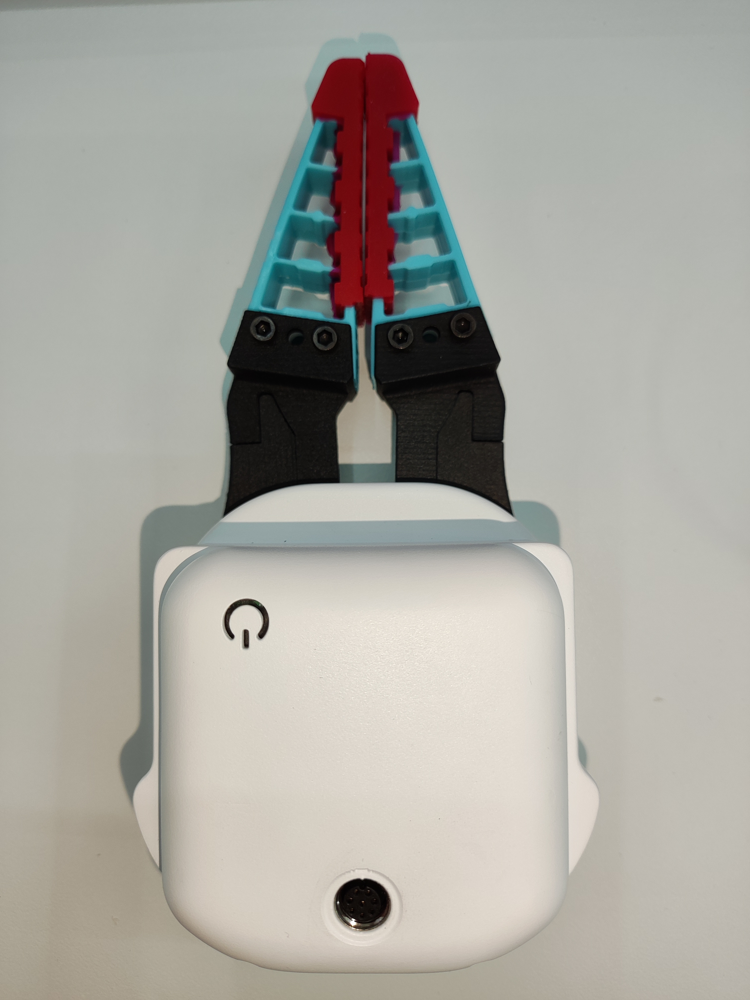
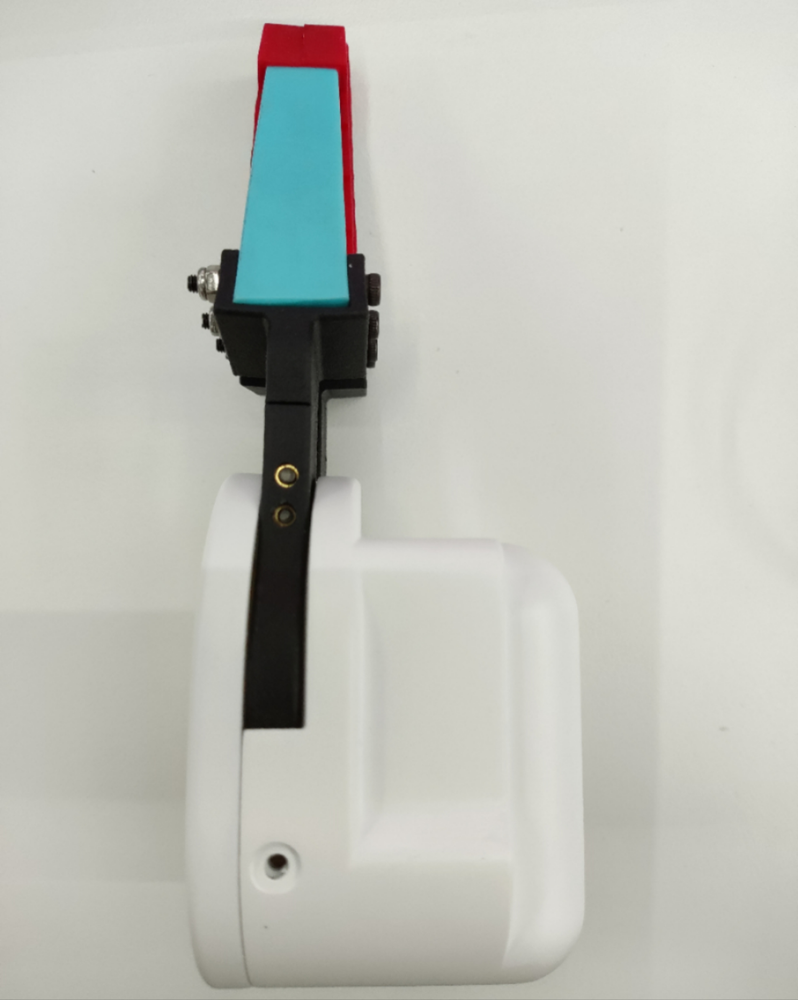
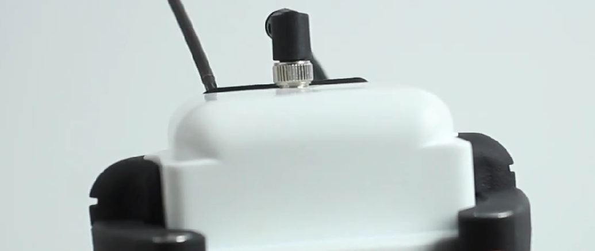
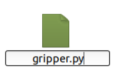
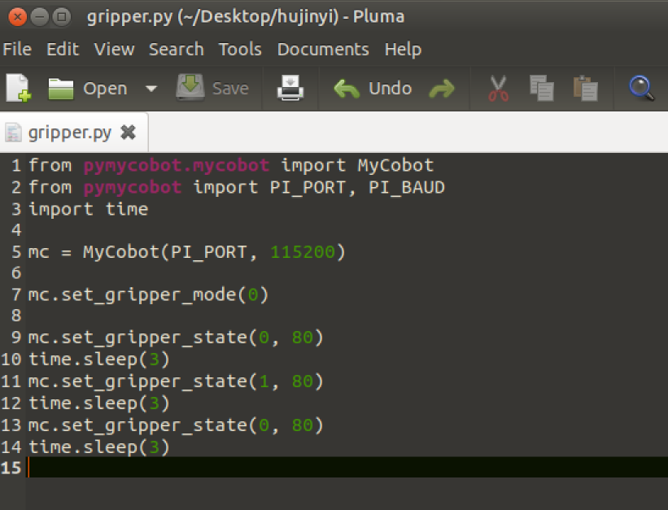
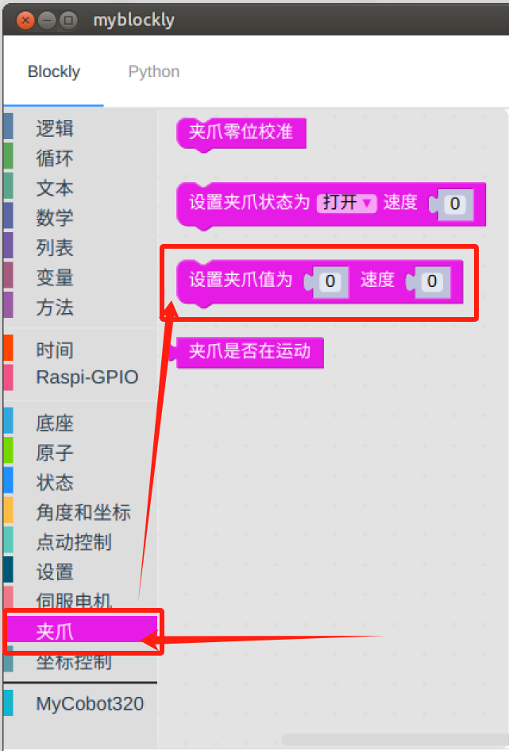
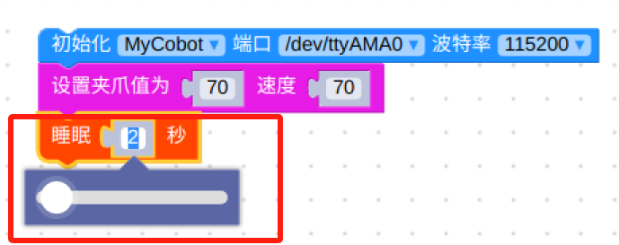
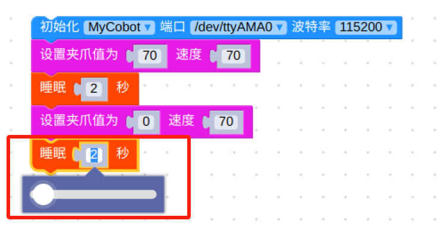
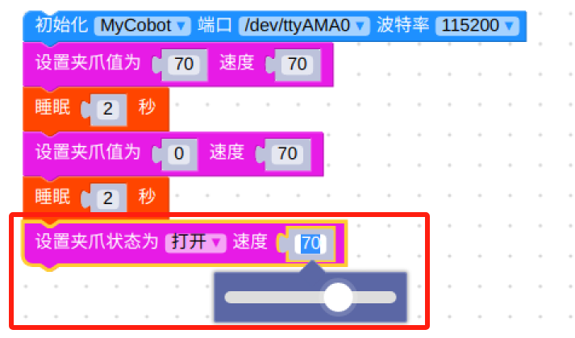

# myCobotPro 柔性夹爪-两指电动

**适配型号**：myCobot 320

**产品图示**





**规格说明：**

| 名称 name              | myCobotPro 自适应夹爪 黑白色             |
| ---------------------- | ---------------------------------------- |
| 材料                   | 光敏树脂+金属                            |
| 工艺 technology        | 3D 打印                                  |
| 夹持范围 clamp size    | 20mm-180mm                                |
| 最大夹持力 clamp force | 1000 克                                  |
| 重复精度 precision     | 0.5 毫米                                 |
| 使用寿命 lifetime      | 1 年                                     |
| 驱动方式 drive         | 电动                                     |
| 传动方式 transmission  | 齿轮+连杆                                |
| 尺寸 size              | 158x105x55mm                             |
| 重量 weight            | 350 克                                   |
| 固定方式 fixed         | 螺丝固定                                 |
| 使用环境要求           | 常温常压                                 |
| 控制接口 control       | 串口/IO 控制                             |
| 适用设备               | ER myCobot 320 M5
ER myCobot 320 Pi
ER myCobot Pro 600 |

**柔性夹爪:** 夹取物体使用

**简介**

- 传统工业吸盘需要吸取物料的平整表面，在越来越多的工况中，吸取表面容易损伤面板或元器件，柔触夹爪捏边抓取，轻松无痕无损搬运面板，确保产品表面无瑕疵，提升良品率。
- 柔触夹爪的模块化设计，自重轻，可以按照面板尺寸自由排列组合。
- 传统气缸的夹持力普遍较大，且力度难以控制，夹持面板的边缘容易夹伤夹翘，柔性夹爪的单指夹持力精准可控，不会夹伤脆弱工件。

**工作原理**

- 柔性夹爪是研究人员模仿海星腕足的形态，研发出的一种创新型仿生柔性夹具。软爪的“手指”是由高分子硅胶柔性材料制作而成，通过充气实现弯曲形变，能够像海星一样，自适应地包覆住目标物体，可完成对异形、易损物品的柔性、无损抓取 。

**适用物体**

- 合理大小内的任意形状物体

**安装使用**

- 夹爪安装：

  - 结构安装：

    1. 将垫片对准机械臂末端孔位，配合螺丝拧紧：
       

    2. 将夹爪的螺丝孔对准垫片四周的孔位，配合细螺丝拧紧：
       

  - 电气连接：
    > 注意在机械臂断电状态下进行。
    1. 将 m8 线对准机械臂的接口，注意接口处有缺口，连接线有对应突起，确认方向后插入，并拧紧：
       
    2. 插入夹爪控制接口，同样注意缺口的方向：
       

<br>

**myCobot Pro 320 使用说明**

- 编程开发（python）：

  > 使用 python 对夹爪进行编程开发：
  > [python 环境下载](../../../7-ApplicationBasePython/7.1_download.md)

  1. 新建 python 文件：  
     在想要的文件路径下右键新建 python 文件：  
     

     > 文件名字可以根据需要修改

     

  2. 进行功能编程：
     

     > 代码如下：

     - M5 版本：

     ```python
     from pymycobot.mycobot import MyCobot
     import time

     # 初始化一个MyCobot对象
     mc = MyCobot("COM3", 115200)

     #设置夹爪为485模式
     mc.set_gripper_mode(0)
     # 控制夹爪打开-关闭-打开：
     #使用夹爪状态接口0为张开，1为关闭
     mc.set_gripper_state(0, 80)
     time.sleep(3)
     mc.set_gripper_state(1, 80)
     time.sleep(3)
     mc.set_gripper_state(0, 80)
     time.sleep(3)

     # 详细接口使用可以查看python API
     ```

     - Pi 版本：

     ```python
     from pymycobot.mycobot import MyCobot
     from pymycobot import PI_PORT, PI_BAUD  # 当使用树莓派版本的mycobot时，可以引用这两个变量进行MyCobot初始化
     import time

     # 初始化一个MyCobot对象
     mc = MyCobot(PI_PORT, 115200)

     #设置夹爪为485模式
     mc.set_gripper_mode(0)
     # 控制夹爪打开-关闭-打开：
     #使用夹爪状态接口0为张开，1为关闭
     mc.set_gripper_state(0, 80)
     time.sleep(3)
     mc.set_gripper_state(1, 80)
     time.sleep(3)
     mc.set_gripper_state(0, 80)
     time.sleep(3)

     # 详细接口使用可以查看python API
     ```

  3. 保存文件并关闭，在文件夹空白处右键打开命令行终端

     

     输入：

     ```bash
     python gripper.py
     ```

     

     > 可以看到夹爪打开-关闭-打开

- 编程开发（myblockly）：

  > 使用 myblockly 对夹爪进行编程开发：
  > [myblockly 下载](../../../5-BasicApplication/5.2-ApplicationUse/myblockly/320pi/2-install_uninstall.md)  
  > 注意使用 myblockly 开发前，需要先用 python 程序运行过`mc.set_gripper_mode(0)`，将夹爪设置为 485 模式。

  1. 确认结构及电气连接都完成后，启动机械臂，出现图形界面后打开 myblockly 软件  
     
  2. 修改波特率为 115200  
     
  3. 在左侧列表找到 `夹爪`，选择`设置夹爪值`模块  
     
  4. 拖动模块连接在`初始化mycobot`模块下面，根据需要修改张开的程度和速度，这里都设置为`70`  
     
  5. 在`时间`，选择`睡眠`模块  
     
  6. 设置时间为 `2 秒`，目的是留出夹爪运动时间  
     
  7. 重复选择一次`设置夹爪值`和`睡眠`模块，将`设置夹爪值`张开程度改为`0`  
     
     
  8. 在左侧列表找到 `夹爪`，选择`设置夹爪值`模块
     
  9. 修改状态为`打开`，速度为`70`
     
  10. 点击右上角的绿色运行图标，可以看到夹爪`打开-关闭-打开`的运动状态
