# **myCobotPro Flexible Gripper - 2-finger electric**

**Compatible models:**：myCobot 320

**product icon**

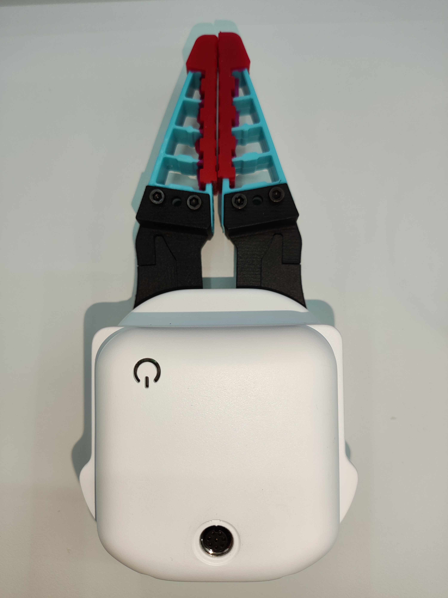

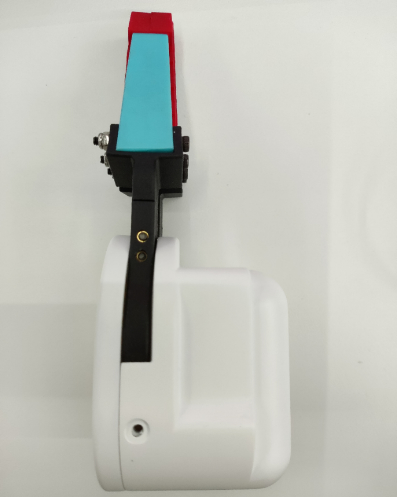

**Specification:**

| name       | myCobotPro Flexible Gripper - 2-finger electric |
| ---------------------- | ---------------------------------------- |
| Material      | Photosensitive resin + metal       |
| clamping rangeclamp size      | 3D printing                |
| clamp size    | 20mm-180mm               |
|  clamp force | 1000 gram                   |
| Repeatability precision       | 0.5 mm         |
| service life lifetime         | 1 year              |
| drive mode drive         | electric powered       |
| Transmission modetransmission  | Gear + connecting rod             |
| size              | 158x105x55mm                             |
| weight            | 350 gram                                   |
| fixed method         | screw                                 |
| Use environment requirements  | atmospheric and atmospheric pressure |
| control interface control       | Serial / IO Control          |
| Applicable equipment               | ER myCobot 320 M5、ER myCobot 320 Pi、ER myCobot Pro 600 |

**Flexible gripper:** used for gripping objects

**Introduction**

- Traditional industrial suction cups need to absorb the flat surface of the material. In more and more working conditions, the suction surface is easy to damage the panel or components. The soft-touch gripper pinches the edge to grab the panel easily and without trace or damage, ensuring that the product surface is flawless. , Improve the yield rate.

- The modular design of the soft-touch gripper is light in weight and can be freely arranged and combined according to the size of the panel.

- The clamping force of traditional cylinders is generally large, and the force is difficult to control. The edge of the clamping panel is easy to pinch and warp. The single-finger clamping force of the flexible jaws is precise and controllable, and will not pinch fragile workpieces.

**working principle**

- The flexible gripper is an innovative bionic flexible gripper developed by researchers to imitate the shape of the starfish's arms and legs. The "fingers" of the soft claw are made of flexible polymer silicone material, which can be bent and deformed by inflation. It can adaptively cover the target object like a starfish, and can complete the flexible and non-destructive grasping of special-shaped and fragile objects Pick.

**Applicable object**

- Objects of any shape within a reasonable size

**Installation and use**

- Structural installation:

  - Structural installation:

    1. Align the spacer with the hole in the end of the arm and tighten it with the screw:
       

    2. Align the screw holes in the jaws with the holes around the gasket and tighten with the fine screws:
       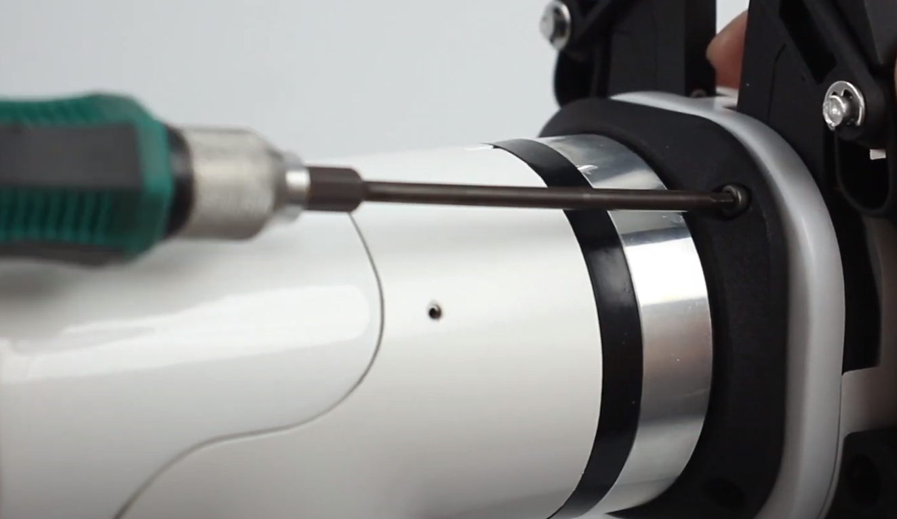

  - Electrical connection:
    > Take care to do this with the robotic arm powered off.
    1. Align the m8 cable with the connector of the robotic arm, note that the connector is notched and the connecting cable has a corresponding protrusion, confirm the direction and then insert and tighten:
       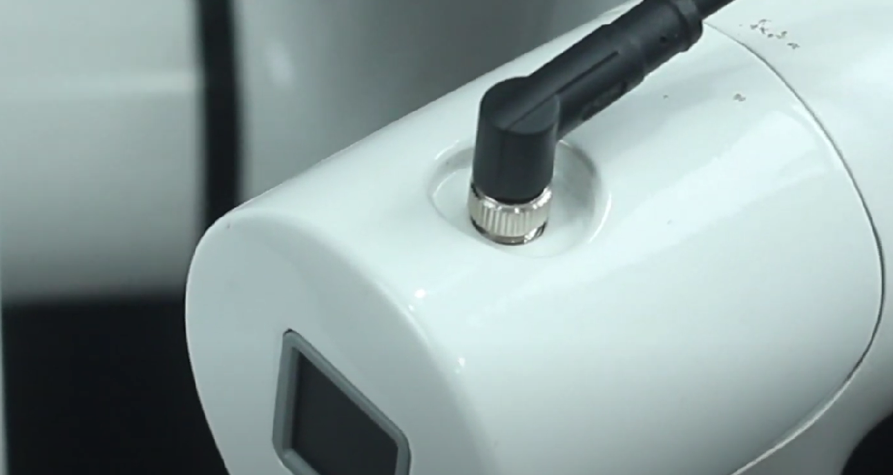
    2. Insert the jaw control connector, again paying attention to the orientation of the notch:
       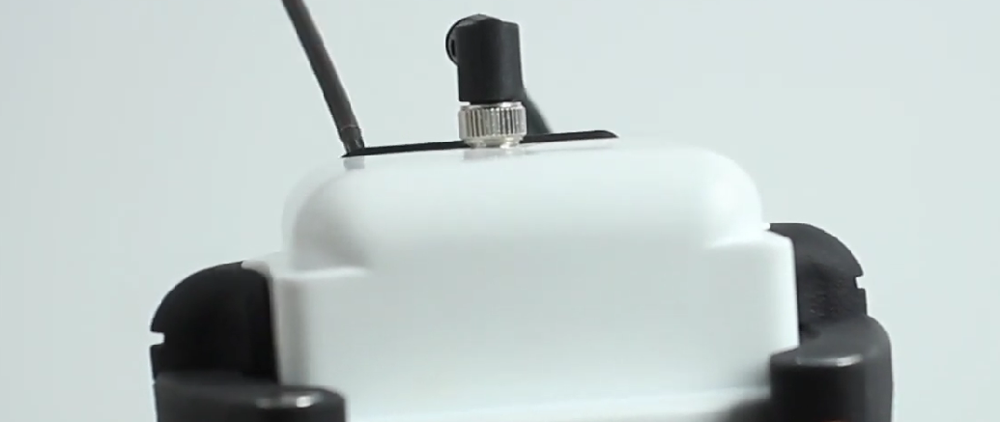

<br>

**Instructions for using myCobot Pro 320**

- Programming development (python):

  > Programming development of the clamping jaws using python:
  > [python environment download](../../../7-ApplicationBasePython/7.1_download.md)

  1. Create a new python file:  
     Right click on the desired file path to create a new python file:  
     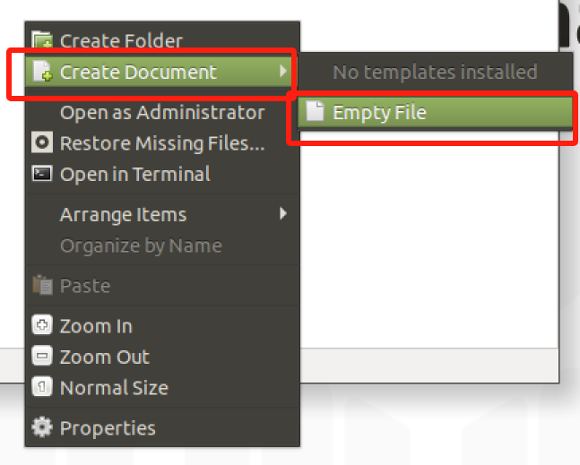

     > The name of the file can be changed as needed

     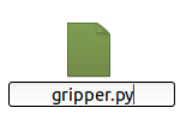

  2. Perform function programming:
     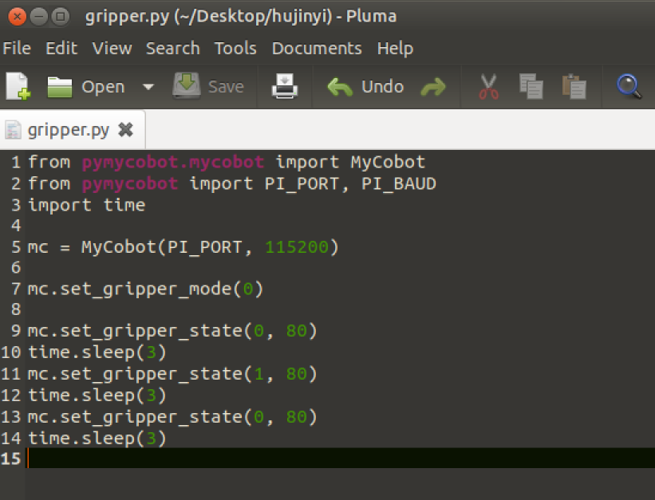

     > The codes are listed below:

     - M5 Version:

     ```python
     from pymycobot.mycobot import MyCobot
     import time

     # Initialise a MyCobot object
     mc = MyCobot("COM3", 115200)

     # Set the gripper jaws to 485 mode
     mc.set_gripper_mode(0)
     # Controls the gripper jaws to open-close-open:
     # Use gripper status interface 0 for open, 1 for closed
     mc.set_gripper_state(0, 80)
     time.sleep(3)
     mc.set_gripper_state(1, 80)
     time.sleep(3)
     mc.set_gripper_state(0, 80)
     time.sleep(3)

     # See the python API for details on interface usage.
     ```

     - Pi version:

     ```python
     from pymycobot.mycobot import MyCobot
     from pymycobot import PI_PORT, PI_BAUD # When using the Raspberry Pi version of mycobot, you can reference these two variables for MyCobot initialisation
     import time

     # Initialise a MyCobot object
     mc = MyCobot(PI_PORT, 115200)

     # Set the gripper jaws to 485 mode
     mc.set_gripper_mode(0)
     # Controls the gripper jaws to open-close-open:
     # Use gripper status interface 0 for open, 1 for closed
     mc.set_gripper_state(0, 80)
     time.sleep(3)
     mc.set_gripper_state(1, 80)
     time.sleep(3)
     mc.set_gripper_state(0, 80)
     time.sleep(3)

     # See the python API for details on interface usage.
     ```

  3. Save the file and close it, and open a command-line terminal by right-clicking on an empty space in the folder.

     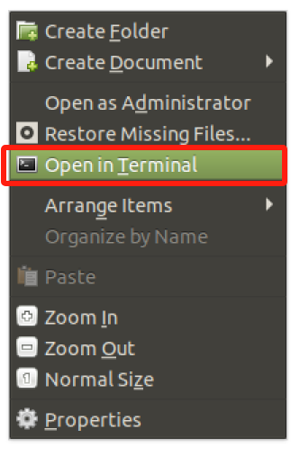

     Input:

     ```bash
     python gripper.py
     ```

     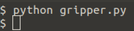

     > You can see the jaws open-close-open.

- Programming Development (myblockly):

  > Programming development of the jaws using myblockly:
  > [myblockly download](../../../5-BasicApplication/5.2-ApplicationUse/myblockly/320pi/2-install_uninstall.md)  
  > Before developing with myblockly, you need to run `mc.set_gripper_mode(0)` in python to set the gripper to 485 mode.

  1. After confirming that the structural and electrical connections are complete, start the arm and open the myblockly software when the graphical interface appears.  
     
  2. Modify the baud rate to 115200  
     
  3. Find `Jaws` in the list on the left and select the `Set Jaw Value` module.   
     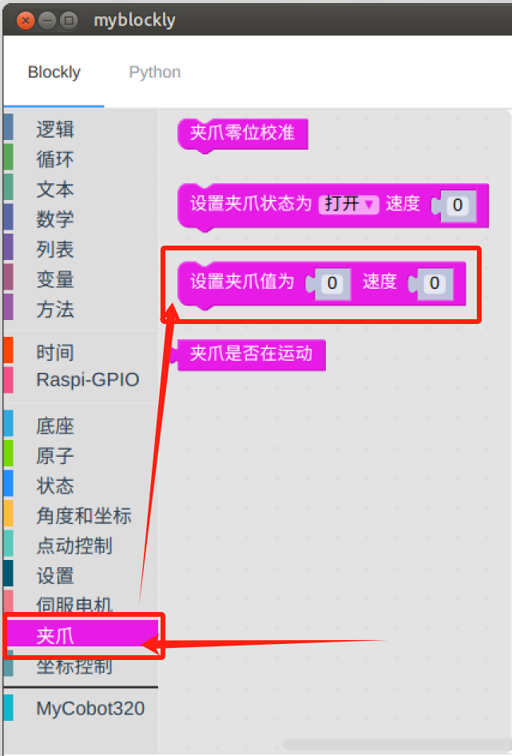
  4. The drag module is attached under the `initialise mycobot' module, modifying the degree of spread and speed as required, which is set to `70' here.  
     
  5. In `Time', select `Sleep' module  
     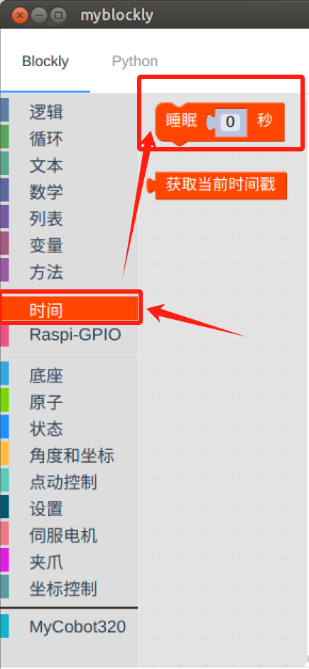
  6. Set the time to `2 seconds' to allow time for the jaws to move.  
     
  7. Repeat the selection of the `Set Jaw Value' and `Sleep' modules to change the `Set Jaw Value' opening level to `0'.  
     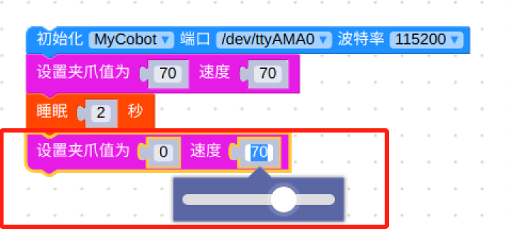
     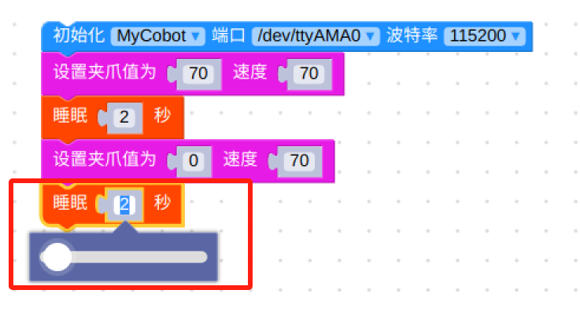
  8. Find `Jaws' in the list on the left and select the `Set Jaw Value' module.
     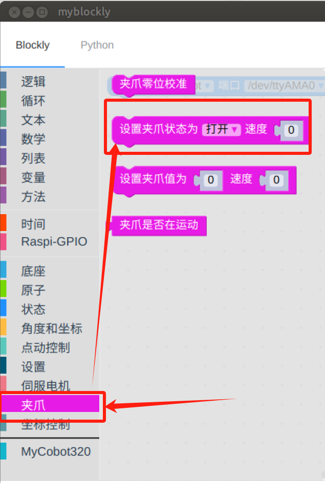
  9. Modify status to `open' and speed to `70'.
     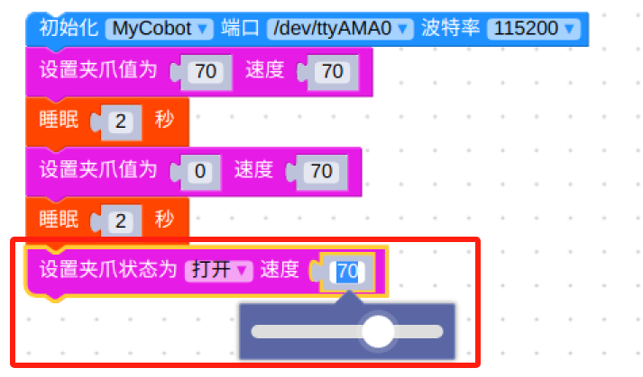
  10. Click on the green running icon in the upper right corner to see the `open-close-open' movement of the jaws.
