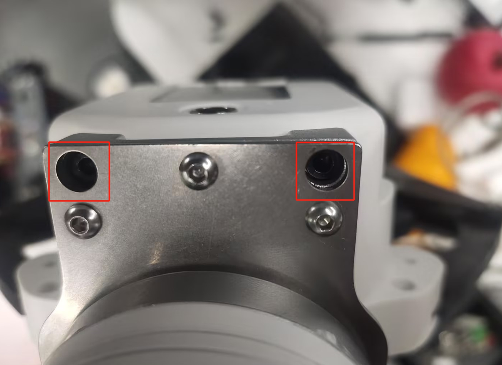

# myCobot Pro 力控夹爪

## 1 产品图片


## 2 规格参数说明

| **名称**     | **myCobot Pro 力控夹爪**      |
| :----------- | :-------------------------------------- |
| 材料         | PC、PBT                       |
| 尺寸        | 156X106X61mm                       |
| 工艺技术     | 注塑                                |
| 夹取范围     | 0-100毫米（默认指尖）                                |
| 重复性精度   | 0.5 mm                                  |
| 使用寿命     | 30万次开合                                    |
| 驱动模式     | 电驱动                                  |
| 传动方式   | 齿轮+连杆                             |
| 尺寸         | 158x105x55mm                            |
| 重量         | 340 g                               |
| 额定负载   | 500g                                  |
| 工作电压   | 24V                                 |
| 固定方法     | 螺丝固定                                |
| 使用环境要求 | 常温常压                                |
| 控制接口     | RS485/IO 控制/按键控制                        |
| 适用设备     | ER myCobot 320系列,ER Mercury系列,ER myCobot Pro 600,ERmyCobot Pro 630,其他通用机器人 |

## 3 工作原理
在电机的驱动下，机械手的手指表面做直线往复运动，实现打开或关闭动作。通过设置夹持力矩，使工件的冲击最小，定位点可控，夹紧可控。

## 4 使用场景
实验操作：在科研实验中，完成试管、器皿等的抓取和移动，确保实验的安全和准确性。
教育演示：作为教学工具，帮助学生理解机器人抓取原理，培养实践能力。
物料搬运：在模拟生产线或仓储中，搬运各种规格的物料，提高工作效率。

## 5 安装方式

用螺丝和垫片将夹爪连接件安装到机械臂末端法兰


再用螺丝将夹爪安装在连接件上




最后用M8航空线将夹爪和机械臂就行连接


## 6 python控制方式

机械臂需要烧录支持力控夹爪的pico固件，以及安装支持力控夹爪的pymycobot驱动库，但由于两者还在内测中，并未正式发布，如有需要，请联系售后人员获取

### 6.1 python控制方式API说明

**注意事项**：夹爪每条指令的调用的时间间隔要大于1.5秒。

#### `set_pro_gripper(gripper_id, address, value)`

- **功能**：设置Pro力控夹爪参数，可以设置多种参数功能。具体请查看如下表格。
- **参数**：
  - `gripper_id` (`int`): 夹爪ID，默认14，取值范围 1 ~ 254。
  - `address` (`int`): 夹爪的指令序号。
  - `value` ：指令序号对应的参数值。

<table>
  <tr>
    <th>功能</th>
    <th>gripper_id</th>
    <th>address</th>
    <th>value</th>
  </tr>
  <tr>
    <td>设置夹爪ID</td>
    <td style="text-align: center;">14</td>
    <td style="text-align: center;">3</td>
    <td>1 ~ 254</td>
  </tr>
  <tr>
    <td>设置夹爪使能状态</td>
    <td style="text-align: center;">14</td>
    <td style="text-align: center;">10</td>
    <td>0或者1, 0 - 掉使能; 1 - 上使能</td>
  </tr>
  <tr>
    <td>设置夹爪顺时针可运行误差</td>
    <td style="text-align: center;">14</td>
    <td style="text-align: center;">21</td>
    <td>0 ~ 16</td>
  </tr>
  <tr>
    <td>设置夹爪逆时针可运行误差</td>
    <td style="text-align: center;">14</td>
    <td style="text-align: center;">23</td>
    <td>0 ~ 16</td>
  </tr>
  <tr>
    <td>设置夹爪最小启动力</td>
    <td style="text-align: center;">14</td>
    <td style="text-align: center;">25</td>
    <td>0 ~ 254</td>
  </tr>
  <tr>
    <td>IO输出设置</td>
    <td style="text-align: center;">14</td>
    <td style="text-align: center;">29</td>
    <td>0, 1, 16, 17</td>
  </tr>
  <tr>
    <td>设置IO张开角度</td>
    <td style="text-align: center;">14</td>
    <td style="text-align: center;">30</td>
    <td>0 ~ 100</td>
  </tr>
  <tr>
    <td>设置IO闭合角度</td>
    <td style="text-align: center;">14</td>
    <td style="text-align: center;">31</td>
    <td>0 ~ 100</td>
  </tr>
  <tr>
    <td>设置舵机虚位数值</td>
    <td style="text-align: center;">14</td>
    <td style="text-align: center;">41</td>
    <td>0 ~ 100</td>
  </tr>
  <tr>
    <td>设置夹持电流</td>
    <td style="text-align: center;">14</td>
    <td style="text-align: center;">43</td>
    <td>1 ~ 254</td>
  </tr>
</table>

- **返回值**:
  - 请查看如下表格：

<table>
  <tr>
    <th>功能</th>
    <th>返回值</th>
  </tr>
  <tr>
    <td>设置夹爪ID</td>
    <td>0 - 失败； 1 - 成功</td>
  </tr>
  <tr>
    <td>设置夹爪使能状态</td>
    <td>0 - 失败； 1 - 成功</td>
  </tr>
  <tr>
    <td>设置夹爪顺时针可运行误差</td>
    <td>0 - 失败； 1 - 成功</td>
  </tr>
  <tr>
    <td>设置夹爪逆时针可运行误差</td>
    <td>0 - 失败； 1 - 成功</td>
  </tr>
  <tr>
    <td>设置夹爪最小启动力</td>
    <td>0 - 失败； 1 - 成功</td>
  </tr>
  <tr>
    <td>IO输出设置</td>
    <td>0 - 失败； 1 - 成功</td>
  </tr>
  <tr>
    <td>设置IO张开角度</td>
    <td>0 - 失败； 1 - 成功</td>
  </tr>
  <tr>
    <td>设置IO闭合角度</td>
    <td>0 - 失败； 1 - 成功</td>
  </tr>
  <tr>
    <td>设置舵机虚位数值</td>
    <td>0 - 失败； 1 - 成功</td>
  </tr>
  <tr>
    <td>设置夹持电流</td>
    <td>0 - 失败； 1 - 成功</td>
  </tr>
</table>


#### `get_pro_gripper(gripper_id, address)`

- **功能**：获取Pro力控夹爪参数，可以获取多种参数功能。具体请查看如下表格。
- **参数**：
  - `gripper_id` (`int`): 夹爪ID，默认14，取值范围 1 ~ 254。
  - `address` (`int`): 夹爪的指令序号。

<table>
  <tr>
    <th>功能</th>
    <th>gripper_id</th>
    <th>address</th>
  </tr>
  <tr>
    <td>读取固件主版本号</td>
    <td style="text-align: center;">14</td>
    <td style="text-align: center;">1</td>
  </tr>
  <tr>
    <td>读取固件次版本号</td>
    <td style="text-align: center;">14</td>
    <td style="text-align: center;">2</td>
  </tr>
  <tr>
    <td>读取夹爪ID</td>
    <td style="text-align: center;">14</td>
    <td style="text-align: center;">3</td>
  </tr>
  <tr>
    <td>读取夹爪顺时针可运行误差</td>
    <td style="text-align: center;">14</td>
    <td style="text-align: center;">22</td>
  </tr>
  <tr>
    <td>读取夹爪逆时针可运行误差</td>
    <td style="text-align: center;">14</td>
    <td style="text-align: center;">24</td>
  </tr>
  <tr>
    <td>读取夹爪最小启动力</td>
    <td style="text-align: center;">14</td>
    <td style="text-align: center;">26</td>
  </tr>
  <tr>
    <td>读取IO张开角度</td>
    <td style="text-align: center;">14</td>
    <td style="text-align: center;">34</td>
  </tr>
  <tr>
    <td>读取IO闭合角度</td>
    <td style="text-align: center;">14</td>
    <td style="text-align: center;">35</td>
  </tr>
  <tr>
    <td>获取当前队列的数据量</td>
    <td style="text-align: center;">14</td>
    <td style="text-align: center;">40</td>
  </tr>
  <tr>
    <td>读取舵机虚位数值</td>
    <td style="text-align: center;">14</td>
    <td style="text-align: center;">42</td>
  </tr>
  <tr>
    <td>读取夹持电流</td>
    <td style="text-align: center;">14</td>
    <td style="text-align: center;">44</td>
  </tr>
</table>

- **返回值**：
  - 查看如下表格（若返回值为 -1，则表示读不到数据）：
  
<table>
  <tr>
    <th>功能</th>
    <th>返回值</th>
  </tr>
  <tr>
    <td>读取固件主版本号</td>
    <td>主版本号</td>
  </tr>
  <tr>
    <td>读取固件次版本号</td>
    <td>次版本号</td>
  </tr>
  <tr>
    <td>读取夹爪ID</td>
    <td>1 ~ 254</td>
  </tr>
  <tr>
    <td>读取夹爪顺时针可运行误差</td>
    <td>0 ~ 254</td>
  </tr>
  <tr>
    <td>读取夹爪逆时针可运行误差</td>
    <td>0 ~ 254</td>
  </tr>
  <tr>
    <td>读取夹爪最小启动力</td>
    <td>0 ~ 254</td>
  </tr>
  <tr>
    <td>读取IO张开角度</td>
    <td>0 ~ 100</td>
  </tr>
  <tr>
    <td>读取IO闭合角度</td>
    <td>0 ~ 100</td>
  </tr>
  <tr>
    <td>获取当前队列的数据量</td>
    <td>返回当前绝对控制队列中的数据量</td>
  </tr>
  <tr>
    <td>读取舵机虚位数值</td>
    <td>0 ~ 100</td>
  </tr>
  <tr>
    <td>读取夹持电流</td>
    <td>1 ~ 254</td>
  </tr>
</table>
  
#### `set_pro_gripper_angle(gripper_id, gripper_angle)`

- **功能**：设置力控夹爪角度。
- **参数**：
  - `gripper_id` (`int`): 夹爪ID，默认14，取值范围1 ~ 254。
  - `gripper_angle` (`int`): 夹爪角度，取值范围 0 ~ 100。
- **返回值**：
  - 0 - 失败
  - 1 - 成功

####  `get_pro_gripper_angle(gripper_id)`

- **功能**：读取力控夹爪角度。
- **参数**：
  - `gripper_id` (`int`): 夹爪ID，默认14，取值范围 1 ~ 254。
- **返回值**：`int`  0 ~ 100

####  `set_pro_gripper_open(gripper_id)`

- **功能**：打开力控夹爪。
- **参数**：
  - `gripper_id` (`int`): 夹爪ID，默认14，取值范围 1 ~ 254。
- **返回值**：
  - 0 - 失败
  - 1 - 成功

####  `set_pro_gripper_close(gripper_id)`

- **功能**：关闭力控夹爪。
- **参数**：
  - `gripper_id` (`int`): 夹爪ID，默认14，取值范围 1 ~ 254。
- **返回值**：
  - 0 - 失败
  - 1 - 成功

####  `set_pro_gripper_calibration(gripper_id)`

- **功能**：设置力控夹爪零位。（首次使用需要先设置零位）
- **参数**：
  - `gripper_id` (`int`): 夹爪ID，默认14，取值范围 1 ~ 254。
- **返回值**：
  - 0 - 失败
  - 1 - 成功

####  `get_pro_gripper_status(gripper_id)`

- **功能**：读取力控夹爪夹持状态。
- **参数**：
  - `gripper_id` (`int`): 夹爪ID，默认14，取值范围 1 ~ 254。
- **返回值:**
  - `0` - 正在运动。
  - `1` - 停止运动，未检测到夹到物体。
  - `2` - 停止运动，检测到夹到物体。
  - `3` - 检测到夹到物体之后，物体掉落。

#### `set_pro_gripper_torque(gripper_id, torque_value)`

- **功能**：设置力控夹爪扭矩。
- **参数**：
  - `gripper_id` (`int`): 夹爪ID，默认14，取值范围 1 ~ 254。
  - `torque_value` (`int`) ：扭矩值，取值范围 1 ~ 100。
- **返回值**：
  - 0 - 失败
  - 1 - 成功

####  `get_pro_gripper_torque(gripper_id)`

- **功能**：读取力控夹爪扭矩。
- **参数**：
  - `gripper_id` (`int`): 夹爪ID，默认14，取值范围 1 ~ 254。
- **返回值:** (`int`) 100 ~ 300

####  `set_pro_gripper_speed(gripper_id, speed)`

- **功能**：设置力控夹爪速度。
- **参数**：
  - `gripper_id` (`int`): 夹爪ID，默认14，取值范围 1 ~ 254。
  - `speed` (int): 夹爪运动速度，取值范围 1 ~ 100。
- **返回值**：
  - 0 - 失败
  - 1 - 成功

####  `get_pro_gripper_default_speed(gripper_id, speed)`

- **功能**：读取力控夹爪默认速度。
- **参数**：
  - `gripper_id` (`int`): 夹爪ID，默认14，取值范围 1 ~ 254。
- **返回值**：夹爪默认运动速度，范围 1 ~ 100。

####  `set_pro_gripper_abs_angle(gripper_id, gripper_angle)`

- **功能**：设置力控夹爪绝对角度。
- **参数**：
  - `gripper_id` (`int`): 夹爪ID，默认14，取值范围 1 ~ 254。
  - `gripper_angle` (`int`): 夹爪角度，取值范围 0 ~ 100。
- **返回值**：
  - 0 - 失败
  - 1 - 成功

####  `set_pro_gripper_pause(gripper_id)`

- **功能**：暂停运动。
- **参数**：
  - `gripper_id` (`int`) 夹爪ID，默认14，取值范围 1 ~ 254。
- **返回值**：
  - 0 - 失败
  - 1 - 成功
  
####  `set_pro_gripper_resume(gripper_id)`

- **功能**：运动恢复。
- **参数**：
  - `gripper_id` (`int`) 夹爪ID，默认14，取值范围 1 ~ 254。
- **返回值**：
  - 0 - 失败
  - 1 - 成功

####  `set_pro_gripper_stop(gripper_id)`

- **功能**：停止运动。
- **参数**：
  - `gripper_id` (`int`) 夹爪ID，默认14，取值范围 1 ~ 254。
- **返回值**：
  - 0 - 失败
  - 1 - 成功

### 6.2 python 零位校准操作说明
将夹爪连接到机械臂末端后，运行下面的代码，夹爪会先张到最大，然后完全闭合，完成校准。
```Python
from pymycobot import MyCobot320
mc=MyCobot320("COM1")#填写机械臂的串口号
mc.set_pro_gripper_calibration(14)#夹爪的默认ID是14
```

### 6.3 python控制场景案例
#### demo1:力矩值适配
用户可通过观察对应力矩值设置前提下，力控夹爪夹住物体后的形变程度
选择一个形变最小，但可正常夹住物体的力矩值，此力矩值即为当前物体最合适力矩值

```Python
from pymycobot import MyCobot320
import time
mc=MyCobot320("COM1")#填写机械臂的串口号
mc.set_pro_gripper_torque(14,10)#设置力矩值
print(mc.get_pro_gripper_torque(14))#查看设置的力矩值
mc.set_pro_gripper_open(14)#夹爪完全张开
time.sleep(3)
mc.set_pro_gripper_close(14)#夹爪完全闭合
```

#### demo2:A-B点物体抓取移动
```Python
from pymycobot import MyCobot320
import time
mc=MyCobot320("COM1")#填写机械臂的串口号
mc.set_pro_gripper_torque(14,10)#设置夹爪的力矩值
print(mc.get_pro_gripper_torque(14))#打印设置完的夹爪力矩值
mc.set_pro_gripper_open(14)#先让夹爪完全打开
start_angles=[19.68, -1.23, -91.4, -0.52, 90.08, 60.29]
target_coords=[[231.3, -61.3, 232.7, 178.35, -2.7, -130.56],[231.3, 65.3, 232.7, 178.35, -2.7, -130.56]]
end_angles=[80,0,-85,0,90,60]
for i in range(len(target_coords)):
    mc.sync_send_angles(start_angles,50)
    mc.send_coords(target_coords[i],100,1)
    time.sleep(2)
    mc.send_coord(3,165,50)
    time.sleep(2)
    mc.set_pro_gripper_close(14)
    time.sleep(2)
    mc.send_coords(target_coords[i],100,1)
    mc.sync_send_angles(end_angles,100)
    mc.set_pro_gripper_open(14)
    time.sleep(2)
```


