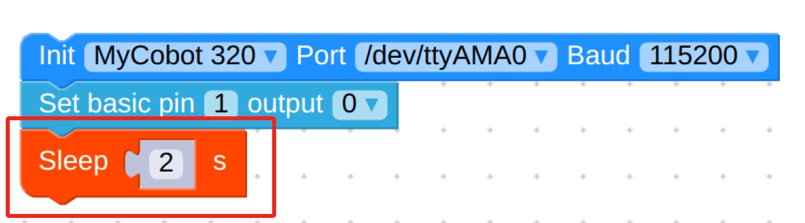
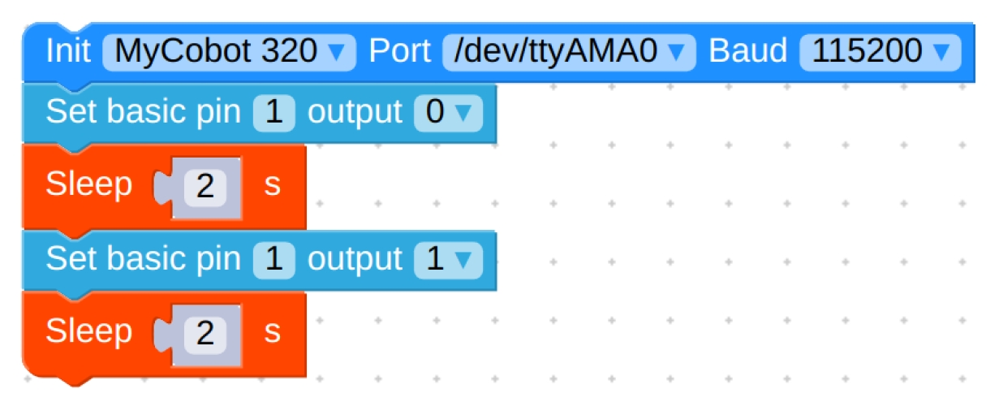

# Module Suction Cup

> **Compatible models:** myCobot 320, myCobot Pro 630

## Product Icon


## Specifications

| **name**                     | **Module suction cup**                           |
| ---------------------------- | ------------------------------------------------ |
| model                        | myCobotPro_suctionPump                           |
| Material                     | Nylon 7100                                       |
| Number of suction cups       | 1/2/4                                            |
| Suction cup size             | diameter 33mm                                    |
| absorb weight                | Maximum 1000g                                    |
| Power source equipment       | Suction and blowing integrated air compressor    |
| service life                 | one year                                         |
| a fixed way                  | screw fixed                                      |
| control interface            | I/O control                                      |
| Use environment requirements | Temperature and pressure                         |
| Applicable equipment         | ER myCobot 320 series, ER myCobot Pro 600 series |

## Use for Objects

**Introduction**

- Suction cup suction pump is that the suction port is connected with the object to be adsorbed through suction cups, tubes and other components, and vacuumizes the suction cup, causing the internal air pressure to change from normal pressure to negative pressure. The pressure difference between the external atmospheric pressure and this negative pressure is used to achieve adsorption. The purpose of living objects.

- The overall structure is a multi-functional expandable suction cup, which can be installed up to 4; high-pressure resistant hose, which can be reused many times; an air compressor with suction and blowing integrated, which can be expanded to other functions.

**working principle**

- Start the suction of the vacuum equipment to generate negative air pressure in the suction cup, so that the object to be lifted can be sucked firmly, and the object to be lifted can be started to be transported.

- When the object to be lifted is transported to the destination, inflate it smoothly into the vacuum suction cup, so that the negative air pressure in the vacuum suction cup becomes zero or slightly positive air pressure, and the vacuum suction cup is separated from the object to be lifted, thus completing the lifting and conveying of heavy objects task.

**Applicable objects :** suitable for objects with flat surfaces

## Mall link:

- [Taobao](https://shop504055678.taobao.com)
- [shopify](https://shop.elephantrobotics.com/)

## How to use


For a system incorporating a suction cup, solenoid valve, and vacuum pump, the connection typically works as follows:

1. **Vacuum Pump**: This is the source of vacuum pressure. It should be connected to the solenoid valve's inlet port.
2. **Solenoid Valve**: Acts as a control mechanism that regulates when and how the vacuum is applied or released to the suction cup. The vacuum pump connects to one side of the solenoid valve, and the suction cup connects to the outlet side.
3. **Suction Cup**: This is the end-effector that directly interacts with the objects to be manipulated. It connects to the outlet side of the solenoid valve.

In operation, when the solenoid valve is energized, it opens, allowing vacuum pressure from the pump to reach the suction cup, enabling it to grip objects. De-energizing the valve cuts off the vacuum, allowing air to flow back to the suction cup, releasing the grip on the object. This setup is efficient for automation systems requiring precise control over picking and placing items.

**Installation and use**

- It needs to be used with an air compressor:
  

  1. Insert the black plug into the row of plugs;

  2. Insert the matching red hose into the connector on the machine:  
     
  3. The red button is the on/off switch, pulling it outwards turns it on, pressing it back turns the machine off:
     

- Suction cup mounting:

  1. Connect the other end of the red hose from the air compressor to the solenoid valve connection:
     
  2. Use the clear hose that comes with the modular suction cup to connect to the connector above the solenoid valve and the hose branch of the modular suction cup respectively:
     
     
  3. Secure the module suction cup to the end of the robot arm with the matching screws:
     
  4. Attach the hose branch to the modular suction cup:
     

- Electrical Connections:

  1. Connect the black wire to the GND of the robot arm base, and the red wire to any one of OUT1~OUT6, and change the pin number of the subsequent programme according to the selected interface, here we use OUT1:
     

- Software-driven testing:

  > To test if the jaws are available after installation, use myBlockly.
  > [myblockly download](../../../5-ProgramingApplication-myblockly-uiflow-mind/5.1-myblockly/5.1.1-myBlocklyFirstUse.md#myblockly下载安装)

  1. After confirming that the structural and electrical connections are complete, start the arm and open the myblockly software when the graphical interface appears.
     
  2. Modify the baud rate to 115200:
     
  3. Find `Base` in the list on the left and select the `Set Pin Out` module:
     
  4. Set `pin number` to `1` and `output` to `0`:
     
  5. Find `Time` and select the `Sleep` module:
     
  6. Set the time as desired, here it is set to `2s`:
     
  7. Repeat the above steps for the final setup as follows:
     
  8. Hold the suction cup against the object and click the green run button in the upper right corner to allow the suction cup to hold the object for 2s and then release it.

- Programming Development:

  > Programming Suction Cups with python
  > [python environment download](../../../7-ApplicationBasePython/7.1_download.md)

  1. Create a new python file:
     Right click on the desired file path to create a new python file:  
     

     > The file name can be changed as needed

     

  2. Perform function programming:
     

     > The code is as follows:

     ```python
     from pymycobot.mycobot import MyCobot
     import time

     # Initialise a MyCobot object
     mc = MyCobot("COM3", 115200)

     # Controls suction cups closed-open:
     # Use suction cup status interface 0 for open, 1 for closed
     mc.set_basic_output(1, 0)
     time.sleep(2)
     mc.set_basic_output(1, 1)
     time.sleep(2)

     # For more information on using the interface, see the python API.
     ```

  3. Save the file and close it, right-click on an empty space in the folder to open a command line terminal

     

     Input:

     ```bash
     python ModularPump.py
     ```

     

     > You can see the suction cups close-open

[← Accessories Tools Page](../1.4-AccessoriesTools.md#pump-cup)
