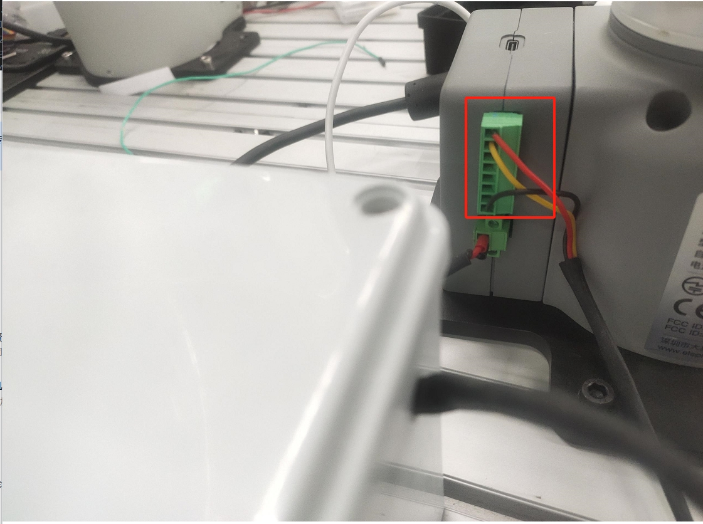

# 独头吸泵

> **兼容型号:** myCobot 320、myCobot Pro 600、myCobot Pro 630


## 产品图片


**规格说明**

| 名称         | 独头吸泵                                      |
| ------------ | --------------------------------------------- |
|吸泵盒尺寸|150mmX150mmX108mm|
|吸泵长度|106mm|
|吸盘直径|25mm|
|气管长度|1m|
|工作电压|24V|
|额定电流|1A|
|自身重量|2kg|
| 额定负载     |  1kg                                    |
|流量|	10-15L/min|
|负压|	-85Kpa|
| 固定方式     | 螺丝固定                                      |
| 使用环境要求 | 常温常压   
| 控制接口     | IO 控制                                       |                                   |
| 适用设备     | myCobot 320、myCobot Pro 600、myCobot Pro 630 |
<!-- | 使用寿命     | 一年                                          | -->

**独头吸泵** :吸附物体使用

**简介**

- 吸盘吸泵是抽气口通过吸盘、管子等元件与待吸附物体连接，对吸盘抽真空，造成内部气压由常压变为负压，利用外界大气压和这个负压之间的压差作用，达到吸附住物体的目的。


**工作原理**

- 起动真空设备抽吸，使吸盘内产生负气压，从而将待提升物吸牢，即可开始搬送待提升物。
- 当待提升物搬送到目的地时，平稳地充气进真空吸盘内，使真空吸盘内由负气压变成零气压或稍为正的气压，真空吸盘就脱离待提升物,从而完成了提升搬送重物的任务。

**适用物体** 适用于带有平面物体

##  硬件安装
先将吸泵安装到机械臂的末端上


然后将吸泵控制盒的线接到机械臂的底座IO上


##  python控制

**M5 版本**
```python
from pymycobot import MyCobot,utils
import time
arm=MyCobot(utils.get_port_list()[0])
for i in range(1):
    arm.set_basic_output(1,0)#打开吸泵
    time.sleep(2)
    arm.set_basic_output(1,1)#关闭吸泵
    time.sleep(2)

```
**PI 版本**
```python
from pymycobot import MyCobot,PI_PORT,PI_BAUD
import time
arm=MyCobot(PI_PORT,PI_BAUD)
for i in range(1):
    arm.set_basic_output(1,0)#打开吸泵
    time.sleep(2)
    arm.set_basic_output(1,1)#关闭吸泵
    time.sleep(2)

```