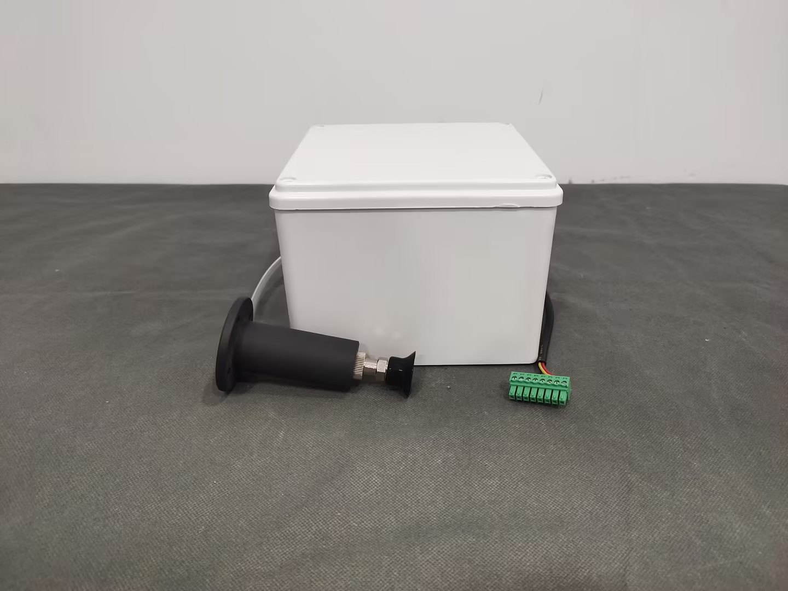
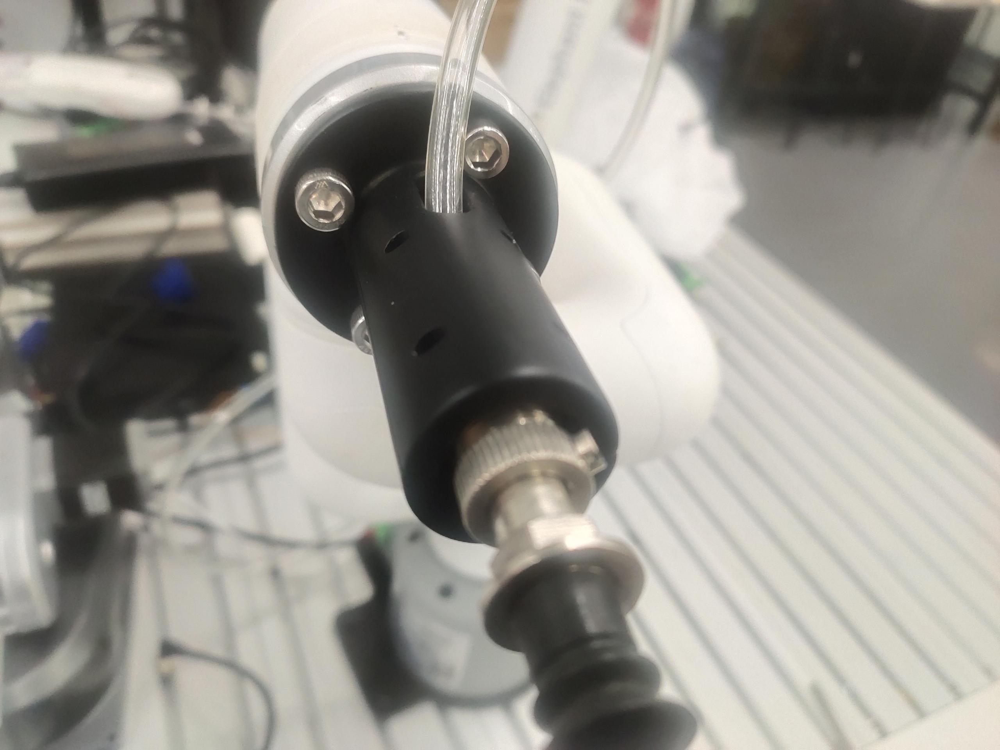
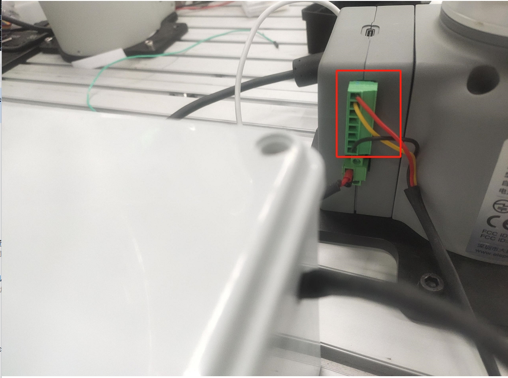

# Single-ended suction pump

> **Compatible models:** myCobot 320, myCobot Pro 600, myCobot Pro 630

## Product images



**Specifications**

| Name | Single-ended suction pump |
| ------------ | --------------------------------------------- |
|Suction pump box size|150mmX150mmX108mm|
|Suction pump length|106mm|
|Suction cup diameter|25mm|
|Tube length|1m|
|Working voltage|24V|
|Rated current|1A|
|Own weight|2kg|
|Rated load |1kg |
|Flow rate|10-15L/min|
|Negative pressure|-85Kpa|
|Fixed mode |Screw fixed |
|Use environment requirements |Normal temperature and pressure
| Control interface | IO control | |
| Applicable equipment | myCobot 320, myCobot Pro 600, myCobot Pro 630 |
<!-- | Service life | One year | -->

**Single-head suction pump**: Used for adsorbing objects

**Introduction**

- The suction cup suction pump is connected to the object to be adsorbed through the suction cup, pipe and other components, and the suction cup is vacuumed, causing the internal air pressure to change from normal pressure to negative pressure, and the pressure difference between the external atmospheric pressure and this negative pressure is used to achieve the purpose of adsorbing the object.

**Working principle**

- Start the vacuum equipment to suck, so that negative air pressure is generated in the suction cup, so that the object to be lifted is firmly sucked, and the object to be lifted can be transported.

- When the object to be lifted is transported to the destination, the vacuum suction cup is steadily inflated, so that the negative air pressure in the vacuum suction cup changes to zero air pressure or slightly positive air pressure, and the vacuum suction cup is separated from the object to be lifted, thereby completing the task of lifting and transporting heavy objects.

**Applicable objects** Applicable to flat objects

## Hardware installation
First install the suction pump on the end of the robot


Then connect the wire of the suction pump control box to the base IO of the robot


## Python control

**M5 version**
```python
from pymycobot import MyCobot,utils
import time
arm=MyCobot(utils.get_port_list()[0])
for i in range(1):
    arm.set_basic_output(1,0)#Turn on the suction pump
    time.sleep(2)
    arm.set_basic_output(1,1)#Turn off the suction pump
    time.sleep(2)

```
**PI version**
```python
from pymycobot import MyCobot,PI_PORT,PI_BAUD
import time 
arm=MyCobot(PI_PORT,PI_BAUD) 
for i in range(1): 
    arm.set_basic_output(1,0)#Open the suction pump 
    time.sleep(2) 
    arm.set_basic_output(1,1)#Close the suction pump 
    time.sleep(2) 
```