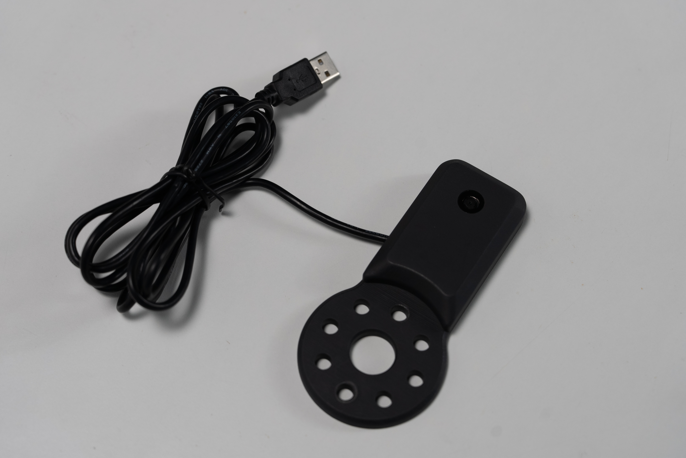

# myCobotPro Camera Module

> **Compatible models:** myCobot 320, myCobot 600

## Product Icon

## Specifications

| **name**                     | **myCobotPro camera module**                    |
| ---------------------------- | ----------------------------------------------- |
| model                        | myCobot_Pro_cameraHolder_J6                     |
| Material                     | photosensitive resin                            |
| USB protocol                 | USB2.0 HS/FS                                    |
| lens focal length            | Standard 1.7mm                                  |
| Field of view                | about 60°                                       |
| supported system             | Win7/8/10, Linux, MAC                           |
| service life                 | two years                                       |
| a fixed way                  | screw fixed                                     |
| Use environment requirements | Temperature and pressure                        |
| Applicable equipment support | ER myCobot 320 Series   ER myCobot Pro 600 Series |

## Use for Objects

**Camera Flange:** Machine Vision

**Introduction**

- USB high-definition camera can be used with suction pump, self-adaptive gripper, artificial intelligence kit, etc., eye in hand to achieve precise positioning and calibration.

## Mall link: 

-   [Taobao](https://shop504055678.taobao.com)
-   [shopify](https://shop-elephantrobotics-com.translate.goog/collections/mycobot-pro-600/products/mycobotpro-cameraflange?_x_tr_sl=auto&_x_tr_tl=zh-CN)

----
[← Accessories Tools Page](../1.4-AccessoriesTools.md#camera) 