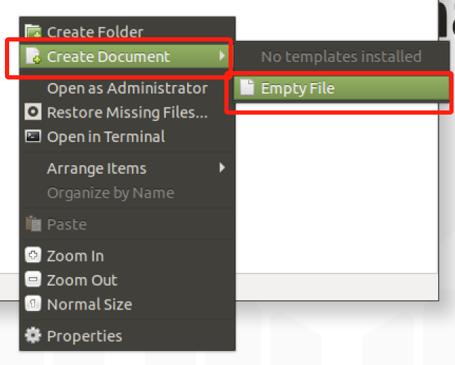

# myCobotPro Camera Module

> **Compatible models:** myCobot 320, myCobot 630

## Product Icon


## Specifications

| **name**                     | **myCobotPro camera module**                         |
| ---------------------------- | ---------------------------------------------------- |
| model                        | myCobot_Pro_cameraHolder_J6                          |
| Material                     | photosensitive resin                                 |
| resolution (of a photo)      | 1080P                                                |
| thread length                | 1.5m                                                 |
| USB protocol                 | USB2.0 HS/FS                                         |
| lens focal length            | Standard 1.7mm                                       |
| Field of view                | about 60°                                            |
| supported system             | Win7/8/10, Linux, MAC                                |
| service life                 | two years                                            |
| a fixed way                  | screw fixed                                          |
| Use environment requirements | Temperature and pressure                             |
| Applicable equipment support | ER myCobot 320 Series <br> ER myCobot Pro 600 Series |

## Use for Objects

**Camera Flange:** Machine Vision

**Introduction**

- USB high-definition camera can be used with suction pump, self-adaptive gripper, artificial intelligence kit, etc., eye in hand to achieve precise positioning and calibration.

**Installation and use**

- Check that the kit has everything: screws and hexagonal spanners, camera module with usb cable
  
- Camera Installation:

  - Structural installation:

    1. Align the camera module to the end of the robot arm according to the desired direction, and tighten the screws with the Allen spanner
       

  - Electrical Connections:

    1. 将 USB 线插入底座 USB 接口：
       

- Programming Development:

  > Programming the camera module using python
  > [python environment download](../../../7-ApplicationBasePython/7.1_download.md)

  - Create a new python file:  
     Right click on the desired file path to create a new python file:  
     

    > The file name can be changed as needed

    

  - Perform function programming:
    

    > The code is as follows:

    ```python
    import cv2
    import numpy as np

    cap = cv2.VideoCapture(0) # "0", based on the queried camera equipment number

    while(True):
        ret, frame = cap.read()

        # gray = cv2.cvtColor(frame, cv2.COLOR_BGR2GRAY)

        cv2.imshow('frame', frame)
        # Press 'q' to exit
        if cv2.waitKey(1) & 0xFF == ord('q'):
            break

    cap.release()
    cv2.destroyAllWindows()
    ```

  - Save the file and close it, right-click on an empty space in the folder to open a command line terminal

    

    Input:

    ```bash
    python camera.py
    ```

    

    > You can see what the camera captured

    Run results:
    

- How to check camera device number

  ```bash
  ls /dev/video* -l
  ```

  > This can be confirmed by plugging and unplugging the devices and using the command separately to observe the added device number.

  Example results:
  

## Mall link:

- [Taobao](https://shop504055678.taobao.com)
- [shopify](https://shop-elephantrobotics-com.translate.goog/collections/mycobot-pro-600/products/mycobotpro-cameraflange?_x_tr_sl=auto&_x_tr_tl=zh-CN)

---

[← Accessories Tools Page](../1.4-AccessoriesTools.md#camera)
