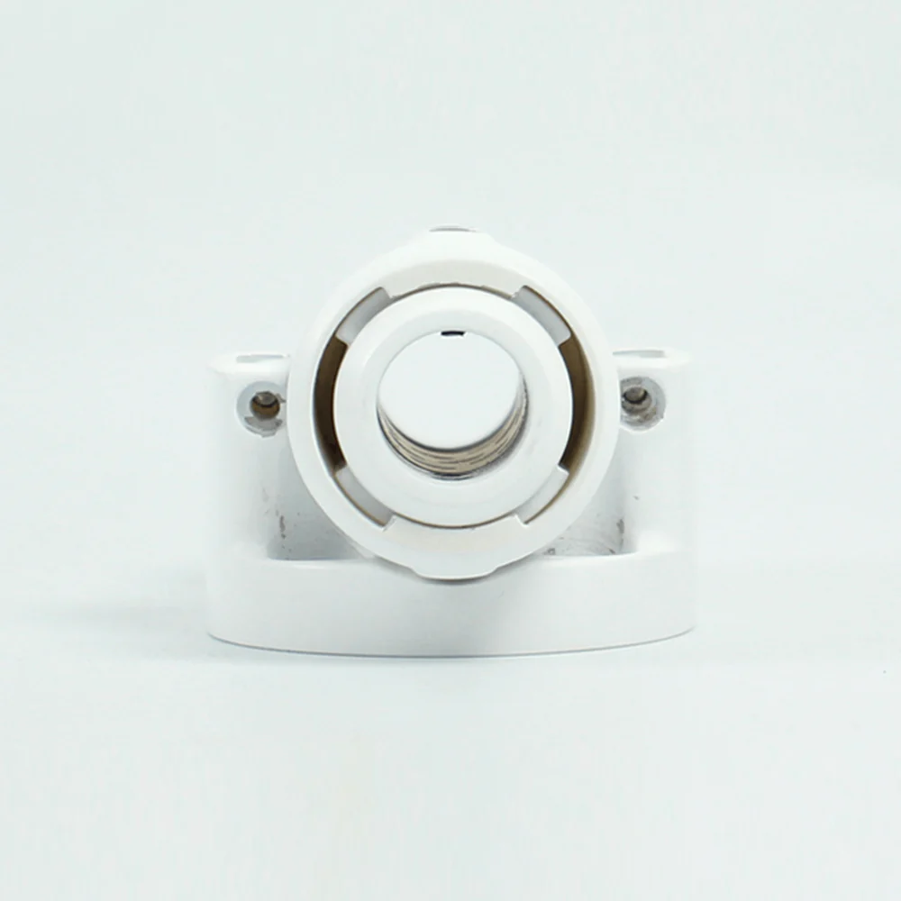

# myCobot Pro 夹持器

> **兼容型号:** ER myCobot 320 series, ER myPalletizer 600

## 产品图片

## 规格

| **名称**     | **myCobotPro 笔夹持器**                    |
| ------------ | ------------------------------------------ |
| 模型         | myCobot_Pro_penHolder_J6                   |
| 材料         | 光敏树脂                                   |
| 空笔尖       | ±1 mm                                      |
| 使用寿命     | 两年                                       |
| 固定方式     | 螺丝固定                                   |
| 使用环境要求 | 常温常压                                   |
| 适用设备     | ER myCobot 320 series, ER myPalletizer 600 |

## 用于物体

在使用机械臂书写和绘画时使用

**导引言**

- 整体纯色设计，支持上下 15 毫米超大笔画伸缩，有效减少误差，可用于书写、绘图等应用。

**适用对象**

- 白板笔

## 购买链接

- [淘宝](https://shop504055678.taobao.com)
- [shopify](https://shop.elephantrobotics.com/)

## 如何使用

1 安装 :  

  

[← 周边配件页](../README.md#holder) | [下一页 →](../1.4.4-Holder/2-PhoneHolderPro.md)
