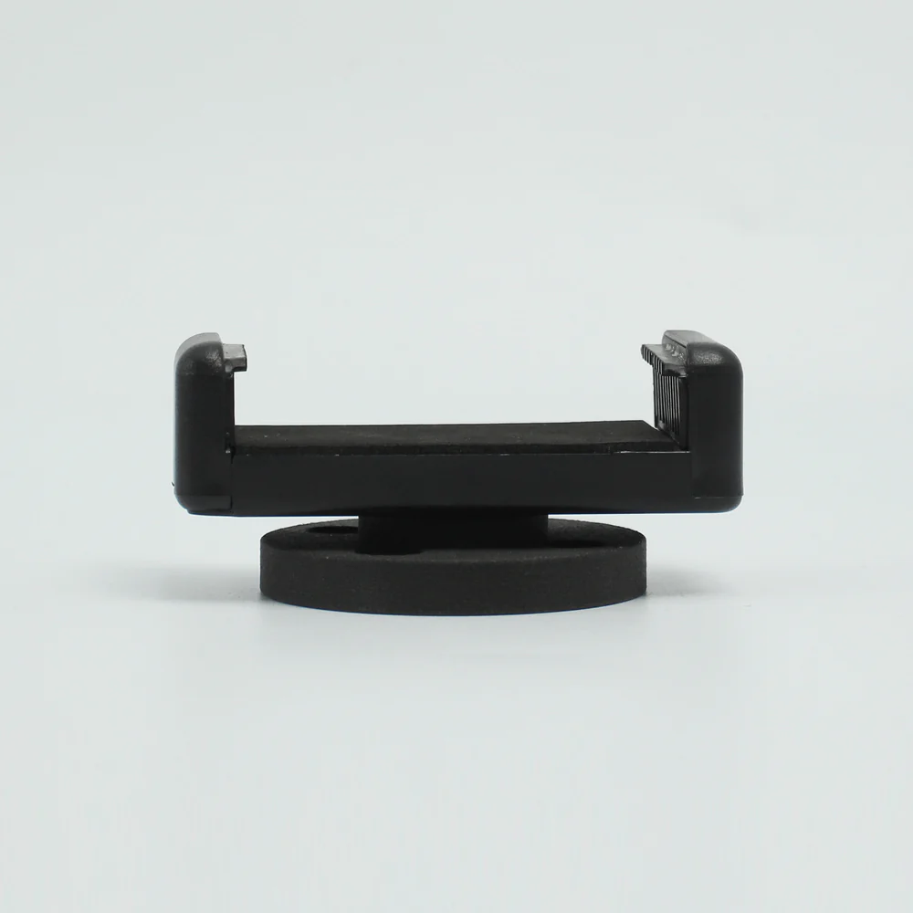
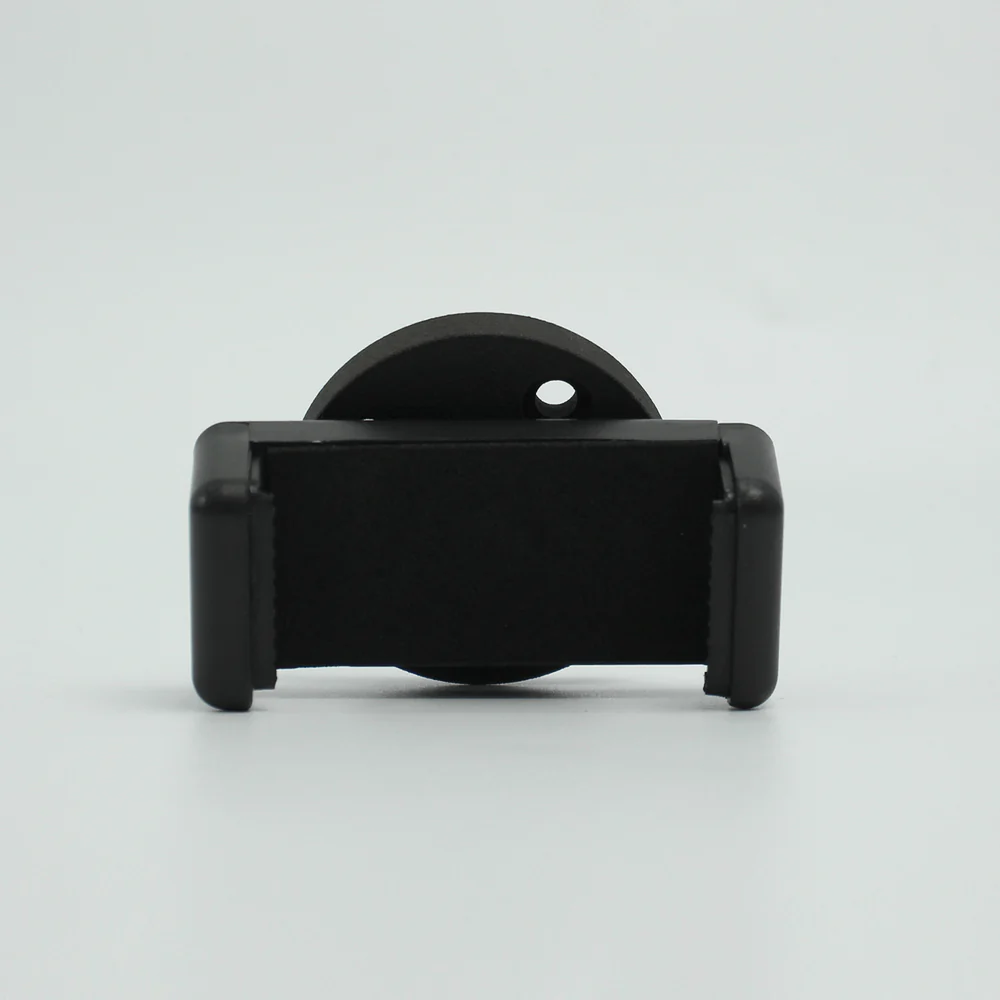
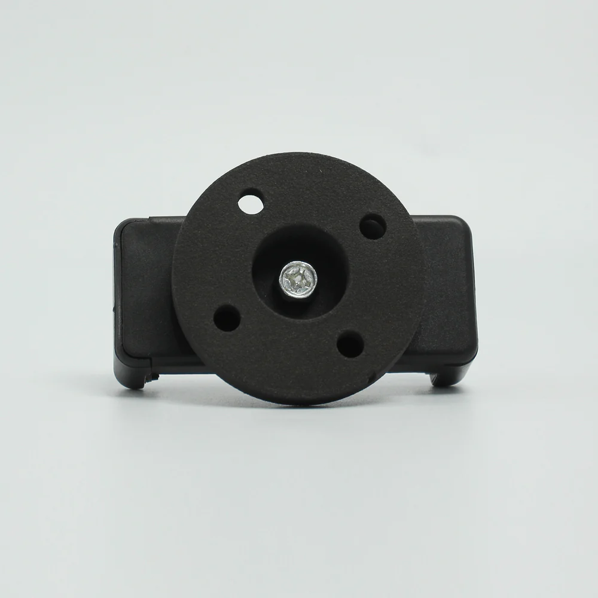

# myCobot Pro Mobile 手机支架

> **兼容型号:** ER myCobot 320 series, ER myCobot 600

## 产品图片

  

## 规格

| **名称**     | **myCobotPro Mobile 手机支架**        |
| ------------ | ------------------------------------- |
| 模型         | myCobot_Pro_PhoneHolder_J6            |
| 材料         | 光敏树脂                              |
| 夹紧重量     | 200g                                  |
| 使用寿命     | 两年                                  |
| 固定方式     | 螺丝固定                              |
| 使用环境要求 | 温度和压力                            |
| 适用设备     | ER myCobot 320 series, ER myCobot 600 |

## 用于物体

**引言**

- 适用于拍摄和其他需要物理夹紧的设备。可夹持各种手机，结构简单，易于安装和拆卸。

**适用对象**

- 射击器材

## 购买链接:

- [淘宝](https://shop504055678.taobao.com)
- [shopify](https://shop-elephantrobotics-com.translate.goog/collections/mycobot-pro-600/products/mycobot-pro-adaptive-gripper-black-white-for-mycobot-320-mycobot-pro-600-%E7%9A%84%E5%89%AF%E6%9C%AC?_x_tr_sl=auto&_x_tr_tl=zh-CN)

## 如何使用

1 安装 :  

  

---

[← 周边配件页](../README.md#holder)
