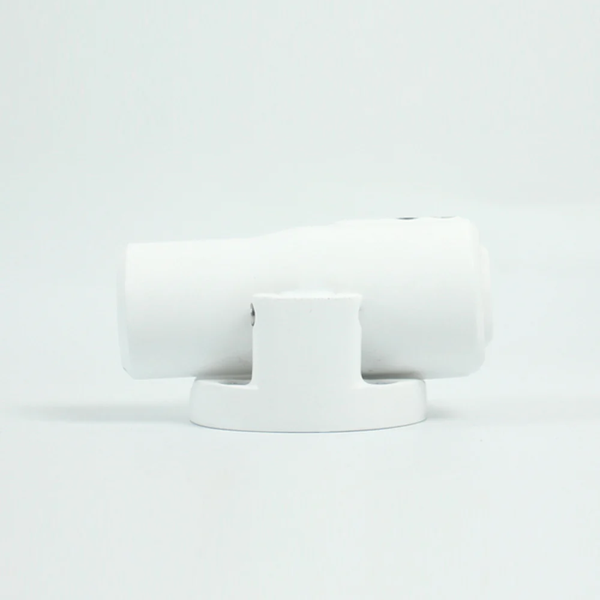
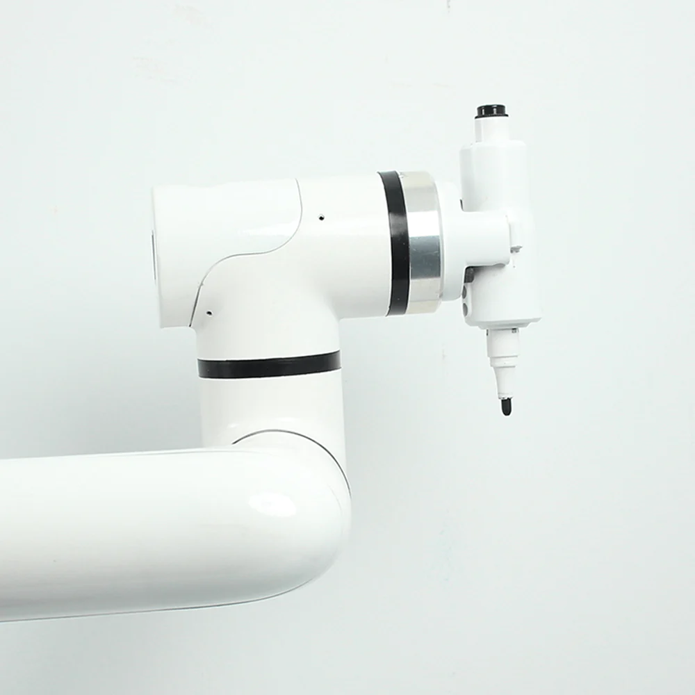

# myCobot Pro Pen Holder

> **Compatible models:** ER myCobot 320 series, ER myPalletizer 600

## Product Icon

## Specifications

| **name**                     | **myCobotPro Pen Holder**                  |
| ---------------------------- | ------------------------------------------ |
| model                        | myCobot_Pro_penHolder_J6                   |
| Material                     | photosensitive resin                       |
| empty nib                    | ±1 mm                                      |
| service life                 | two years                                  |
| a fixed way                  | screw fixed                                |
| Use environment requirements | Temperature and pressure                   |
| Applicable equipment         | ER myCobot 320 series, ER myPalletizer 600 |

## Use for Objects

Used when using the robotic arm to write and draw

**Introduction**

- The overall solid color design supports up and down 15mm ultra-large stroke expansion and contraction, effectively reducing errors, and can be used for writing, drawing and other applications.

**Applicable object**

- Whiteboard pen

## Mall link

-   [Taobao](https://shop504055678.taobao.com)
-   [shopify](https://shop.elephantrobotics.com/)

 ## How to use

1 Installing :  

  

[← Accessories Tools Page](../../1.4-AccessoriesTools/1.4-AccessoriesTools.md#holder) | [Next Page →](../1.4.4-Other/2-PhoneHolderPro.md)