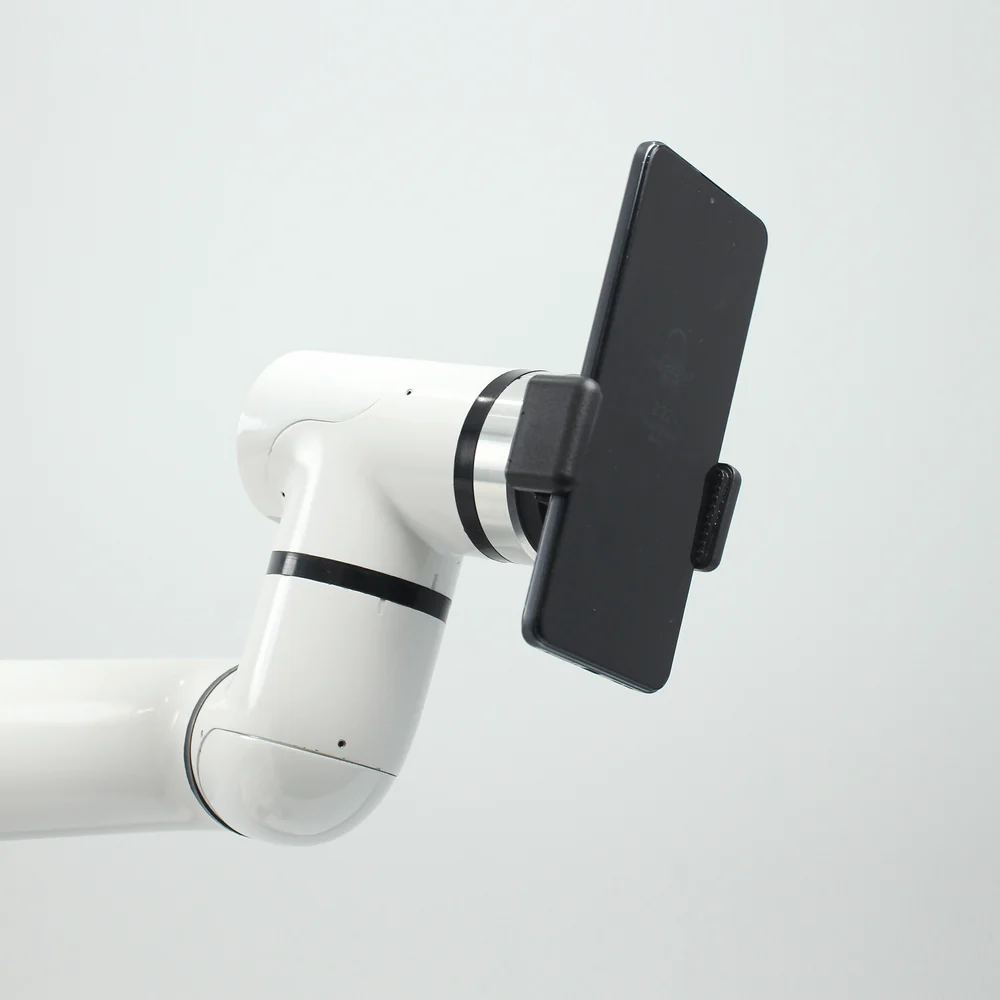

# myCobot Pro Mobile Phone Holder

> **Compatible models:** ER myCobot 320 series, ER myCobot 600

## Product Icon

  

## Specifications

| **name**                     | **myCobotPro Mobile Phone Holder**    |
| ---------------------------- | ------------------------------------- |
| model                        | myCobot_Pro_PhoneHolder_J6            |
| Material                     | photosensitive resin                  |
| clamping weight              | 200g                                  |
| service life                 | two years                             |
| a fixed way                  | screw fixed                           |
| Use environment requirements | Temperature and pressure              |
| Applicable equipment         | ER myCobot 320 series, ER myCobot 600 |

## Use for Objects

**Introduction**

- It is suitable for shooting and other equipment that requires physical clamping. It can clamp a variety of mobile phones. It has a simple structure and is easy to install and disassemble.

**Applicable object**

- shooting equipment

## Mall link: 

-   [Taobao](https://shop504055678.taobao.com)
-   [shopify](https://shop-elephantrobotics-com.translate.goog/collections/mycobot-pro-600/products/mycobot-pro-adaptive-gripper-black-white-for-mycobot-320-mycobot-pro-600-%E7%9A%84%E5%89%AF%E6%9C%AC?_x_tr_sl=auto&_x_tr_tl=zh-CN)

 ## How to use

1 Installing :  

  

--------
[← Accessories Tools Page](../../1.4-AccessoriesTools/1.4-AccessoriesTools.md#holder) 