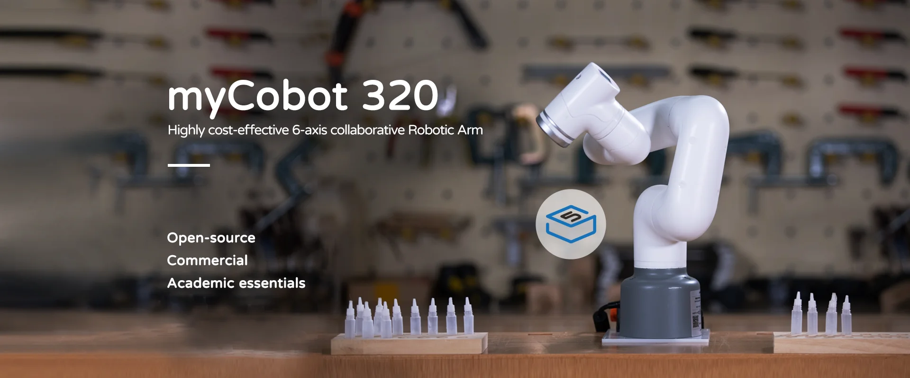
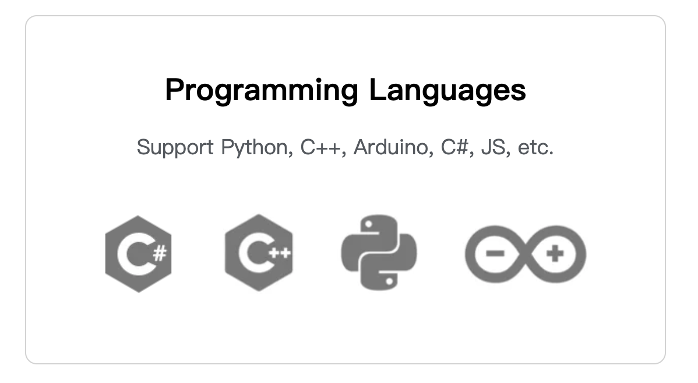

# myCobot 320

 

> **320, meaning 320 mm, refers to the effective working radius of the robot arm.**
 

## Product Introduction 

The myCobot 320 Robot Arm, developed by Elephant Robotics, is a collaborative robot designed specifically for education, research, and light industrial automation. This robot is renowned for its compact design and powerful capabilities, committed to providing unlimited possibilities for innovation and learning. It features a maximum arm reach of 350mm and a maximum payload of 1kg, supporting programming languages of varying difficulty levels, suitable for users of all skill levels.

## Supported Extension Development 

The myCobot 320 encourages users to engage in extension development to fully exploit its potential: 
- **Programming Languages**: Supports Python, C++, among others, offering a diverse selection of programming options.  
  
- **Hardware Interfaces**: Includes IO, USB, etc., facilitating the connection to a variety of sensors and actuators. 
- **Software Libraries**: Provides a rich set of open-source libraries and APIs to streamline the development process. 
- **System Compatibility**: Compatible with Windows, Linux, MacOS, accommodating a wide range of development environments.    
    

## Documentation Learning Content 

By reading the official documentation, you will gain: 
- **Basic Setup**: Guidelines for installation, configuration, and initial operation.
- **Programming Guidance**: How to control and program the myCobot 320 M5 using various languages and platforms.
- **Custom Development**: How to utilize extension interfaces and software libraries for custom application development.
- **Success Stories**: Insights into the application of myCobot 320 M5 across different domains.
- **Maintenance and Troubleshooting**: Tips for maintenance and solutions to common issues.

## Address for Purchase     

If you are interested in purchasing the device, please click the link below.   

-   Taobao: https://shop504055678.taobao.com
-   shopify: https://shop.elephantrobotics.com/

## Chapter Summary

Now that you have a grasp of the product's fundamental features and applications, let's delve deeper into obtaining more detailed information together. The next section of this manual will guide you to various sub-chapters, enabling you to gain a more comprehensive understanding of our product's design philosophy, target user demographics, recommended usage scenarios, as well as the supported accessories and tools. 

Please feel free to select the following sections based on your interests and requirements:  

[1.1-Design Philosophy](../../myCobot320-docs/1-ProductIntroduction/1.1-DesignPhilosophy.md) 
In this section, we will introduce the product's design principles and philosophy to help you better comprehend why the product possesses specific features and advantages.

[1.2-Suitable Users](../../myCobot320-docs/1-ProductIntroduction/1.2-SuitableUsers.md) 
Understand which user groups are most suitable for using this product and how it caters to the diverse needs of different users.

[1.3-Application Scenario](../../myCobot320-docs/1-ProductIntroduction/1.3-ApplicationScenario.md) 
In this part, we will elucidate the product's optimal application methods in various scenarios, enabling you to fully harness its functionality.

[1.4-Accessories and Tools](../../myCobot320-docs/1-ProductIntroduction/1.4-AccessoriesTools/1.4-AccessoriesTools.md) 
Examine the supported accessories and tools to ensure that you can make the most of the product's full potential. 

Please click on the respective links based on your interests to access more detailed information. If you have any questions or require further assistance, please do not hesitate to contact our customer support team. We are committed to providing you with support and guidance. Thank you for choosing our product, and we look forward to delivering an outstanding user experience for you! 

## Words of Thanks 

We greatly appreciate you taking the time to read the myCobot 320 user manual. We hope this document helps you to better understand and effectively use this robot, thereby inspiring your creativity. Should you have any questions or require further assistance, please do not hesitate to contact our customer support team. We look forward to seeing the innovative projects you accomplish with myCobot 320 and welcome you to our rapidly growing community of developers. 

----
If you have already read all the content in this chapter, please proceed to the next chapter. 

[Next Chapter →](../../myCobot320-docs/2-ProductFeature/README.md) 