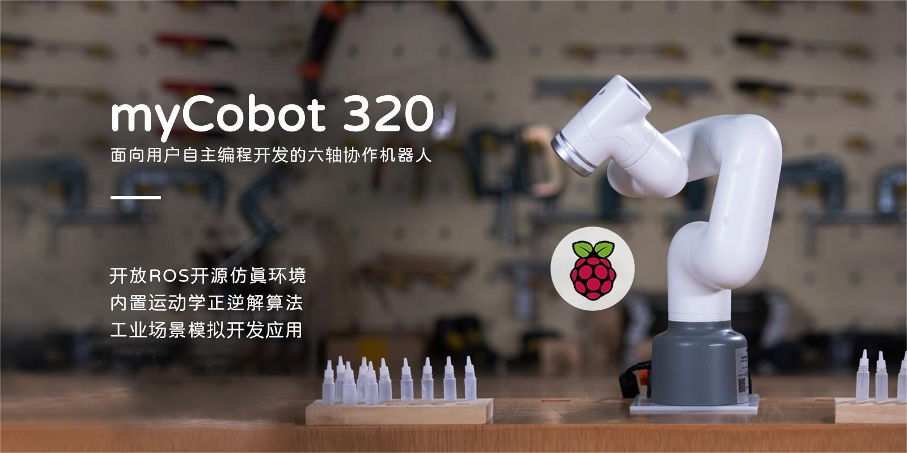

# myCobot 320 Pi 使用手册

> 320，即 320 毫米，指机器人手臂的有效工作半径。

## 产品说明

myCobot 320 Pi 机械臂由大象机器人公司开发，是专为教育、研究和轻工业自动化设计的协作机器人。这款机器人以其紧凑的设计和强大的功能而闻名，致力于为创新和学习提供无限可能。它的最大臂展为 350 毫米，最大有效载荷为 1 千克，支持不同难度的编程语言，适合各种技能水平的用户使用。

## 支持扩展开发内容

myCobot 320 鼓励用户参与扩展开发：

- 编程语言：支持 Python 语言。
- 硬件接口：包括 IO、USB 等，便于连接各种传感器和执行器。
- 软件库：提供丰富的开放源代码库和 API，以简化开发流程。
- 系统兼容性：与 Windows、Linux 和 MacOS 兼容，适用于各种开发环境。
  

## 你可以学到什么

通过阅读官方文档，你将学会：

- 基本设置：安装、配置和初始操作指南。
- 编程指南：如何使用各种语言和平台对 myCobot 320 Pi 进行控制和编程。
- 定制开发：如何利用扩展接口和软件库进行定制应用开发。
- 成功案例：对 myCobot 320 Pi 在不同领域应用的见解。
- 维护和故障排除：维护提示和常见问题的解决方案。

## 感谢阅读

非常感谢你阅读 myCobot 320 Pi 用户手册。我们希望本手册能帮助您更好地了解并有效地使用这款机器人。如果您有任何疑问或需要进一步帮助，请随时联系我们的客户支持团队。我们期待看到您使用 myCobot 320 Pi 做出更多创新，并欢迎您加入我们快速发展的开发者社区。

---

如果您已经阅读了本章的所有内容，可以继续阅读下一章。

[下一章 →](../2-ProductFeature/2.2_320_PI_product/README.md)
