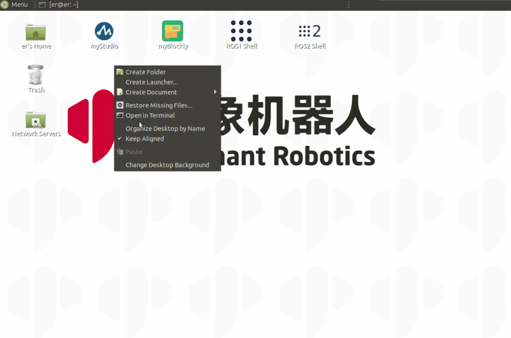

# TCP/IP

TCP/IP 传输协议，即传输控制/网络协议，也叫作网络通讯协议。它是在网络的使用中的最基本的通信协议，对互联网中各部分进行通信的标准和方法进行了规定。用户可以通过机械臂的 IP 地址连接机械臂，达到无需连接 USB 端口也可以远程操作机械臂的效果。

本章以 myCobot 280 M5 为例进行说明。

**在使用机械臂之前请确保 Basic 固件与 Atom 固件已经烧录.**

## myCobot

### 连接步骤

#### 树莓派连接

- 使用树莓派远程连接时，需要注意以下几点
  1. 树莓派和控制端需要在同一网络
  2. 服务器文件需要先在树莓派中执行（具体操作见下方 gif 操作图）
  3. 服务器文件执行后，提示“Binding succeeded” 和 “waiting connect ”表示开启成功，控制端可参考 **2 案例**进行控制

​ 

_具体操作为:_

_克隆我们的项目库：_`git clone https://github.com/elephantrobotics/pymycobot.git`

_在 demo 文件夹中找到 Server.py 文件 [Server.py](https://github.com/elephantrobotics/pymycobot/blob/main/demo/Server.py)_

请根据您的机器型号更改 Server.py 文件最后一行 MyCobotServer 中传递的参数。

### 使用说明:

使用前请把 pymycobot 更新到最新版本

`pip install pymycobot --upgrade`

请根据您的机器型号更改 Server.py 文件最后一行 MyCobotServer 中传递的参数。

- 默认型号为 320 Pi
- 默认参数为：
  - serial_num：/dev/ttyAMA0
  - baud: 115200

### 案例

```python
from pymycobot import MyCobotSocket
# 默认使用9000端口
# 其中"192.168.11.15"为机械臂IP，请自行输入你的机械臂IP
mc = MyCobotSocket("192.168.11.15",9000)

# 连接正常就可以对机械臂进行控制操作
mc.send_angles([0,0,0,0,0,0],20)
res = mc.get_angles()
print(res)

...
```

---

[← 上一页](2_API.md) | [下一页 →](4_drag.md)
