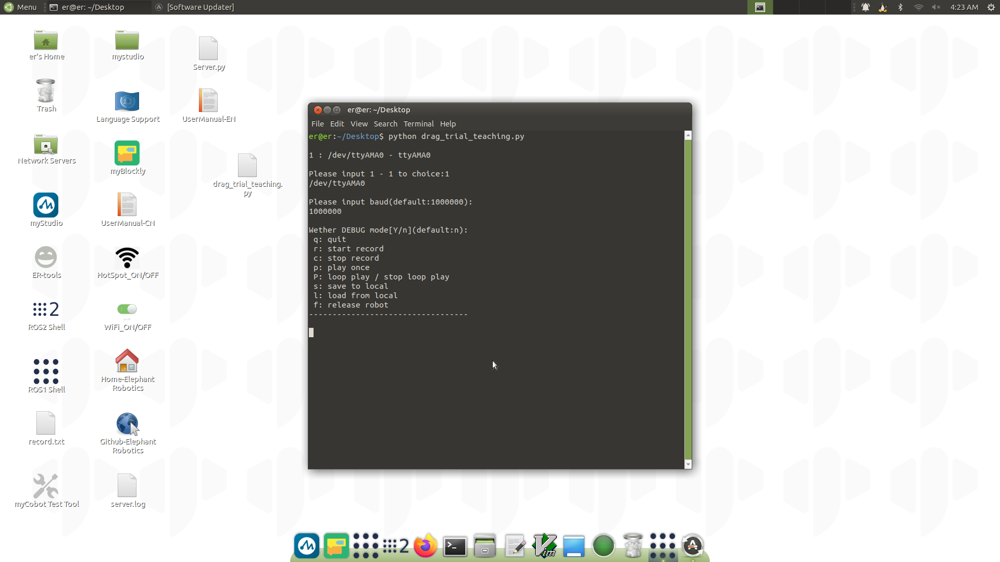

# 拖动示教

可以实现轨迹录制（包括自适应夹爪）和播放。

> Python 版本拖动示教仅支持 280、270、320 机型中的 Pi、Jetson Nano 版本使用。

## 使用方法：

- 1. 下载 [拖动示教 Python 代码文件](https://github.com/elephantrobotics/pymycobot/blob/main/demo/drag_trial_teaching.py)
- 2. 将下载的文件拷贝到机械臂系统内。
- 3. 打开终端运行该文件即可：

  ```bash
    python drag_trial_teaching.py
  ```

    

文件运行以后：

- 3.1 选择机械臂端口
- 3.2 输入波特率，默认为 1000000

| **machine type** | **Serial number** | **baud rate** |
| :--------------- | :---------------- | :------------ |
| 270 PI           | /dev/ttyAMA0      | 1000000       |
| 280 PI           | /dev/ttyAMA0      | 1000000       |
| 320 PI           | /dev/ttyAMA0      | 115200        |
| 280 Jetson Nano  | /dev/ttyTHS1      | 1000000       |

- 3.3 选择是否需要调试，默认不开启调试
- 3.4 最后进入功能选择列表，功能选择均通过键盘按键实现：

  - `q`: 退出
  - `r`: 开始录制
  - `c`: 停止录制
  - `p`: 播放一次
  - `P`: 循环播放 / 停止播放
  - `s`: 保存本次录制信息，会将录制信息保存到 `drag_trial_teaching.py`同目录下的 record.txt 文件中
  - `l`: 会将 `drag_trial_teaching.py` 同目录下的 record.txt 文件中的信息加载进来
  - `f`: 放松机械臂所有关节

---

[← 上一页](3_TCPIP.md) | [下一节 →](5_Handle_control.md)
