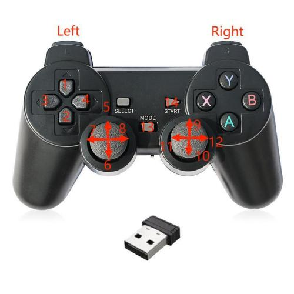

The movement of the machine can be controlled by the gamepad, and the grasping of objects can be realized with the gripper or the suction pump.

> Note: The handle needs to be purchased separately, please consult the official customer service for details

> 

# Handle COntrol

## The corresponding functions of the handle buttons are as follows:

### myCobot

- **1**: RX direction coordinate value increases
- **2**: RX direction coordinate value decreases
- **3**: RY direction coordinate value decreases
- **4**: RY direction coordinate value increases
- **5**: X direction coordinate value increases
- **6**: X direction coordinate value decreases
- **7**: Y direction coordinate value decreases
- **8**: Y direction coordinate value increases
- **9**: Z direction coordinate value increases
- **10**: Z direction coordinate value decreases
- **11**: RZ direction coordinate value decreases
- **12**: RZ direction coordinate value increases
- **13**: Wake up the handle. After the handle is not used for a long time after connection, it will enter sleep mode. You need to press this button to wake up.
- **14**: Check the connection status of the machine. The atom LED flashes green three times to indicate that the machine is normal; flashes red three times to indicate that the state is abnormal.
- **X**: Press and hold the button, the gripper continue to open
- **Y**: Press and hold the button, the gripper continue to close
- **A**: open suction pump
- **B**: Shut down the suction pump
- **Left 1**: Press and hold for 2s to initialize the robot to the joint zero state.
- **Left 2**: Press and hold for 2s, the robot stops torque output and relaxes all joints.
- **Right 1**: Press and hold for 2s to initialize the robot to move to the initial point.
- **Right 2**: Press and hold for 2s, the robot turns on the torque output, and all joints are locked

### myArm

- **1**: RX direction coordinate value increases
- **2**: RX direction coordinate value decreases
- **3**: RY direction coordinate value decreases
- **4**: RY direction coordinate value increases
- **5**: X direction coordinate value increases
- **6**: X direction coordinate value decreases
- **7**: Y direction coordinate value decreases
- **8**: Y direction coordinate value increases
- **9**: Currently not functional
- **10**: Currently not functional
- **11**: Currently not functional
- **12**: Currently not functional
- **13**: Wake up the handle. After the handle is not used for a long time after connection, it will enter sleep mode. You need to press this button to wake up.
- **14**: Check the connection status of the machine. The atom LED flashes green three times to indicate that the machine is normal; flashes red three times to indicate that the state is abnormal.
- **X**: Z direction coordinate value increases
- **Y**:Z direction coordinate value decreases
- **A**: open suction gripper
- **B**: Shut down the suction gripper
- **Left 1**: Press and hold for 2s to initialize the robot to the joint zero state.
- **Left 2**: Press and hold for 2s, the robot stops torque output and relaxes all joints.
- **Right 1**: Press and hold for 2s to initialize the robot to move to the initial point.
- **Right 2**: Press and hold for 2s, the robot turns on the torque output, and all joints are locked

## instructions

### 1.Connecting devices

Connect the MyCobot and handle to the computer.

### 2.Install required libraries

Download code: https://github.com/elephantrobotics/pymycobot

Open the terminal, Enter the `pymycobot/demo/handle_control` folder, and run the following command。

```bash
pip3 install -r requirements.txt
```

### 3.Modify port number

#### myCobot-pi

Edit the handle_control.py file

```python
import pygame
import time
from pymycobot import MyCobot
from pymycobot import PI_PORT, PI_BAUD  # When using the Raspberry Pi version of mycobot, these two variables can be referenced for MyCobot initialisation
import threading

mc = MyCobot(PI_PORT, 115200)
...
```

Finally. run the program.

```bash
python3 handle_control.py
```

#### myArm

Edit the myarm_handle_control.py file

```python
import pygame
import time
from pymycobot import MyArm
import threading
# Change com7 to the port number detected by your computer

mc = MyArm("/dev/ttyAMA0",115200)
...
```

Finally. run the program

```bash
python3 myarm_handle_control.py
```

> Note: After running the program, first click the **14** button to check the machine connection status, the machine connection status is normal (if it is abnormal, you will not be able to perform other operations, please solve the abnormal connection problem first), and then click **Right 1** button, other operations can only be performed after the machine reaches the initial point.

---

[← Previous Page](4_drag.md) | [Next Section →](6_example.md)
