# Environment Building

pymycobot 是一个和 myCobot 进行串口通讯的 Python 包，支持 Python2、Python3.5 及之后版本。

在使用 pymycobot 控制机械臂之前需要搭建 Python 环境，下面就对 Python 的下载安装做出详细说明。

## 1 Python 下载和安装

目前，Python 有两个版本：2.x "和 "3.x"。这两个版本互不兼容。本节以版本 `3.x` 为例，因为它越来越受欢迎。

### 1.1 安装 Python

> **注意：** 安装之前，请先确认您的电脑是 64 位还是 32 位。右键点击`我的电脑`，选择`属性`。如下图显示是 64 位的操作系统，所以选择 64 位的 Python 安装包。
>
> 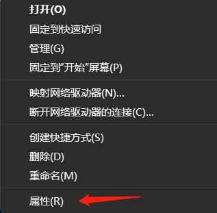
>
> 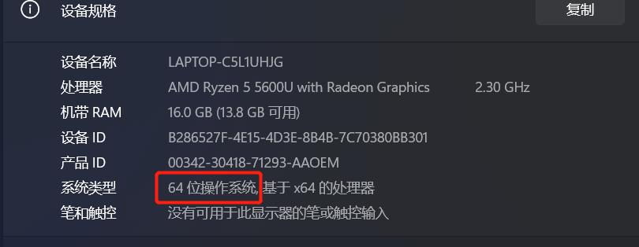

- **Python 官方下载地址： https://www.python.org/downloads/**

* **点击`Downloads`选项，开始下载 Python，点击`Add Python 3.10 to PATH`,点击`Install Now`，开始安装 Python**


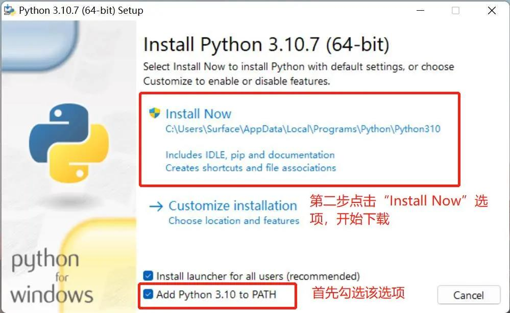

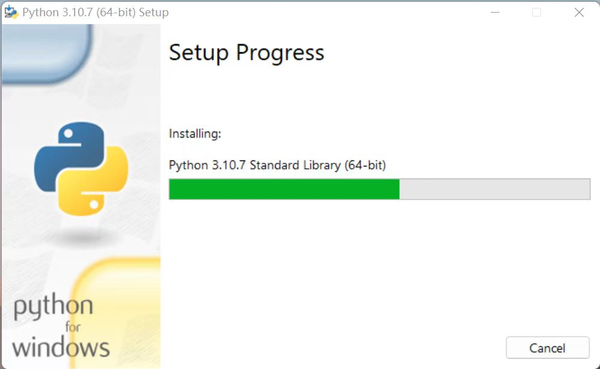

- **出现“Setup was successful”提示，说明安装完成**

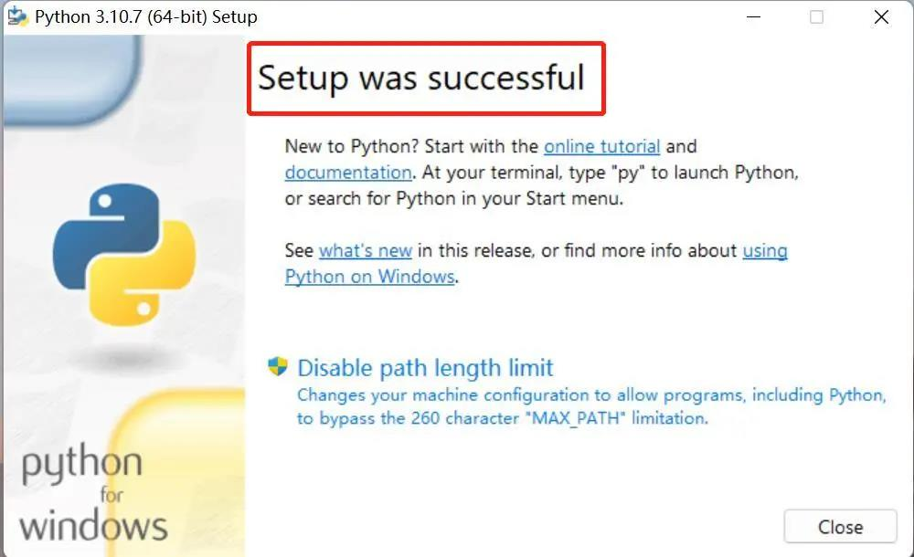

### 1.2 运行 Python

安装成功后，打开命令提示符窗口（`Win+R`，输入 `cmd` 回车），敲入`python`后，会出现两种情况。

**下载成功：**


出现图片中的提示表示 Python 安装成功。

出现提示符`>>>` 就表示我们已经在 Python 交互式环境中了，可以输入任何 Python 代码，回车后会立刻得到执行结果。

**错误报告：**

假如输入错误（比如输入 pythonn），则会出现错误提示：

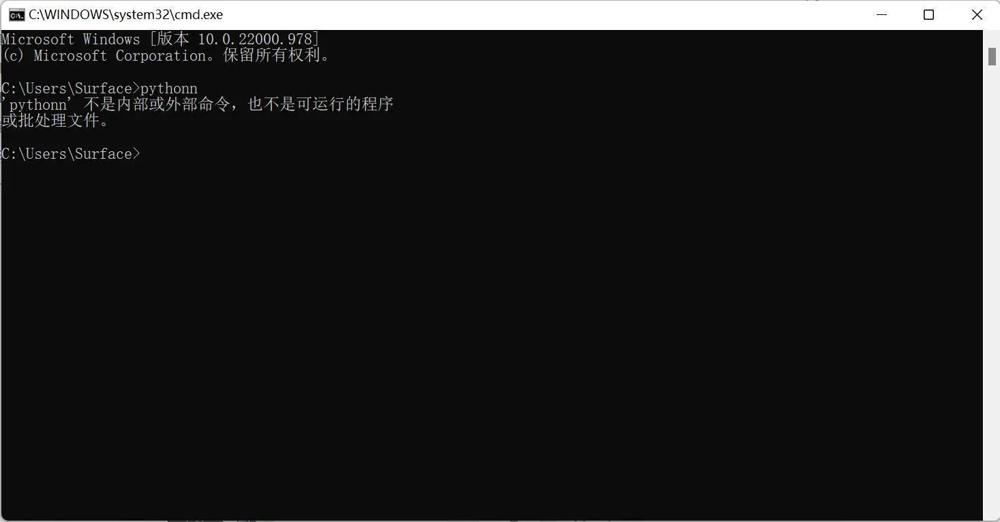

> **注意：**出现错误的信息一般都是没有配置环境变量导致的，可以参考**1.3 配置环境变量**修改环境变量。

### 1.3 配置环境变量

由于 Windows 会根据一个 Path 的环境变量设定的路径去查找 python.exe，如果没找到，就会报错。因此，如果安装时漏掉了勾选`Add Python 3.10 to PATH`，则需要手动把 python.exe 所在的路径添加到 Path 中，或者重新安装一遍 Python，记得勾选上`Add Python 3.10 to PATH`选项即可。

以下是手动添加 python.exe 所在的路径步骤。

- 右键我的电脑–>选择属性–>选择高级系统设置–>选择右下角的环境变量：

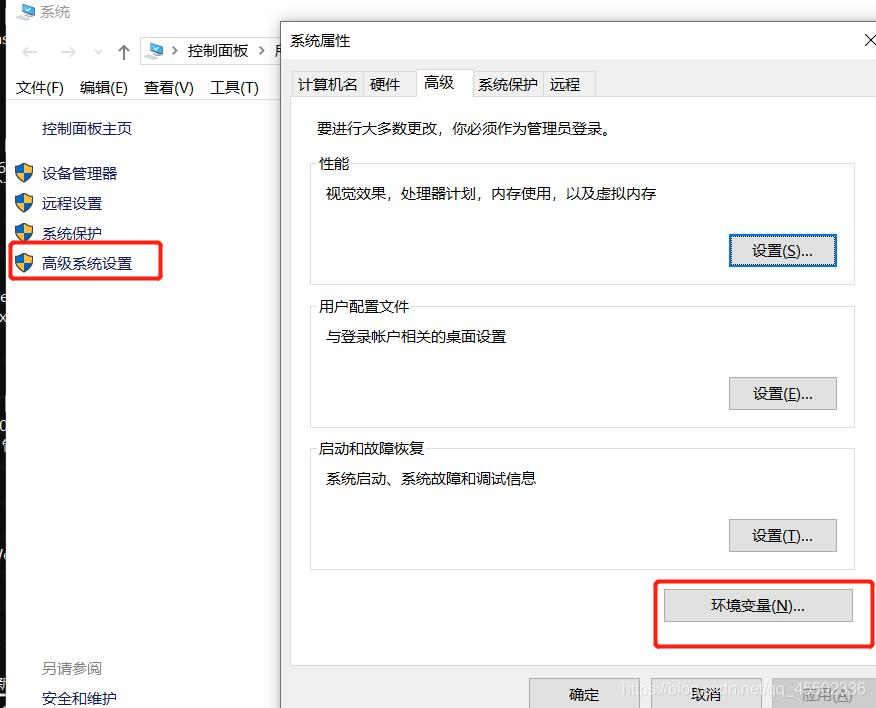

- 环境变量主要有包括用户变量和系统变量，需要设置的环境变量就在这两个变量中。如下图所示：

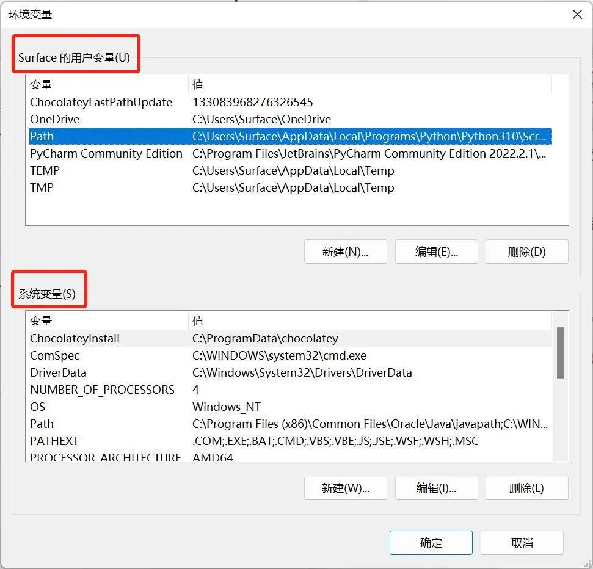

- 用户变量是将自己的下载的程序可以在 cmd 命令中使用。把程序的绝对路径写到用户变量中即可使用，如下图所示：


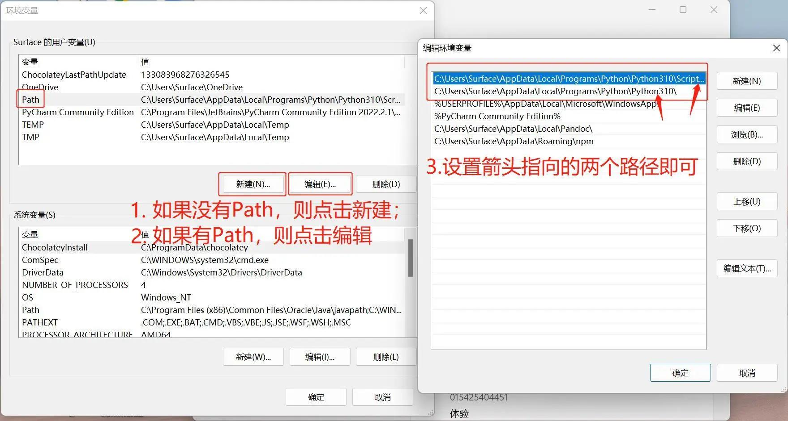

- 以上步骤完成后，打开命令提示符窗口（Win+R，再输入 cmd，回车），敲入 Python，出现下图中的提示表示成功：

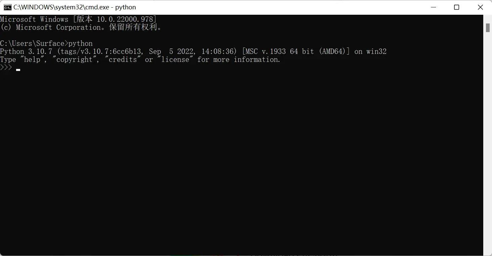

## 2 PyCharm 安装和使用

PyCharm 是一款功能强大的 Python 编辑器，具有跨平台性。首先介绍 PyCharm 在 Windows 系统中的安装步骤。

**下载地址：** **https://www.jetbrains.com/pycharm/download/#section=windows**

### 2.1 下载安装

- 进入该网站后，我们会看到如下界面：


根据界面介绍下载文件，Professional 表示专业版，Community 是社区版，推荐安装社区版，因为是免费使用的。

- 下载好之后开始安装，点击`Next`：


- 按照个人喜好选择相应选项，然后点击`Next`：


- 出现下图界面继续点击`Next`：


- 下载中：

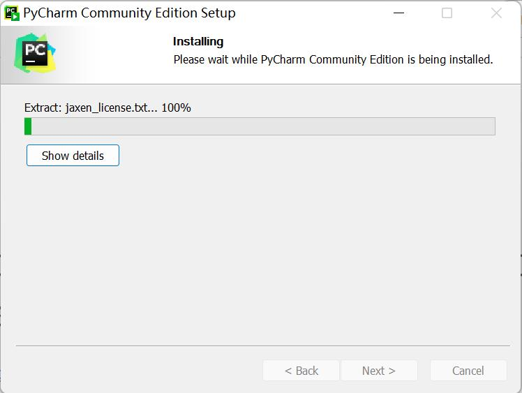

- 点击`Finish`结束安装：


### 2.2 创建项目

PyCharm 安装完成之后进入该软件，创建第一个程序。

- 单击桌面上的 PyCharm 图标，进入到 PyCharm 中，如下图所示，点击`New Project`：


- 点击之后找到`Interpreter`，开始对解释器进行设置，点击`Add Interpreter`：

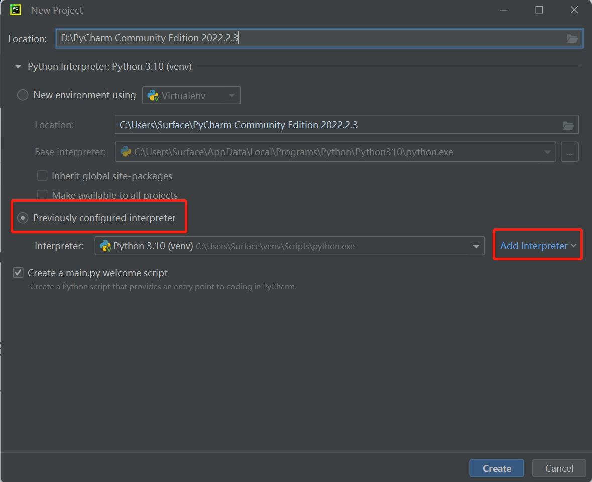

- 点击`New`，找到 python.exe 存储位置，勾选`Inherit global site-package`选项：


- 设置`Location`。Location 是存储 PyCharm 项目的地方，可根据需要自行选择。

  

- 新建 PyCharm 文件。右击箭头指向的文档图标，点击`New`，点击`Python File`，新建成功。

  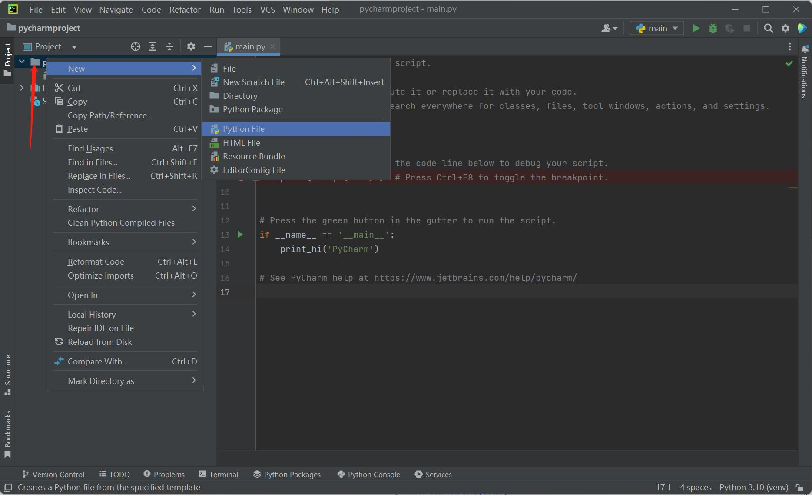

- 命名 Python File：

  

- 文件创建成功后便进入如下的界面，便可以编写自己的程序了


## 3 使用之前

- 固件烧录。固件是指设备内部保存的设备“驱动程序”。操作系统只有通过固件才能按照标准的设备驱动实现特定机器的运行动作。不同版本的机械臂需要烧录不同的固件（可以参考 [**MyStudio**](https://docs.elephantrobotics.com/docs/gitbook/4-BasicApplication/4.1-myStudio/)章节）。
  - **M5 版本**底部的 Basic 需要烧录 minirobot。烧录完成后选择**Transponder**功能（该功能用于接收转发底部 Basic 发送的指令，从而执行目标动作），点击`Press A`，出现**Atom：OK**提示信息即为成功。此外，M5 版本末端 Atom 烧录最新版的 atomMain，出厂默认已烧录，无需自行烧录。
  - **Pi \ jetsonnano 版本**末端 Atom 烧录最新版的 atomMain，出厂默认已烧录，无需自行烧录。
- pymycobot 安装。打开一个控制台终端(快捷键 Win+R,输入 cmd 进入终端)，输入以下命令：

```python
pip install pymycobot --upgrade --user
```

  

- 源码安装。打开一个控制台终端(快捷键 Win+R,输入 cmd 进入终端)，输入以下命令即可安装：

```python
git clone https://github.com/elephantrobotics/pymycobot.git <your-path>
#其中<your-path>填写你的安装地址，不填默认在当前路径

cd <your-path>/pymycobot
#进入到下载包的pymycobot文件夹

#根据你的python版本运行下面其一命令
# Install
 python2 setup.py install
# or
 python3 setup.py install
```

- 更新 pymycobot

```bash
pip install pymycobot --upgrade
```

## 4 Python 简单使用

上述准备工作完成之后，开始通过 Python 代码实现对机械臂的操控。这里以 myPalletizer 260 M5 版本为例进行演示。

首先，打开您安装好的 PyCharm，新建一个 Python 文件，输入以下代码，导入我们的库：

```python
from pymycobot.mypalletizer import MyPalletizer
```

**注意：**

1. 如果输入`from pymycobot.mypalletizer import MyPalletizer`，字体下方没有出现红色波浪线证明已经安装成功可以使用了，如果出现红色波浪线可以参考[**如何安装 API 库** ](https://www.cnblogs.com/xiaoguan-bky/p/11184740.html)，[**如何调用 API 库**](https://jingyan.baidu.com/article/25648fc1e86917d191fd009d.html)。

2. 如果不想通过上述命令安装 API 库，可以通过以下 github 下载项目到本地。

   首先，进入项目地址：**https://github.com/elephantrobotics/pymycobot**。然后点击网页右边 Code 按钮，再点击 Download ZIP 下载到本地，将压缩包 pymycobot 文件项目中的 pymycobot 文件夹放入你 python 依赖库目录中，就可以直接导入使用。

   > 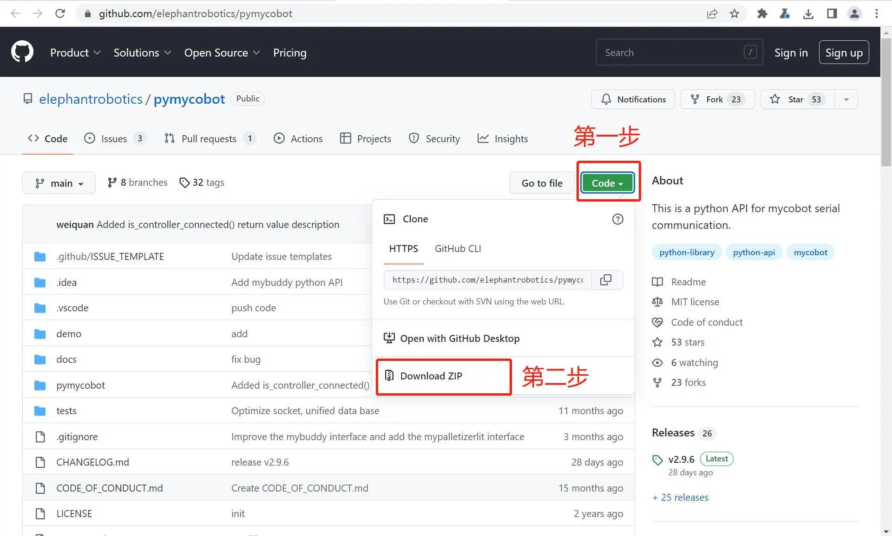

## 5 **简单演示**

在 PyCharm 中新建一个 Python 文件，输入以下代码可执行 LED 闪烁（myCobot 280-M5、myCobot 320-M5 以及 myPalletizer 260 可参考以下代码）。

> **注意：** 各款设备的对应的波特率不尽相同，使用时请查阅资料了解其波特率，串口编号可通过**[计算器设备管理器](https://docs.elephantrobotics.com/docs/gitbook/4-BasicApplication/4.1-myStudio/4.1.1-myStudio_download_driverinstalled.html#4113-%E5%A6%82%E4%BD%95%E5%8C%BA%E5%88%86cp210x%E5%92%8Ccp34x%E8%8A%AF%E7%89%87)**或串口助手进行查看。

以下是 myCobot 和 myPalletizer 相应的代码。

- **MyCobot:**

```python
# demo.py
from pymycobot.mycobot import MyCobot
import time
# 以上需写在代码开头，意为导入项目包

# MyCobot 类初始化需要两个参数：串口和波特率
#   第一个是串口字符串， 如：
#       linux： "/dev/ttyUSB0"
#       windows: "COM3"
#   第二个是波特率：
#       M5版本为： 115200
#   以下为如:
#       mycobot-M5:
#           linux:
#              mc = MyCobot("/dev/ttyUSB0", 115200)
#           windows:
#              mc = MyCobot("COM3", 115200)
#       mycobot-raspi:
#           mc = MyCobot(PI_PORT, PI_BAUD)
#
# 初始化一个MyCobot对象
# 下面为 windows版本创建对象代码
mc = MyCobot("COM3", 115200)

i = 7
# 循环7次
while i > 0:
    mc.set_color(0,0,255) #蓝灯亮
    time.sleep(2)	#等2秒
    mc.set_color(255,0,0) #红灯亮
    time.sleep(2)	#等2秒
    mc.set_color(0,255,0) #绿灯亮
    time.sleep(2)	#等2秒
    i -= 1
```

运行样例文件:

```bash
python3 demo.py
```

机械臂末端的蓝，红，绿灯交替循环点亮，点亮时间持续 2 秒，共 7 次。

---

[← 上一页](../README.md) | [下一页 →](2_API.md)
