# Environment Building

pymycobot is a Python package used for serial communication with myCobot. It supports Python2, Python3.5 and later versions.

Before using pymycobot, make sure to build a Python environment. Follow the steps below to install Python.

## 1 Download and Installation of Python


At present, Python has two versions: `2.x` and `3.x`. These two versions are incompatible with each other. This section takes the version `3.x` as an example due to its increasing popularity.

### 1.1 Installing Python

> **Notice:** Before installation, check the operation system of PC. Press right button on the `My Computer` icon and  then select `Properties`. Install the corresponding Python.
>
> 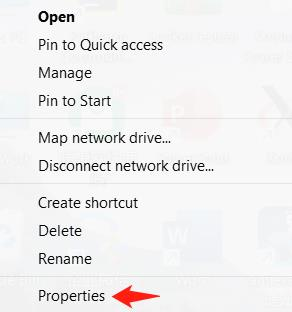
>
> 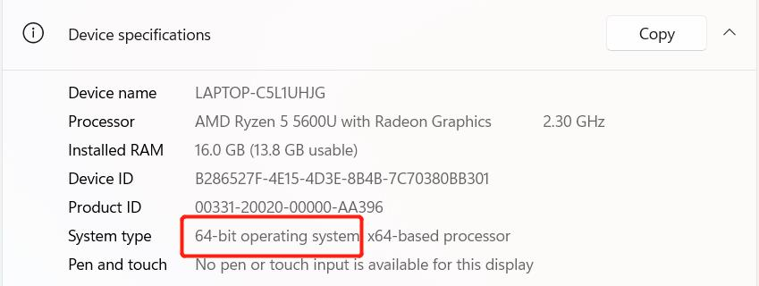


* **Go to http://www.python.org/download/ to download Python.**
* **Click on `Downloads`, and then download begins. Tick `Add Python 3.10 to PATH`. Click on `Install Now`, and then installation begins.**

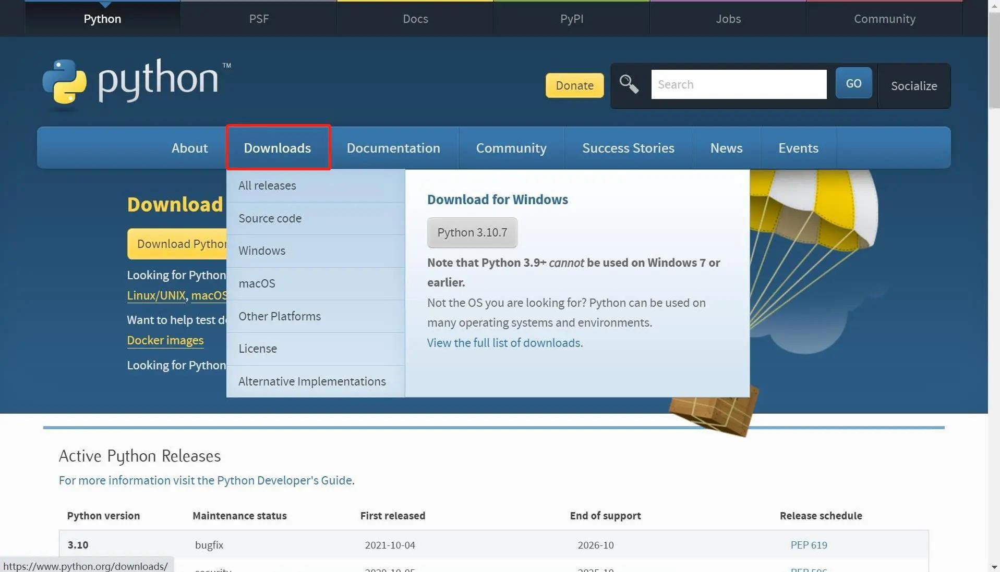


* **Download and installation complete.**

  


### 1.2 Running Python
Open the command prompt window (Win+R, input `cmd` and press `Enter`). Type `Python`.

**Successful Installation:**

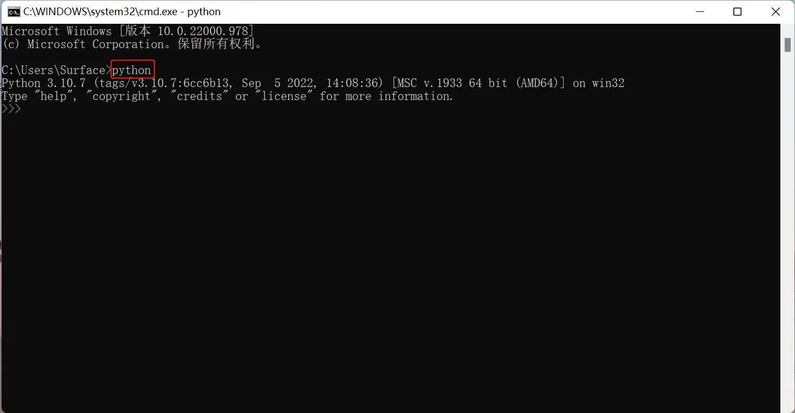

This on-screen instruction means that Python is successfully installed. The prompt `>>>` means Python interactive environment. If you input a Python code to get the execution result immediately.


**Error Report:** 

If a wrong instruction is typed, for example "pythonn", the system may report an error.

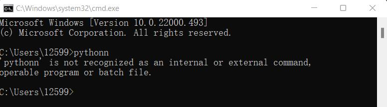

> **Notice:** Generally, the error results from lack of environment configuration. Refer to **1.3 Environment Configuration** to solve problems.


### 1.3 Environment Variable Configuration 
Windows follows the path set by a Path environment variable in search of **python.exe** . Otherwise, an error will be reported. If you fail to tick `Add Python 3.9 to PATH` during installation, you need to manually add the path where python.exe is located into environment variable or download python again. Remember to tick `Add Python 3.9 to PATH` .

Follow the steps below to add python into environment variable manually.

* Right click on `My Computer` icon -->Properties ->Advanced System Settings ->Environment Variables


* The environment variables include user variables and system variables. For user variables, users can utilize their own downloaded programs via `cmd` command. Write the absolute path of the target program into the user variables.


* After the configuration, open the command prompt window (Win+R; input `cmd` and press `Enter`), and type `Python`.


## 2 Installation of PyCharm

PyCharm is a powerful python editor with the nature of cross-platform. Follow the steps below to download and install PyCharm.

Go to **[PyCharm](http://www.jetbrains.com/pycharm/download/#section=windows)** to download PyCharm.

### 2.1 Download and Installation

Official website view:


It is recommended to install the free version.

* Click on `Next`:


* Select options according to your needs and then select `Next`:


* Tap `Install`:


* Installing:


* Tap `Finish`

  


### 2.2 Create a new project

* Click `+New Project` :

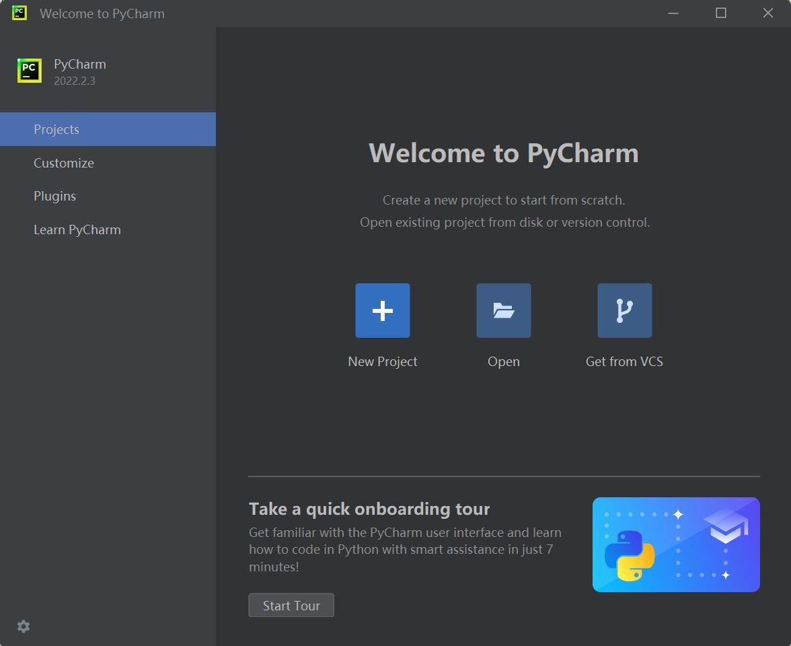

*  The `Interpreter` is used to interpret python programs. Select  `Add Interpreter` ->`New`to add base interpreter.

  

  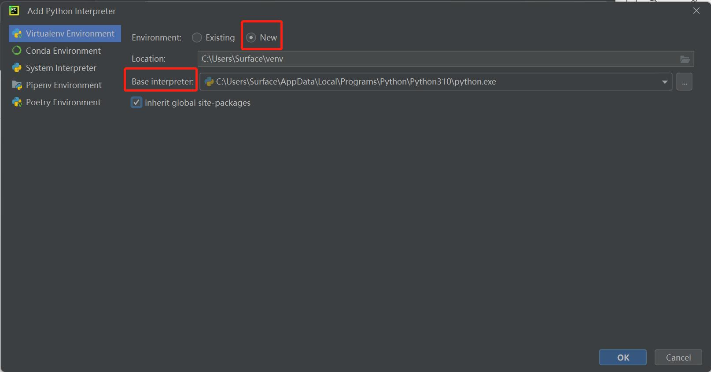

* `Location` refers to the place where to save python file. Choose a file to put your programs.

  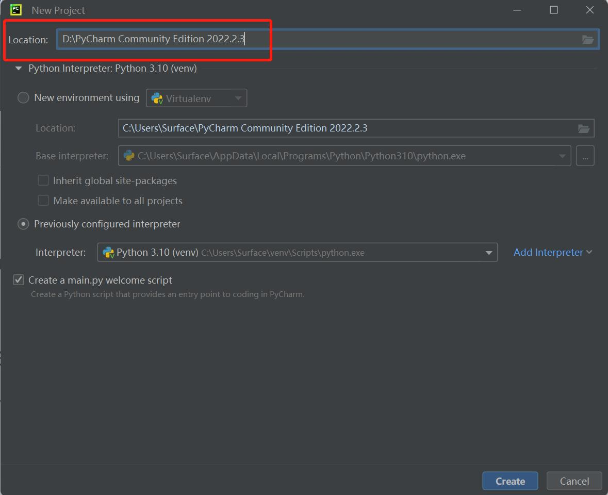

* Click on `Create` and a sample appears:
  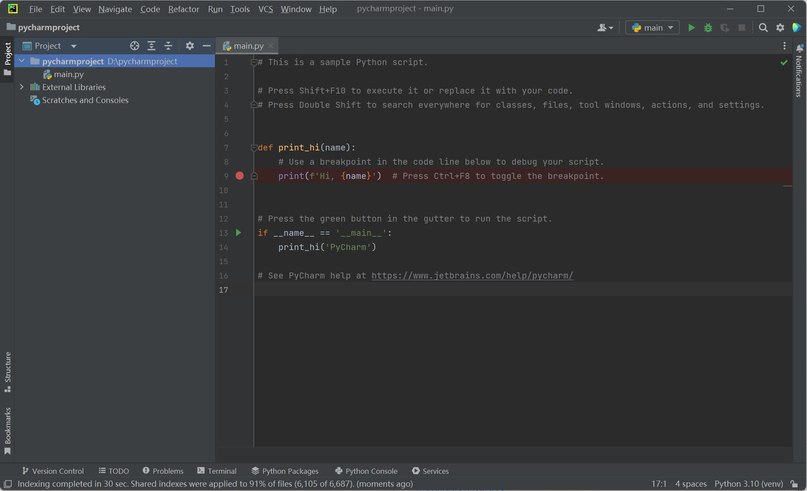

* Right click on the selection that the red arrow points, and create a new python file.

  

* Type name for the new file.

  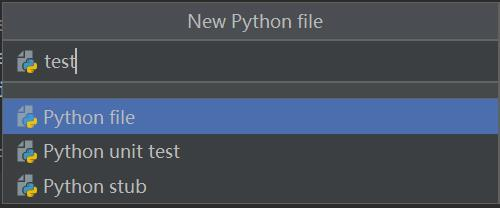


## **3 Preparations**

* Firmware burning. Firmware serves as a driver for systems to control robots. 

  * **M5Stack version** Make sure to burn ` minirobot` for **Basic** at the bottom. And then choose` Transponder` function (to receive instructions from Basic), Press `Press A`. `Atom: OK` means connect successfully. Refer to [**MyStudio**]((https://docs.elephantrobotics.com/docs/gitbook-en/4-BasicApplication/4.1-myStudio/)) for more information about firmware burning.

* pymycobot installation. Type `pip install pymycobot --upgrade --user` via terminal (Win+R) `cmd` command.

  ```python
  pip install pymycobot --upgrade --user
  ```

  

  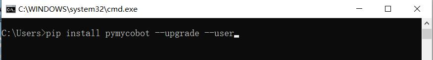

* Source code installation. Open a terminal (Win+R, input `cmd` ), and type the command below to install.

  ```python
  git clone https://github.com/elephantrobotics/pymycobot.git <your-path>   
  #Fill in your installation address in <your-path>, do not choose the current default path.
  								
  cd <your-path>/pymycobot	
  #Go to the pymycobot folder of the downloaded package.
  
  #Run one of the following commands according to your python version.
  # Install
   python2 setup.py install	
  # or
   python3 setup.py install
  ```

* Update pymycobot

```bash
pip install pymycobot --upgrade
```


## 4 Import of pymycobot 

This part takes MyCobot 320-M5 as an example to introduce how to control a robot via python. 

* Import  pymycobot  library for MyCobot :

```python
from pymycobot.mycobot import MyCobot
```

> **Notice:**
>
> 1. If no red wavy line appears below the codes, pymycobot is successfully installed.
> 2. if a red wavy line appears, got to the address **https://github.com/elephantrobotics/pymycobot** to download pymycobot manually and put it into python library.
>
> 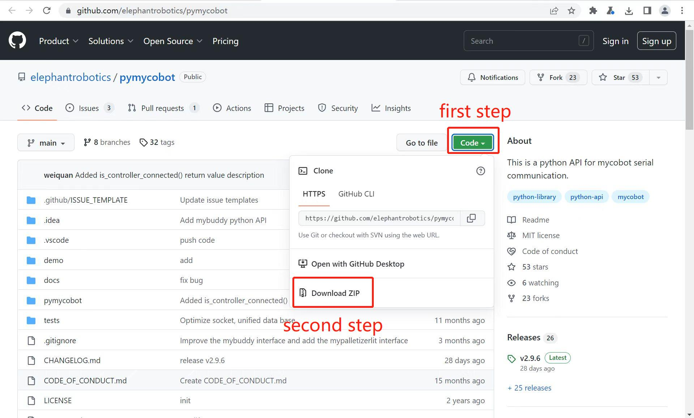


## 5 **Simple Demo**

Create a new Python file, and type the following codes to set the color of RGB light panel.

>  **Notice:** The baud rates are different according to types of devices. Refer to **[calculator device manager](https://docs.elephantrobotics.com/docs/gitbook-en/4-BasicApplication/4.1-myStudio/4.1.1-myStudio_download_driverinstalled.html#4113-%E5%A6%82%E4%BD%95%E5%8C%BA%E5%88%86cp210x%E5%92%8Ccp34x%E8%8A%AF%E7%89%87)** to check the corresponding number.


* **Codes for MyCobot:**

```python
# demo.py
from pymycobot.mycobot import MyCobot
import time
#The above codes are required to be written, which means importing the project package

# MyCobot class initialization requires two parameters:
#   The first is the serial port string:
#       windows: "COM3"
#       linux: "/dev/ttyUSB"
#   The second is the baud rate:
#       M5 version is:  115200
#
#    Example:
#       mycobot-M5: mc = MyCobot("COM3", 115200)

# Initiate MyCobot
# Create object code here for windows version
mc = MyCobot("COM3", 115200)

i = 7
#loop 7 times
while i > 0:							
    mc.set_color(0,0,255) #blue light on
    time.sleep(2)	#wait for 2 seconds				
    mc.set_color(255,0,0) #red light on
    time.sleep(2)	#wait for 2 seconds
    mc.set_color(0,255,0) #green light on
    time.sleep(2)	#wait for 2 seconds
    i -= 1
```

Run the example file:
```bash
python3 demo.py
```


The blue, red, and green lights on the top of the robot flash 7 times continuously at an interval of 2 seconds.

---

[← Previous Page](../README.md) | [Next Page →](2_API.md)