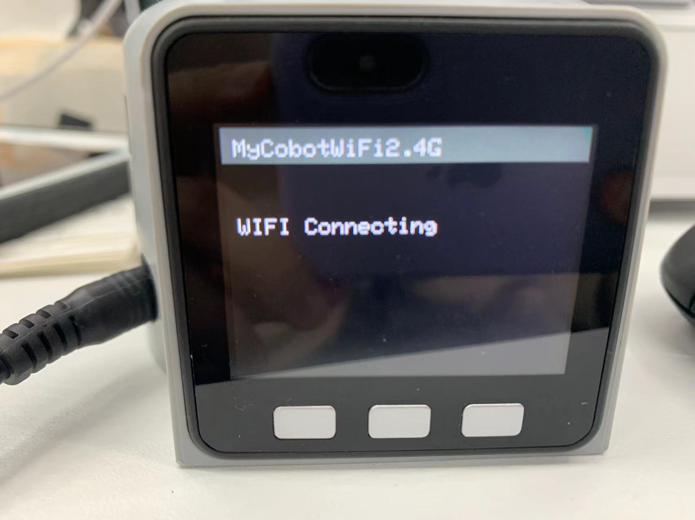
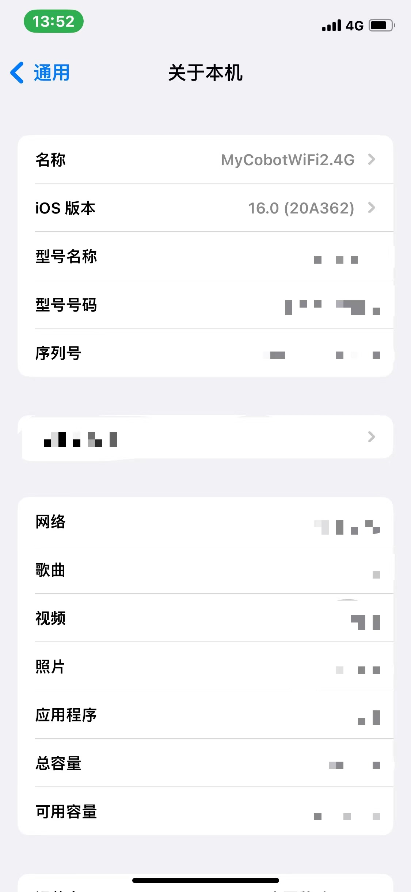
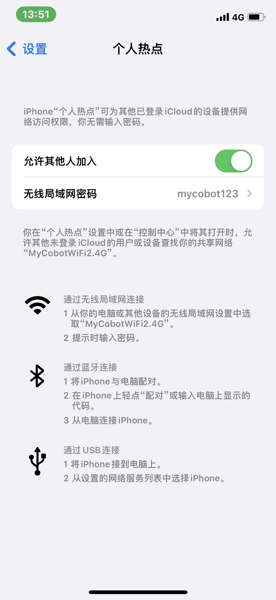
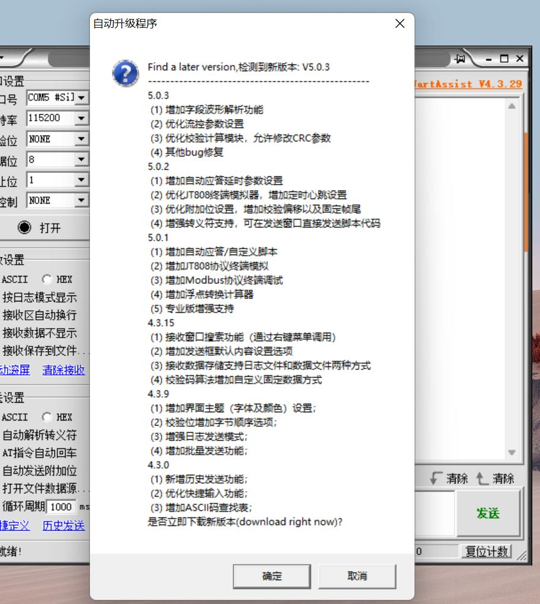
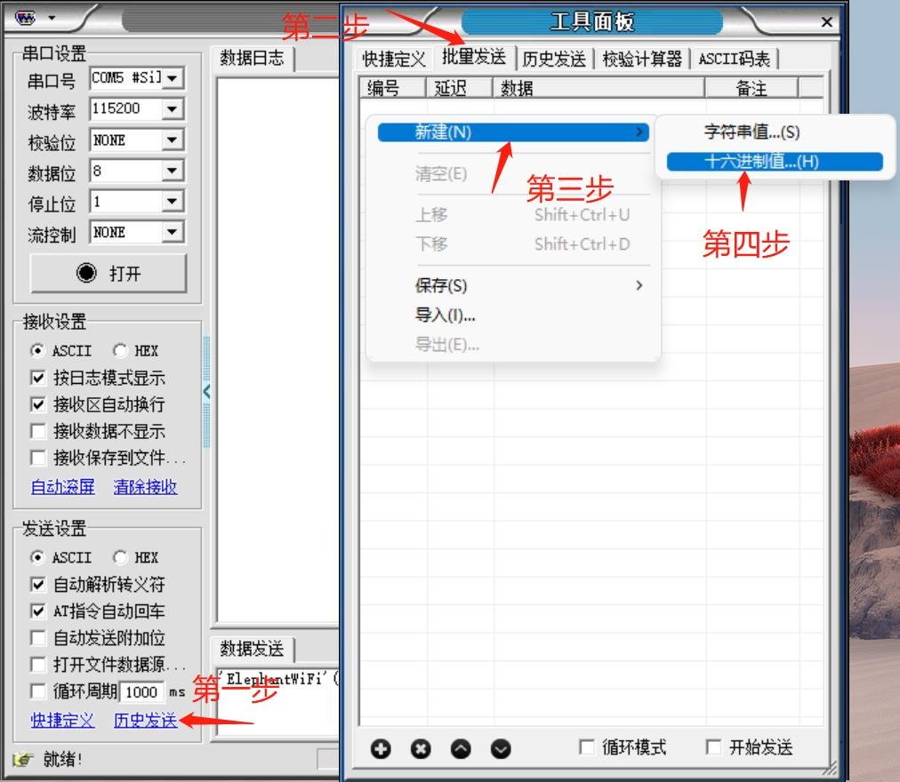
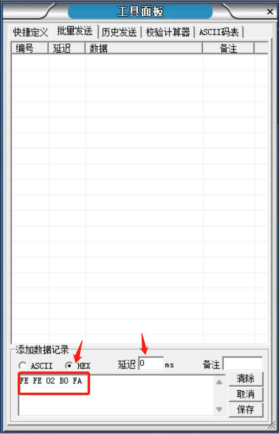
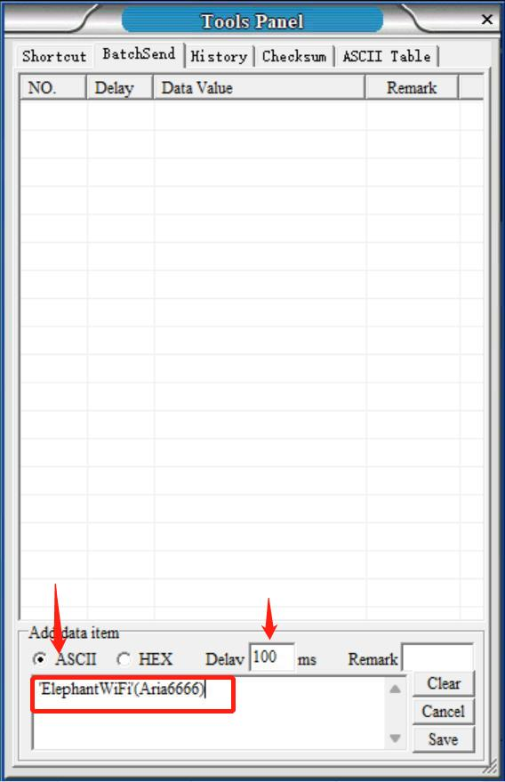
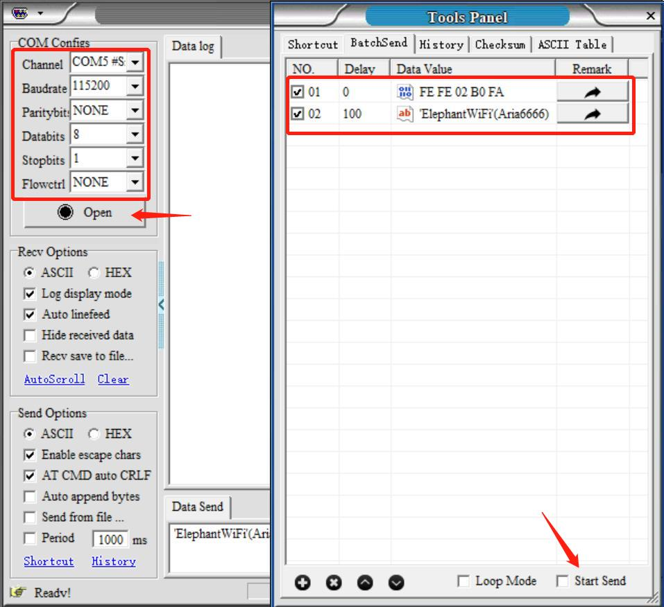
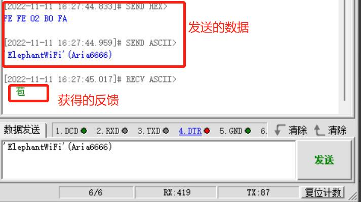
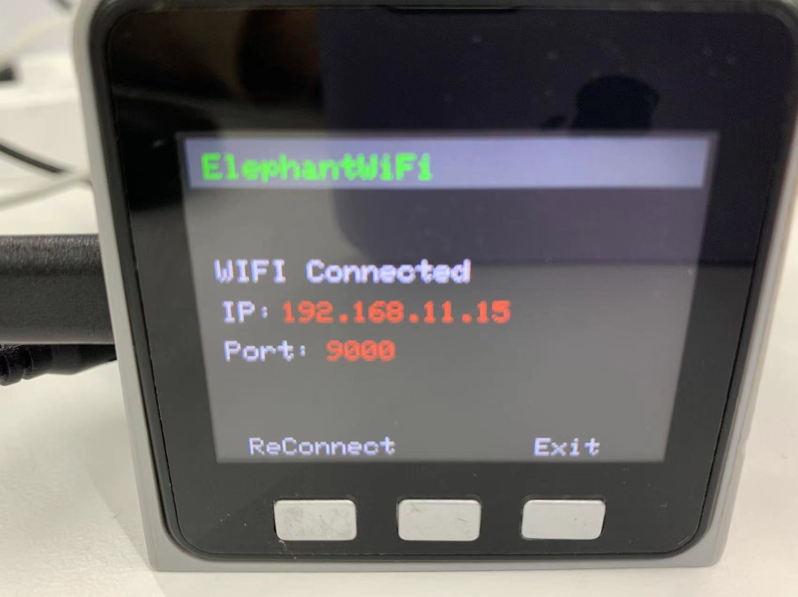

# TCP/IP

TCP/IP 传输协议，即传输控制/网络协议，也叫作网络通讯协议。它是在网络的使用中的最基本的通信协议，对互联网中各部分进行通信的标准和方法进行了规定。用户可以通过机械臂的 IP 地址连接机械臂，达到无需连接 USB 端口也可以远程操作机械臂的效果。

本章以 myCobot 280 M5 为例进行说明。

**使用前请确保 M5Stack-basic 和 Atom 均已烧录。**

## myCobot

### 连接

#### 1.1 WIFI

请按照以下步骤操作。

**Step 1:** 固件烧录完成后点击`WlAN Server`，出现`WIFI Connecting`提示，表示无线网络正在连接。

**Step 2:** 出现 WIFI Connected 以及 IP 和 Port 信息说明 WIFI 已经成功连接。

##### 1.2 移动网络连接

**Step 1:** 如需使用移动网络与机械臂连接，则需把手机移动热点修改为与机械臂网络一致，即“MyCobotWiFi2.4G”，机械臂移动网络密码为“mycobot123”。

**Step 2:** 点击 WLAN Server 即可连接。

> **注意：**如果连接失败请返回到 USB UART 选项点击一次再试。

##### 1.3 WIFI 无法连接解决方案

**Step 1:** 将 atom 和 basic 固件更新到 minirobot v2.0 和 atommain v4.1 版本.

**Step 2:** 打开 UartAssist.exe。

**Step 3:** 打开之后注意不要升级软件版本，点击“取消“。

**Step 4:** 进入 APP 后，点击“历史发送”，点击“批量发送”，空白处右键，点击“新建”，选择“十六进制值”。

**Step 5:** 数据类型选择 HEX，输入 FE FE 02 B0 FA，延迟修改为 0，点击“保存”。

**步骤 6：** 按照下图所示设置继续添加项目。记住在空白框中输入您的个人 WIFI 名称和密码。确保 WIFI 名称周围有引号（英文），密码周围有括号（英文）。然后保存。

**Step 7:** 以上设置完成后需要操作机械臂 basic 进入 Transponder，选择 USB UART。

**Step 8:** 选择串口号，点击“打开”，选中这两个指令，点击“开始发送”。

**Step 9:** 此时可以看到发送的数据会有反馈。

**Step 10:** 操作机械臂 basic 选择 WALN Server，就可以正常连接 WiFi 了。

---

[← 上一页](2_API.md) | [下一页 →](4_Handle_control.md)
