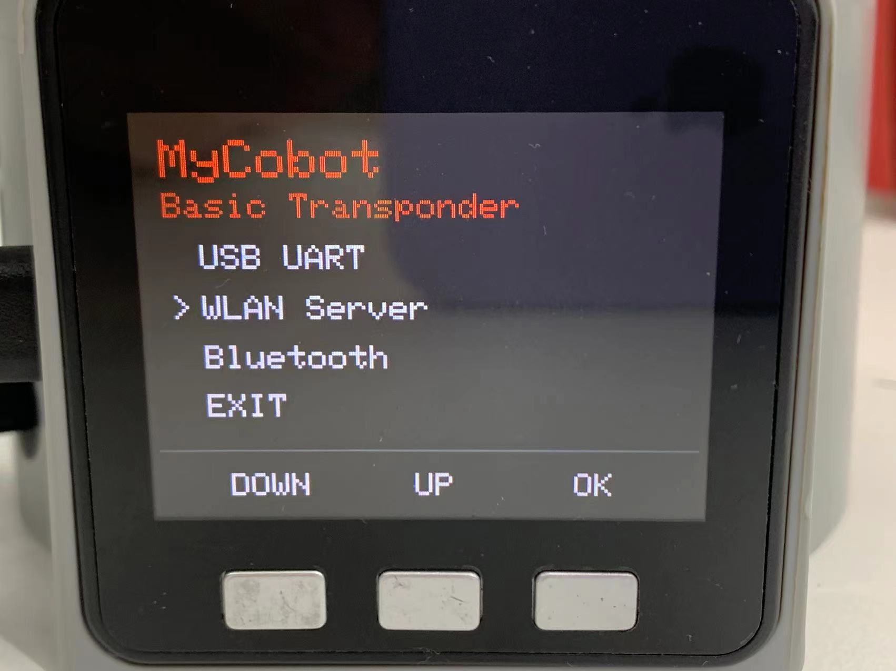
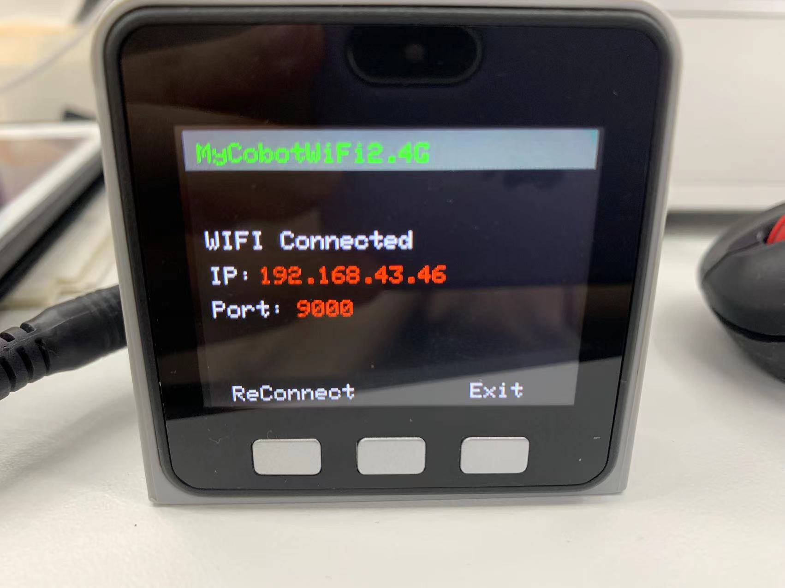
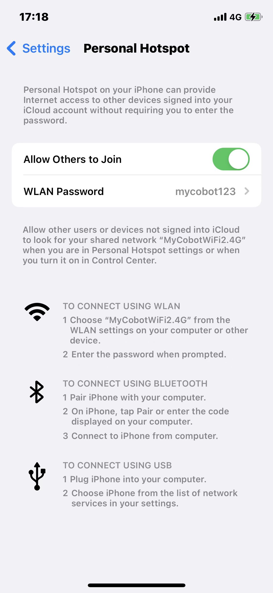
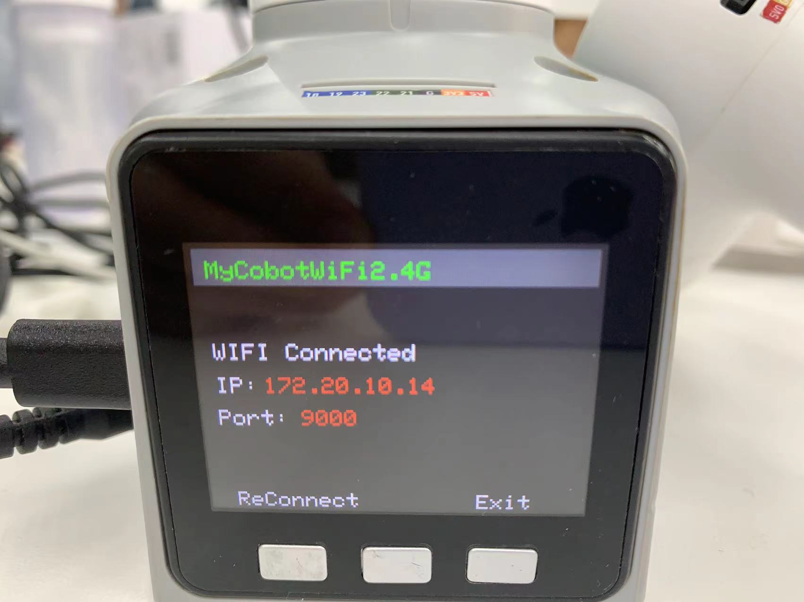
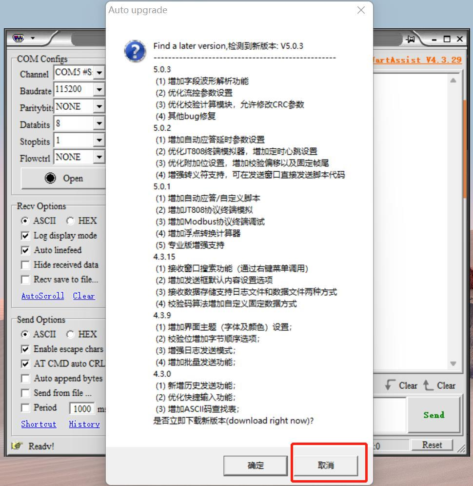
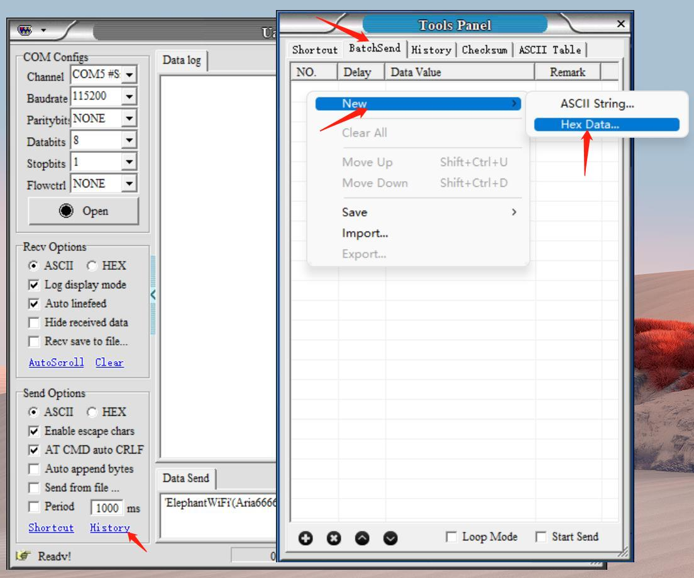

# TCP/IP

TCP/IP, or Transmission Control Protocol/Internet Protocol, is one of the most fundemental communicative protocol on Internet, which stipulates the standard and methods of the Internet communication. Users can control robotic arms remotely through connecting with IP address instead of the USB port.

In this chapter, myCobot 280 M5 is used as an example for explanation.

**Make sure that M5Stack-basic and Atom are both burnt before using.**

## myCobot

### Connection

#### 1.1 WIFI

Follow the steps below.

**Step 1:** Press WLAN Server, and "WIFI Connecting" appears, signaling that the robotic arm is connecting with WIFI.

**Step 2:** If the screen shows WIFI Connected, IP and Port, it means that robotic arm is successfully connected with WIFI.

##### 1.2 Mobile Network

**Step 1:** It is required to change the name of hotspot on your smartphone into the same as that on the robotic arm, namely "MyCobotWiFi2.4G". Meanwhile, change the password of hotspot as "mycobot123".

**Step 2:** Press WLAN Server to connect with mobile network.

> **Notice:** If it fails to connect, go back to press USB UART and then try the steps above again.

##### 1.3 Solution to Failed Connection

**Step 1:** Update the version of Atom and M5Stakc-basic to the minirobot v2.0 and atommain v4.1.

**Step 2:** Click on the icon to open the software UartAssist.exe.

**Step 3:** Click on "取消".

**Step 4:** Click on History, and then BatchSend. After that, right-click in the white space, and then New to add a data item.

**Step 5:** Add a data item according to the settings shown in the figure below. And then, save that item.

**Step 6:** Continue to add item in accordance with the settings shown in the figure below. Remember to type your personal WIFI name and password into the blank box. Make sure that WIFI name is surrounded by quotation mark (English) and password is surround by bracket (English). And then save it.

**Step 6:** Press `Transponder` on the M5Stack-basic and then press USB UART.

**Step 7:** Set COM configurations, and then click on "Open". After that, click on "Start Send".

**Step 8:** After sending the data items, there is a response.

**Step 9:** Press WLAN Server on the M5Stack-basic to connect successfully.

---

[← Previous Page](2_API.md) | [Next Page →](4_Handle_control.md)