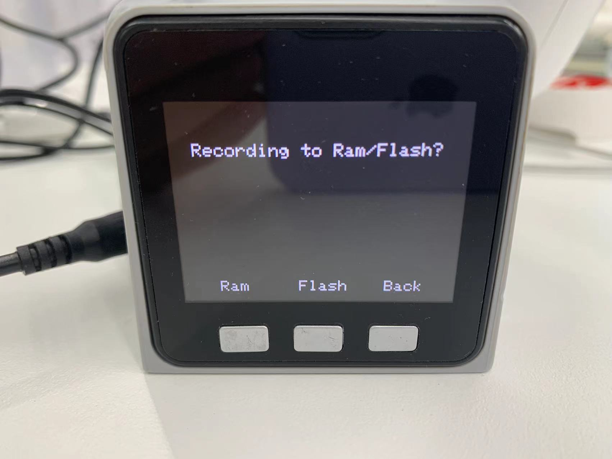

# Drag-and-Record Demonstration

## 1 Applicable Robotic Arms

- myCobot 320 M5

## 2 Steps to Operate the Arms

**Step1:** Burn the latest **atomMain** for **Atom.**

**Step 2:** Burn**minirobot**for**M5Stack-basic**, and press **Maincontrol**.

**Step 3:** Press **Record**.

**Step 4:** Select path for storage, and press **Ram** or **Flash**.

> - RAM is a type of volatile memory, meaning it requires continuous power supply to retain stored data. RAM provides random access, allowing the CPU to access any memory cell directly without the need for sequential access. Thus, RAM offers very fast read and write speeds.
> - Flash memory is non-volatile, meaning it does not require continuous power to retain stored data. It utilizes electronic storage technology where data is programmed into memory cells. Writing to flash memory is relatively slower compared to reading, but reading operations are typically fast.
> - RAM is volatile, while Flash memory is non-volatile, retaining data even during power loss. RAM is used for temporary storage, whereas Flash memory is used for long-term storage. RAM offers faster read and write speeds compared to Flash memory.

**Step 5:** Move the joints of the robot arm to specific positions. After that, press any one of the three buttons so as to stop recording and save the motion.

**Step 6:** Press **Play** to let the robot perform the motion recorded just now.

> **Notice:**
>
> **Pause**: pause the movement
>
> **Stop**: stop the movement
>
> **Play**: resume the movement

## 3 Tutorial Video

Address: [https://www.bilibili.com/video/BV16t4y167vw/](https://www.bilibili.com/video/BV16t4y167vw/)
