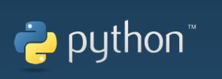

## What is Python?

**Our products are friendly to python and also becomes increasingly perfect for the development of a python API library. Through python, the joint angle, coordinates, gripper and other aspects of the robot can be controlled, and there are many options available. If you want to control our robot arms via Python programming, you are recommended to learn this chapter.**

## 

**Python** was designed in the early 1990s by Guido van Rossum of the Netherlands Society for Mathematics and Computer Science as an alternative to a language called ABC.

**Python** not only provides efficient, advanced data structures, but also can be used to do simple and effective object-oriented programming.

The Syntax and dynamic typing of **Python** as well as the nature of interpreted languages, make it become a programming language for scripting and rapid application development on most platforms. With the continuous updating of the version and the addition of new features, it is gradually used to develop independent, large-scale projects.

The interpreter of **Python** is easily extensible, and new functions and data types can be extended using the C or C++ language (or other languages that can be called through C language).。

**Python** can also be used for extending program languages in customizable software. **Python** has rich standard libraries and provides source or machine codes suitable for each major system platform.

## Installing Python

- **Python** Python's official downloading address：https://www.python.org/downloads/
- [**Python** downloading and Installation Tutorial](https://python.land/installing-python#Install_Python_on_Windows) for reference only

### 1 Download and Installation of Python

Python is applicable to:

- myCobot 280：
  - myCobot 280 M5
  - myCobot 280 PI
  - myCobot 280 Jetson Nano
  - myCobot 280 for Arduino
- myCobot 320：
  - myCobot 320 M5
  - myCobot 320 PI
- myPalletizer 260：
  - myPalletizer 260 M5
  - myPalletizer 260 PI
- mechArm-270：
  - mechArm-270 M5
  - mechArm-270 PI

At present, Python has two versions: `2.x` and `3.x`. These two versions are incompatible with each other. This section takes the version `3.x` as an example due to its increasing popularity.

#### 1.1 Installing Python

> **Notice:** Before installation, check the operation system of PC. Press right button on the `My Computer` icon and then select `Properties`. Install the corresponding Python.
>
> 
>
> 

- **Go to http://www.python.org/download/ to download Python.**
- **Click on `Downloads`, and then download begins. Tick `Add Python 3.10 to PATH`. Click on `Install Now`, and then installation begins.**

- **Download and installation complete.**

  

#### 1.2 Running Python

Open the command prompt window (Win+R, input `cmd` and press `Enter`). Type `Python`.

**Successful Installation:**

This on-screen instruction means that Python is successfully installed. The prompt `>>>` means Python interactive environment. If you input a Python code to get the execution result immediately.

**Error Report:**

If a wrong instruction is typed, for example "pythonn", the system may report an error.

> **Notice:** Generally, the error results from lack of environment configuration. Refer to **1.3 Environment Configuration** to solve problems.

#### 1.3 Environment Variable Configuration

Windows follows the path set by a Path environment variable in search of **python.exe** . Otherwise, an error will be reported. If you fail to tick `Add Python 3.9 to PATH` during installation, you need to manually add the path where python.exe is located into environment variable or download python again. Remember to tick `Add Python 3.9 to PATH` .

Follow the steps below to add python into environment variable manually.

- Right click on `My Computer` icon -->Properties ->Advanced System Settings ->Environment Variables

- The environment variables include user variables and system variables. For user variables, users can utilize their own downloaded programs via `cmd` command. Write the absolute path of the target program into the user variables.

- After the configuration, open the command prompt window (Win+R; input `cmd` and press `Enter`), and type `Python`.

**Preconditions for use：**

- **M5** series version， the bottom **M5Stack-basic** is programmed to miniRobot , select the **Transponder** function, and the end **ATOM** is programmed to the latest version of atomMain (the factory default has been programmed)
- **Pi \ jetsonnano** series, **ATOM** burns the latest version of **atomMain** (factory default already burnt)

---

[← Previous Chapter](../5-BasicApplication/5.2-ApplicationUse/5.2.1-myblockly/320m5/1-myBlocklyFirstUse.md) | [Next Page →](../10-ApplicationBasePython/10.2_320_M5-ApplicationPython/1_download.md)
