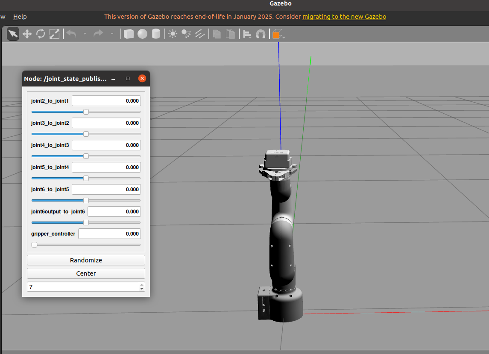
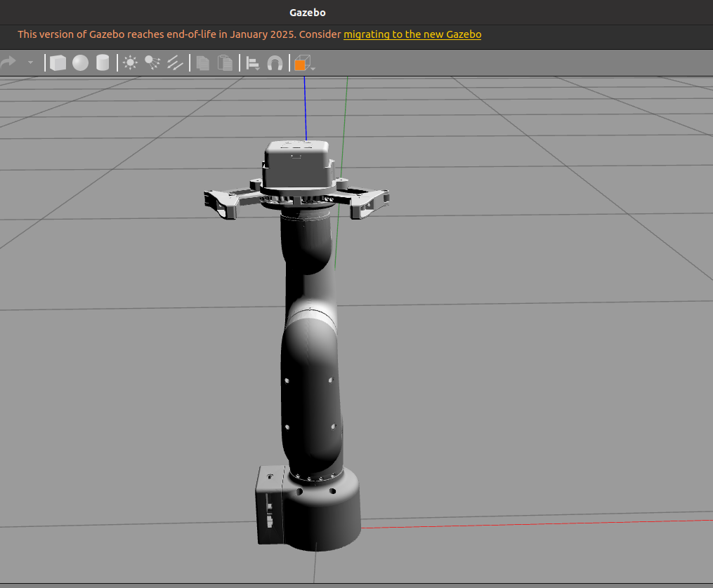
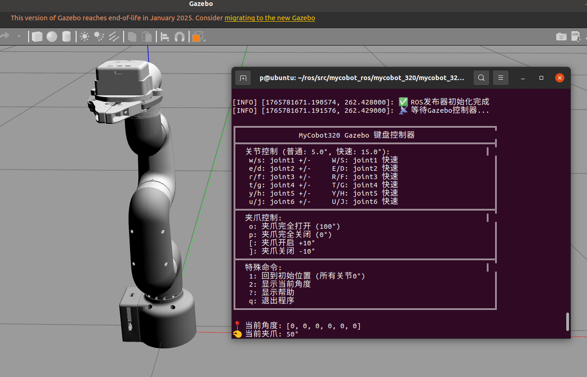

# Gazebo Introduction and Usage

Gazebo is a 3D visualization platform in ROS. On one hand, it can display external information graphically; on the other hand, it can publish control information to objects through RViz to monitor and control robots. It supports simulating a real physical world and can be used in conjunction with MoveIt.

## Local Setup

### 1. Operation Process

#### 1.1 Prerequisites

To use this package, you need to install the [Python API](https://github.com/elephantrobotics/pymycobot.git) library first.

```bash
pip install pymycobot --user

# Environment:
ros1 noetic
gazebo 11
pymycobot 4.0.3
```

#### 1.2 Package Download and Installation

Download the package to your ROS workspace:

```bash
$ cd ~/catkin_ws/src
$ git clone https://github.com/elephantrobotics/mycobot_ros.git
$ cd ~/catkin_ws
$ catkin_make
$ source devel/setup.bash
```

---

## MyCobot_320_m5-Gazebo Usage Guide

### 1. Slider Control

Slider control through joint_state_publisher_gui is now implemented to control the robot arm model pose in Gazebo.

After connecting the real robot arm to the computer, check the port the robot arm is connected to:

```bash
ls /dev/tty*
# /dev/ttyACM0 or /dev/ttyUSB0
```

You will get output similar to:

```bash
/dev/tty    /dev/tty26  /dev/tty44  /dev/tty62      /dev/ttyS20
/dev/tty0   /dev/tty27  /dev/tty45  /dev/tty63      /dev/ttyS21
/dev/tty1   /dev/tty28  /dev/tty46  /dev/tty7       /dev/ttyS22
/dev/tty10  /dev/tty29  /dev/tty47  /dev/tty8       /dev/ttyS23
/dev/tty11  /dev/tty3   /dev/tty48  /dev/tty9       /dev/ttyS24
/dev/tty12  /dev/tty30  /dev/tty49  /dev/ttyACM0    /dev/ttyUSB0
/dev/tty13  /dev/tty31  /dev/tty5   /dev/ttyprintk  /dev/ttyS26
/dev/tty14  /dev/tty32  /dev/tty50  /dev/ttyS0      /dev/ttyS27
/dev/tty15  /dev/tty33  /dev/tty51  /dev/ttyS1      /dev/ttyS28
/dev/tty16  /dev/tty34  /dev/tty52  /dev/ttyS10     /dev/ttyS29
/dev/tty17  /dev/tty35  /dev/tty53  /dev/ttyS11     /dev/ttyS3
/dev/tty18  /dev/tty36  /dev/tty54  /dev/ttyS12     /dev/ttyS30
/dev/tty19  /dev/tty37  /dev/tty55  /dev/ttyS13     /dev/ttyS31
/dev/tty2   /dev/tty38  /dev/tty56  /dev/ttyS14     /dev/ttyS4
/dev/tty20  /dev/tty39  /dev/tty57  /dev/ttyS15     /dev/ttyS5
/dev/tty21  /dev/tty4   /dev/tty58  /dev/ttyS16     /dev/ttyS6
/dev/tty22  /dev/tty40  /dev/tty59  /dev/ttyS17     /dev/ttyS7
/dev/tty23  /dev/tty41  /dev/tty6   /dev/ttyS18     /dev/ttyS8
/dev/tty24  /dev/tty42  /dev/tty60  /dev/ttyS19     /dev/ttyS9
/dev/tty25  /dev/tty43  /dev/tty61  /dev/ttyS2
```

Enable communication and add execution permissions to the scripts:

```bash
sudo chmod -R 777 /dev/ttyACM0  # or sudo chmod -R 777 /dev/ttyUSB0
sudo chmod -R 777 mycobot_320m5_gazebo/mycobot_320m5_gripper_gazebo/scripts/follow_display_gazebo.py
sudo chmod -R 777 mycobot_320m5_gazebo/mycobot_320m5_gripper_gazebo/scripts/slider_control_gazebo.py
sudo chmod -R 777 mycobot_320m5_gazebo/mycobot_320m5_gripper_gazebo/scripts/teleop_keyboard_gazebo.py
roscore
```

After confirming the port, open a terminal in the workspace and enter the following command (remember to change the port to the value found in the previous step):

```bash
source devel/setup.bash
roslaunch mycobot_320m5_gripper_gazebo slider.launch _port:=/dev/ttyACM0 _baud:=115200
```

Then open another terminal in the workspace and enter:

```bash
source devel/setup.bash
rosrun mycobot_320m5_gripper_gazebo slider_control_gazebo.py _port:=/dev/ttyACM0 _baud:=115200
```

Remember to modify the port number to the one found in the previous step. If successful, you will see the following terminal prompt:

```bash
('/dev/ttyACM0', 115200)
spin ...
```

Now you can control the robot arm model pose in Gazebo by manipulating the joint_state_publisher_gui sliders.



---

### 2. Gazebo Model Following

The following commands allow the Gazebo model to follow the actual robot arm's movements. First, run the launch file:

```bash
source devel/setup.bash
roslaunch mycobot_320m5_gripper_gazebo follower.launch _port:=/dev/ttyACM0
```

If the program runs successfully, the Gazebo interface will load the robot arm model with all joints at their original pose, i.e., [0,0,0,0,0,0]. Then open a second terminal and run:

```bash
source devel/setup.bash
rosrun mycobot_320m5_gripper_gazebo follow_display_gazebo.py _port:=/dev/ttyACM0 _baud:=115200
```

Now when you manipulate the actual robot arm's pose, you can see the robot arm in Gazebo moving to the same pose.



---

### 3. Keyboard Control

You can also use keyboard input to control both the Gazebo robot arm model and the actual robot arm simultaneously. First, open a terminal and enter:

```bash
source devel/setup.bash
roslaunch mycobot_320m5_gripper_gazebo follower.launch _port:=/dev/ttyACM0 _baud:=115200
```

As in the previous section, you will see the robot arm model loaded in Gazebo with all joints at their initial pose. Then open another terminal and enter:

```bash
source devel/setup.bash
rosrun mycobot_320m5_gripper_gazebo teleop_keyboard_gazebo.py _port:=/dev/ttyACM0 _baud:=115200
```

If successful, you will see the following output in the terminal:

```shell
Mycobot_320m5_gripper_gazebo Teleop Keyboard Controller
---------------------------
Moving options (control the angle of each joint):

w: joint2_to_joint1++   s: joint2_to_joint1--
e: joint3_to_joint2++   d: joint3_to_joint2--
r: joint4_to_joint3++   f: joint4_to_joint3--
t: joint5_to_joint4++   g: joint5_to_joint4--
y: joint6_to_joint5++   h: joint6_to_joint5--
u: joint6output_to_joint6++ j: joint6output_to_joint6--

o: open gripper          p: close gripper

Other:
1 - Go to home pose
q - Quit
```



Based on the prompts above, you can learn how to control the robot arm. Each key press moves the robot arm and the Gazebo model by 1 degree. You can try holding down one of the keys to reach a certain pose.

