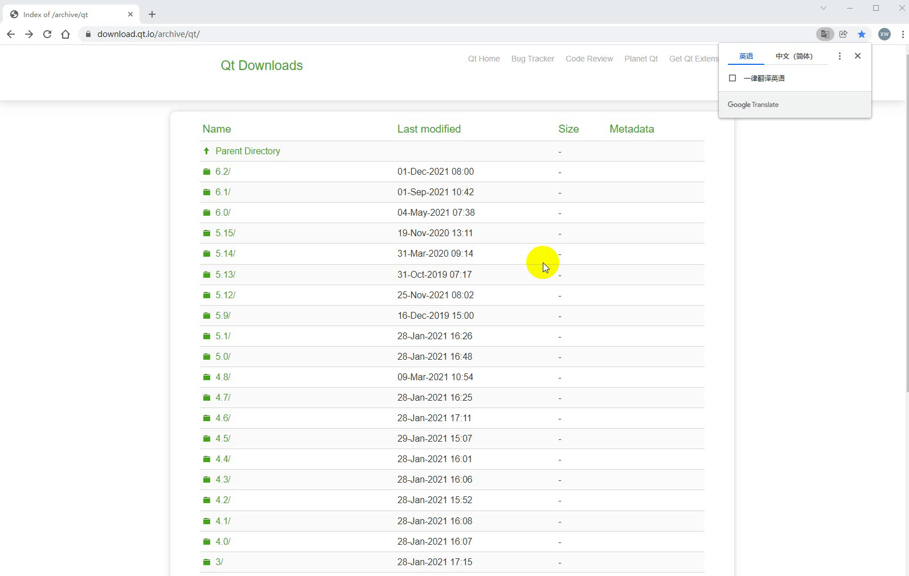
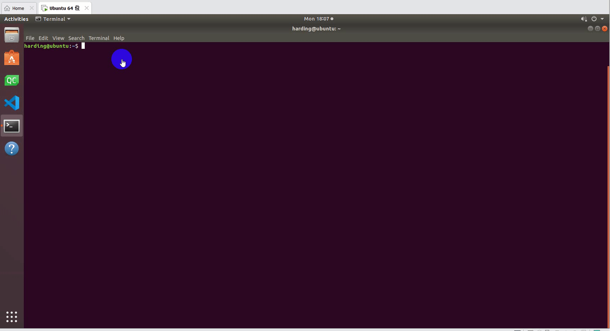

# C++ Environment building
## 1 Confirming development goals
MycobotCpp is an interface program used for serial communication with mycobot. It calls the mycobot library developed by our company, which contains simple use cases. If you want to make developments via C++ to control the robot that have been developed by us, it is your choice. 
Available for: Robot Arm Models: myCobot 280-M5 and myCobot 320-M5. 
The software required to run MycobotCpp: vs2019, qt5.12.10, and vsaddin (qt plugin). 
## 2 Windows Environment Configuration
### 2.1 Installing vs2019
- Downloading: First download [vs2019](https://visualstudio.microsoft.com/zh-hans/vs/) from the official website. 
- Installation: After installation is complete, the interface shown in the figure below will appear. "Universal Windows platform development, desktop development using C++, ASRNET and Web development" are mainly chosen (This is just a suggestion, you can choose according to your own needs. The installation time of vs2019 is long).  

 
- Environment variable configuration: This Computer -> Right-click Properties -> Advanced System Settings -> Environment Variables -> Look at System Variables, click New-> Variable Name: VCINSTALLDIR variable value: Find the directory where Redist is located (eg: D:2019), as shown in the following figure.  
    

### 2.2 Installing qt5.12.10
- Downloading: Download [qt5.12.10](https://download.qt.io/archive/qt/) and above versions. They are all available. The specific operation is shown in the figure below. 
  
- Installation: First log into the qt account. if you haven't an qt account, register first. Next, the interface for selecting components will appear. You may select MinGW and MSVC on Windows, as shown in the following figure. 
 
- Environment variable configuration: This Computer -> Right-click Properties -> Advanced System Settings -> Environment Variables -> Look at System Variables, click New-> Variable Name: QTDIR variable value: the directory where msvc2017_64 is located (eg: D:5.12.10\5.12.102017_64. For details, check the installation path in your computer), as shown in the following figure.  
 

### 2.3 Installing qt plugin vsaddin
- Downloading: First select the [vsaddin](https://download.qt.io/archive/vsaddin/) version corresponding to vs2019. The specific operation is shown in the figure below. 
  
- installation: direct installation.  
- configuration: vs2019 menu bar extension -> QT VS Tools -> QT Versions -> add new qtversion. For Path, select the path where msvc2017_64 is located (eg: D:5.12.10\5.12.102017_64). The specific operation is shown in the following figure:  
 
## 3 Linux Environment Configuration
### 3.1 Installing qt5.12.10
- Downloading: 
The download address is the same as Windows. Select the installation package on Linux. For details, see 8.1.2.2 above.  
- Installation:  
Command line installation: run ./"installation package name". If there is no execute permission, add execute permission: sudo chmod +x "installation package name", and then enter the graphical interface the same as Windows;  
graphical interface installation: the same as Windows. 
It is recommended to install qt directly with ordinary user rights. After the installation is successful, you can execute qmake –version, and the following interface appears: installation is successful:  
 
- Configuration:  
Open the configuration file, install qt: vi ~/.bashrc for ordinary users, and install qt: vi ~/.profile for root users. Add in the configuration file: export QTDIR=“the directory where qt is located” (eg: export QTDIR=$HOME/Qt/5.12.10/gcc_64), as shown in the following figure:  
 

---

[← Previous Page](README.md) | [Next Page →](12.2-build.md)