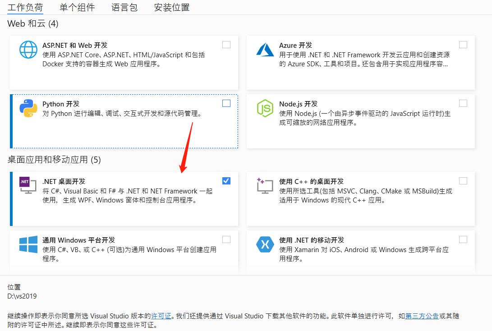
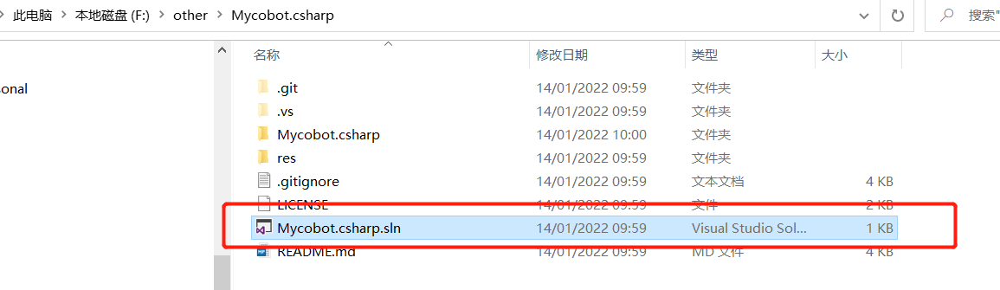
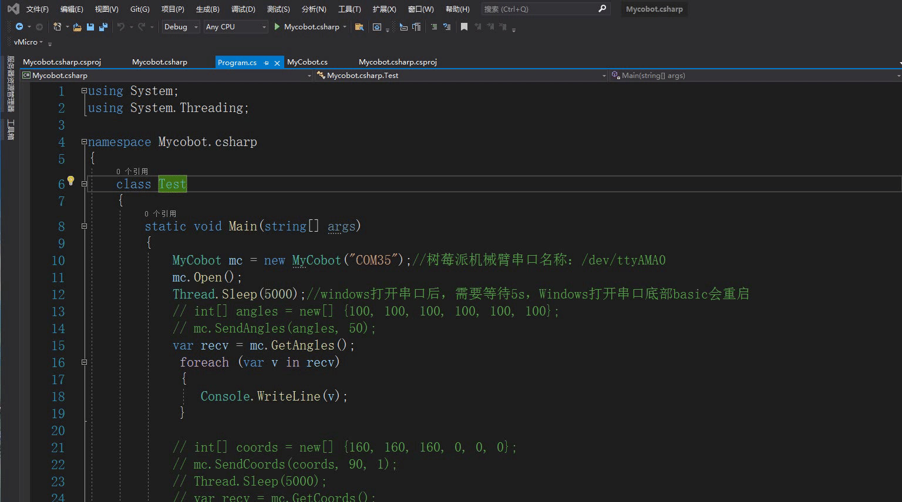
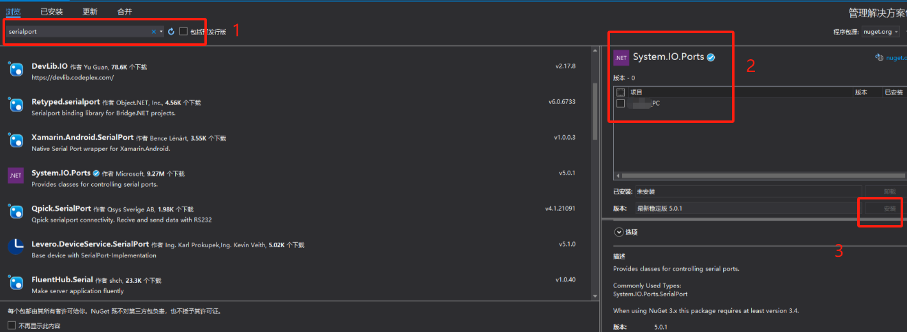

# C# Environment setup

## 1. Confirm development goals

**Mycobot.csharp is a program for serial communication with robots, with simple usage cases. If you want to use C # to freely develop and control the robots that our company has already developed, then it is your choice** 

Supported robotic arm models: **myCobot320** 
**Run the recommended software from Mycobot.csharp: vs2019 (developed on Windows) and MonoDevelop (developed on Raspberry Pi robotic arm)** 
## 2 Windows Environment Configuration
### 2.1 Installation vs 2019
Download: 

First, download [vs2019](https://visualstudio.microsoft.com/zh-hans/vs/)。 

Installation: 

After installation is completed, the interface shown below will appear, mainly selecting **.NET desktop development** is sufficient (this is only a suggestion, specific choices can be made according to your own needs, vs2019 installation time is longer) 

 

## 3. Compile and run the Mycobot.csharp case

### 3.1 Source code download
Download from GitHub[Mycobot.csharp](https://github.com/elephantrobotics/Mycobot.csharp)。 

### 3.2 Dynamic Library Download
Run the case and use it here [dynamic library](https://github.com/elephantrobotics/Mycobot.csharp/tags),It encapsulates the API for controlling the robotic arm: 
Select the latest version, as shown in the following figure： 
 
Dynamic Library Windows(Windows is divided into. net and. net frameworks. To distinguish them, please refer to the following section for running under Windows)and the Raspberry Pi system version, as shown in the following figure: 
 
Arrow 1 is applicable to the Raspberry Pi robotic arm system 
Arrow 2 applies to Windows systems 

## 4 Operation

### 4.1 Example of directly running Mycobot.csharp downloaded from GitHub:
Double click to open Mycobot.csharp.sln (make sure vs2019 is installed on your computer, if not, please refer to 9.1 environment setup) 
 
Compile and run the project, check the serial port number of the robotic arm. If it is not consistent with the example, please modify the serial port number, as shown in the following figure: 
 

### 4.2 Call the Mycobot.cshark dynamic library in your own project:
1. Check the target framework of the project and then download the corresponding dynamic library. If the target framework of your project is. net core,download**net core/Mycobot.csharp.dll**If the target framework is. net framework,download**net framework/Mycobot.csharp.dll**)<br（target frame） 
 
Import **Mycobot. csharp. DLL** into the project 
 
2. Add **system. io. ports** to. csproj (project name, which is located in the project directory). Please refer to the image below for details: 
frame: .net core 
 
frame: .net framework 
 
In versions prior to vs2019, as long as using System.IO.Ports You can use SerialPort If an error is displayed: the corresponding type name cannot be found in the namespace, the project needs to be configured with the corresponding DLL, as follows:
Tools ->Nuget Package Manager ->Manage Nuget packages for solutions ->Browse, search for the corresponding DLL (such as SerialPort) in the left search bar, check the project you want to add on the right, and click download and install 
 

## 5 Questions
Possible issues encountered during use: 
Question 1:System.Runtime, Version=5.0.0.0, Culture=neutral, PublicKeyToken=b03f5f7f11d50a3a' or one of its dependencies... 
Solution: **Update your SDK**(if .net core,update to 5.0 and choose,if .net framework update to 4.0 and choose 4.7.2)Look at the following animation: 
 
Question 2:System.IO.FileNotFoundException:“Could not load file or assembly 'System.IO.Ports, Version=6.0.0.0, Culture=neutral, PublicKeyToken=cc7b13ffcd2ddd51'. 
Solution: Check if it has been added**system.io.ports** to .csproj(Project name, this file is located in the project directory) View the above steps
---

[← Previous Section](../15-ApplicationBaseCSharp/15.6C-M5.md) | [Next Page →](../15-ApplicationBaseCSharp/15.1.1-angle.md)