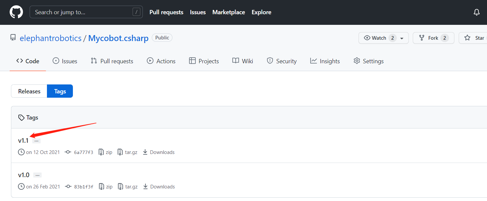
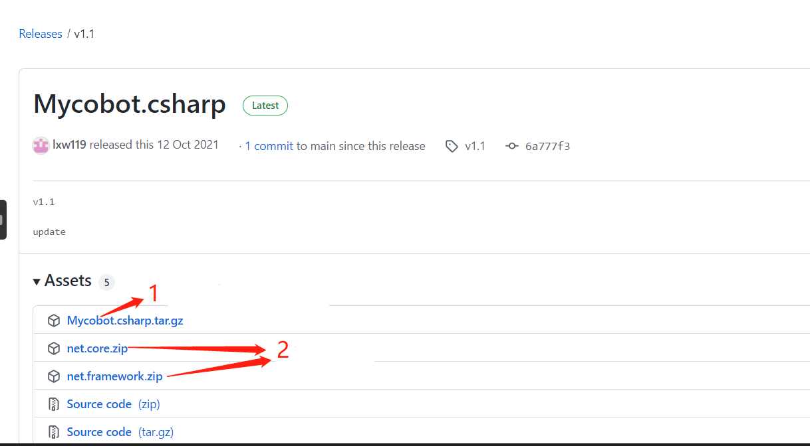

# C#  Environment setup

## 1 Confirm development goals

Supported robotic arm models: **myCobot320**< Br>
**Run the recommended software from Mycobot.csharp: vs2019 (developed on Windows) and MonoDevelop (developed on Raspberry Pi robotic arm)**< Br>
## 2 Raspberry Pi Robot Arm Environment Configuration
### 2.1 Install monodevelop
Installation  
**Execute the following command** in order to install, or you can view it[Official website description](https://www.monodevelop.com/download/#fndtn-download-lin)： 
sudo apt install apt-transport-https dirmngr 
sudo apt-key adv --keyserver hkp://keyserver.ubuntu.com:80 --recv-keys 3FA7E0328081BFF6A14DA29AA6A19B38D3D831EF 
echo "deb https://download.mono-project.com/repo/ubuntu vs-bionic main" | sudo tee /etc/apt/sources.list.d/mono-official-vs.list 
sudo apt update 
sudo apt-get install monodevelop 
Testing: 
Test whether the installation was successful, please check this[document](https://www.monodevelop.com/documentation/creating-a-simple-solution/)。 
## 3 Compile and run the Mycobot.csharp case
Download from GitHub[Mycobot.csharp](https://github.com/elephantrobotics/Mycobot.csharp)。 
### 3.2 动态库下载
To run the case, you need to use this dynamic library, which encapsulates the API for controlling the robotic arm: 
Select the latest version, as shown in the following figure: 
 
The dynamic library is divided into Windows and Raspberry Pi system versions, as shown in the following figure: 
 
Arrow 1 is applicable to the Raspberry Pi robotic arm system 
Arrow 2 applies to Windows systems 

### 3.3 Operation
1 Create a C # console application 
2 **Copy ** file  **program. cs **, **then paste**  program. cs  into the newly created C # console application 
3 Change the ** port number in program.cs** Change to **/dev/tyAMA0 ** (MyCobot mc=new MyCobot ("/dev/tyAMA0")) 
 
4 Change the compilation method to ** Release ** 
 
5 Add the Mycobot.csharp.DLL library file to the project，library:ReFerences-->Edit References-->.Net Assembly-->Browse(path for .dll) 
 
6 Operation 
Attention: Compile&&Run, the entire operation process can be seen in the following dynamic diagram: 
  
---
[← Previous Section](../15-ApplicationBaseCSharp/15.6C-PI.md) | [Next Page →](../15-ApplicationBaseCSharp/15.2.1-angle.md)