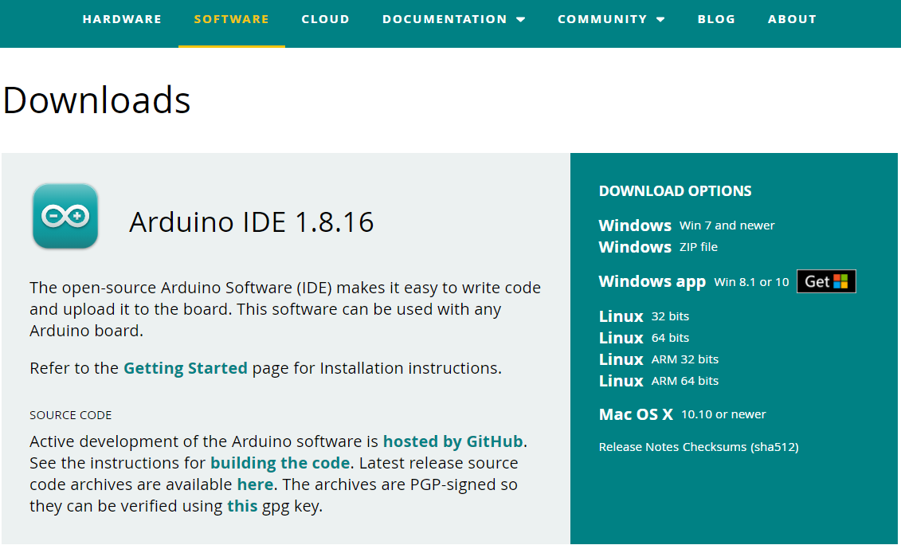
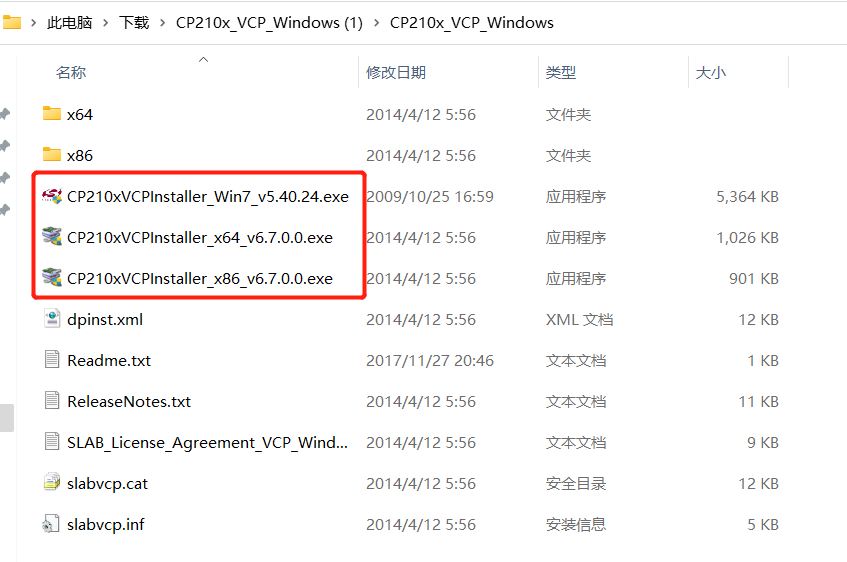
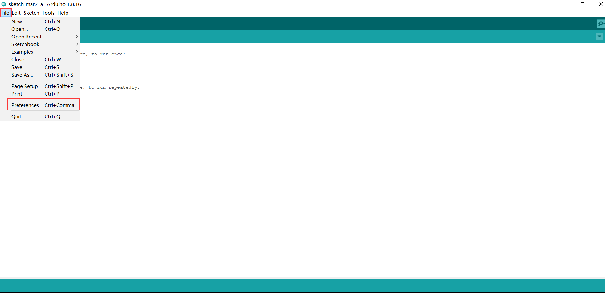
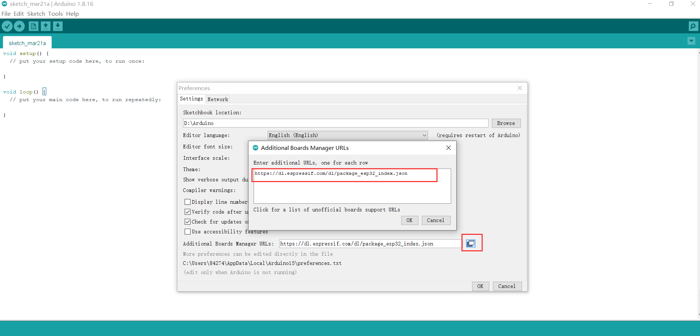
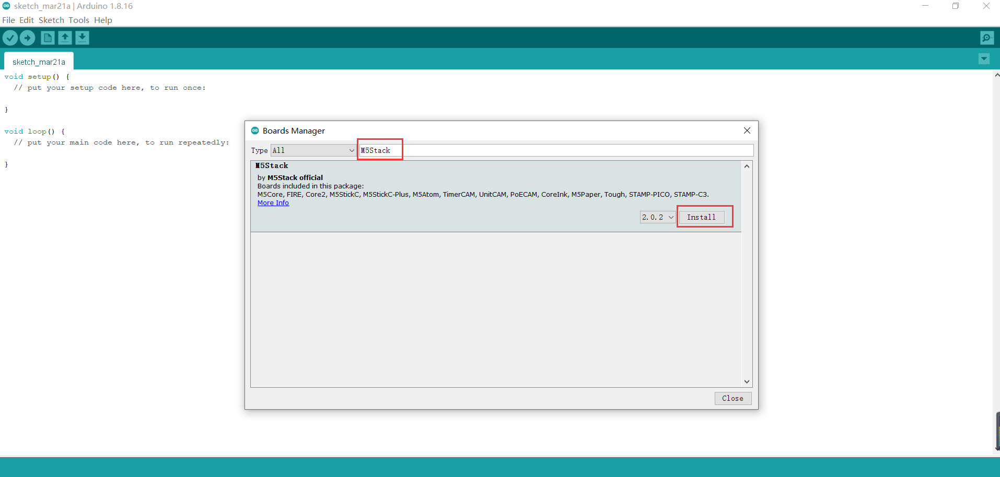
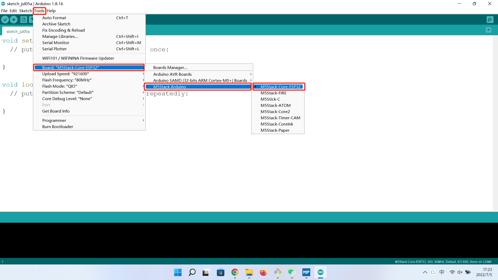
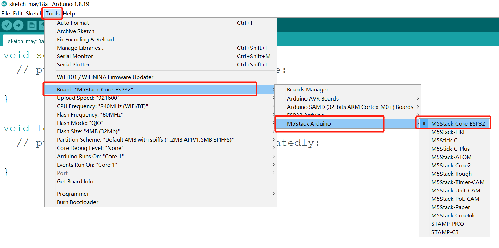
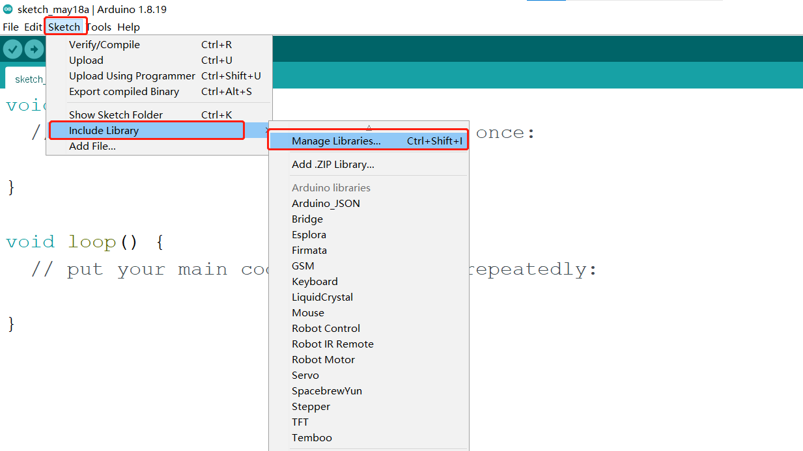
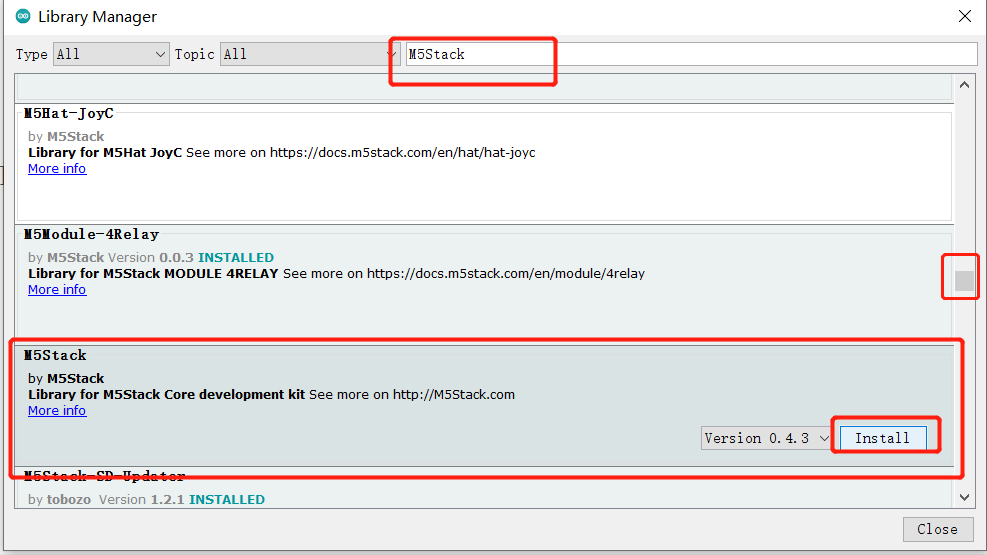
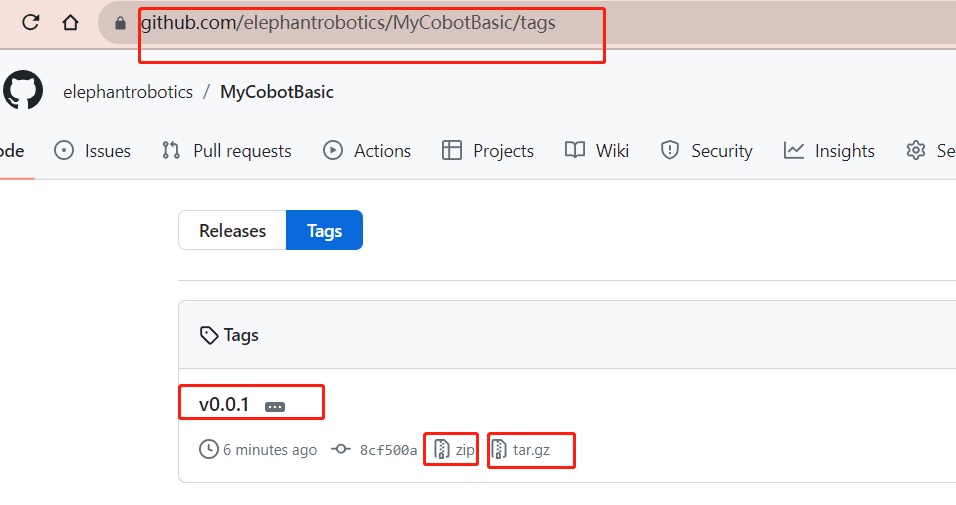

# Arduino Environment Building

## 1 **Arduino IDE** download
 
 **Arduino IDE Download Address** 

- [Arduino Official Website](https://www.arduino.cc/en/software) 

- [Windows X64](https://downloads.arduino.cc/arduino-1.8.16-windows.exe)
  
- [Mac OS X](https://downloads.arduino.cc/arduino-1.8.16-macosx.zip)
  
- [Linux ARM 64](https://downloads.arduino.cc/arduino-1.8.16-linuxaarch64.tar.xz)

## 2 Installed drivers

Before burning the program, M5Core host (including M5Stack-basic/GRAY/M5GO/FIRE/FACES) / **micro control types of equipment** users according to the operating system you are using, please download the corresponding driver package. After decompressing the package, select the installation package of the corresponding OPERATING system bit.

For Mac OS, ensure correct settings of the system **Preferred settings --> Security and privacy --> General** before installation, and allow the user to get it from App Store or an approved developer.

   Download the **M5Stack-basic** serial port driver **CP210X** or **CP34X**

  **CP2104**

  - [ **Windows10** ](https://download.elephantrobotics.com/software/drivers/CP210x_VCP_Windows.zip)
  
  - [ **MacOS** ](https://download.elephantrobotics.com/software/drivers/CP210x_VCP_MacOS.zip)
  
  - [ **Linux** ](https://download.elephantrobotics.com/software/drivers/CP210x_VCP_Linux.zip)

After extracting the zip package, select the corresponding installation package to install according to your computer **operating system** (win10 and win11 select x64 or x86 for installation).

 

  **CP34X**

  - [ **Windows10** ](https://download.elephantrobotics.com/software/drivers/CH9102_VCP_SER_Windows.exe)
  
  - [ **MacOS** ](https://download.elephantrobotics.com/software/drivers/CH9102_VCP_MacOS.zip)

## 3 Add board

* Open the Arduino IDE and select **File --> Preferences --> Settings** to add the url address below to the additional board manager
  https://m5stack.oss-cn-shenzhen.aliyuncs.com/resource/arduino/package_m5stack_index.json

 

 

* After adding, select the **Tools --> Board --> Boards Manager**, in the new pop-up dialog, input and search  **M5Stack** , click Install (in case of search failure, you can try to restart  **Arduino**  program), as shown below:

 

* After adding, select **Tools --> Board**, check whether it is successful, as shown below:

 

## 4 Add related libraries
4.1 Install the M5Stack library 
1. Tools --> Development Board --> M5Stack Arduino select **M5Stack-Core-ESP32**, as shown in the following figure： 

   

2. Project --> Load Library --> Manage Library In the search box, enter **M5Stack**, as shown in the figure below： 

   

3. After finding it, click Install, scroll down, **M5Stack** is at the back, you can see the location of the drop-down slider in the picture for details, as shown in the figure below： 

   

4.2 Install the MyCobotBasic library 
**Note:** Please download the latest library, the first version is v0.0.1.

  - [**MycobotBasic**](https://github.com/elephantrobotics/MyCobotBasic/tags)(After the Mycobot280-Arduino model is imported, you can refer to [10.3-arduinolib_use](10.3-arduinolib_use.md) for use). Please see the figure below for details, .zip is suitable for Windows systems, and .tar.gz is suitable for Linux systems: 
 

* Library Installation Instructions

  First check the location of the Arduino project folder by clicking File --> Preferences (you can copy the path to your hard drive to find the libraries folder) 

 

 

 
1 Copy the path here and press enter to find the libraries folder

  Unzip it into the corresponding folder in the **libraries** directory. If you are using **Arduino**, don't overwrite it, just add to the existing **Library**.

 

  Congratulations, you have built a **Arduino** related development environment. 

Note: Arduino environment configuration and case compilation can be seen in our beep video  ( https://www.bilibili.com/video/BV1Vi4y1c7DQ/ ) .

---

[← Previous Page](README.md) | [Next Page →](16.2-api.md)

​    