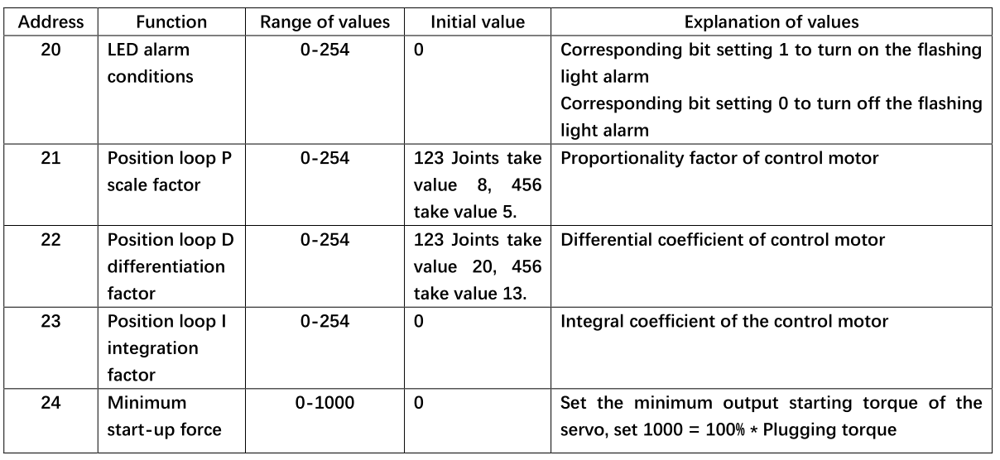

# Arduino API

## 1.  Overall Status

### 1.1 `powerOn();`

- Function: The robot is powered on, and the robot can be controlled after the power is turned on（open by default）

- Return Value: None

### 1.2 `powerOff();`

- Function: Robot power off

- Return Value: None

### 1.3 `isPoweredOn();`

- Function: Atom status inquiry, return Atom connect status

- Return Value: Power on is TRUE, power off is FALSE

### 1.4 `getAtomVersion();`

- Function: Get Atom firmware version

- Return Value: Values of type int,the data needs to be /10. For example, if the version number read is 12, it needs to be divided by 10, and the final version number is 1.2

### 1.5 `setFreeMoveMode(bool mode);`

- Function: Set the free movement mode. After the free movement mode is turned on, the LED at the end will be yellow. Press and hold the atom at the end to move the robot manually
- Parameter Description:
- mode: mode, 0/1, 0--off free movement, 1--open free movement

- Return Value: None

### 1.6 `isFreeMoveMode();`

- Function: Free movement mode status query, return free movement mode status

- Return Value:Turns TRUE on and FALSE off

## 2.  MDI Mode and Robot Control (Manual Data Input)

### 2.1 `getAngles();`

- Function: Read all joint angles, when used one Angles should be defined to receive data that was read. Angles are defined in terms of variables or functions built into library functions. We can define a memory space that is 6 angles to store Angle variables, it is used in the same way as arrays.

- Return Value: Arrays of type Angles

### 2.2 `writeAngle(int joint, float value, int speed);`

- Function: Send a single joint Angle

- Parameter Specification： 
  Joint Number= joint, range from 1-6;
  Specified Angle Value= value, range approximately from -170°- + 170°;
  Specified Speed= speed, range from 1-100

- Return Value: None

### 2.3 `writeAngles(Angles angles, int speed);`

- Function: Synchronize joint angles, send joint angles at the same time. Specified Angles is a container with a capacity of 6 data, can be viewed as an array. Use a for loop to assign values, or assign values separately.

- Angles[0] = Specified Angle, Angles[2] = Specify Angle, range from 0-90 ( the value range should be the same as writeAngle ) unit°  Movement Speed = speed, range from 0–100 unit %

- Return Value: None

### 2.4 `getCoords();`

- Function: Read x,y,z,rx,ry,rz of the end of myCobot, a Coords tempcoords should be defined when used to received angles that was read. Coords are defined in terms of variables or functions built into library functions. We can define a memory space that is 6 tempcoords to store Angle variables, it is used in the same way as arrays.

- Return Value: An array of type Coords. You need to define variables of type Coords.

### 2.5 `writeCoord(Axis axis, float value, int speed);`

- Function: Send the specific value of the individual coordinate parameters x/y/z, the ends are going to move in a single direction.

- Parameter Specification: 
Value of Moving Path Coordinate = value range from -300–300 ( The position coordinates of axis=Axis::X, aixs=Axis::Y and axis=Axis::Z are respectively X,Y,Z, the units would be mm. Position coordinate value range is not uniform, axis=Axis::RX, aixs=Axis::RY and axis=Axis::RZ are respectively RX,RY,RZ ranging from-180°-180°, if the value is beyond the range it will return the clue “inverse kinematics no solution” )  Specified Speed = speed range from 1-100 unit %

- Return Value: None

### 2.6 `writeCoords(Coords coords, int speed);`

- Function: To send the specified coordinate parameter, which should be of type Coords, declare a variable of type Coords, which is used in the same way as an array

- Parameter Specification 
  coords[0] = X, coords[1] = Y, coords[2] = Z, 
  X,Y,Z range from -300.00-300.00 ( Value range is not defined. If the value is beyond the range, the clue ”inverse kinematics no solution” will be given ) unit mm   RX,RY,RZ range from -180-180   Specified Speed = speed, range from 1-100 unit %

- Return Value: None

### 2.7 `checkRunning();`

- Function: Check whether the equipment is in motion

- Return Value: In motion is TRUE，on the contrary it's FALSE

### 2.8 `setEncoder(int joint, int encoder);`

- Function: Set a single joint to rotate to a specified potential value

- Parameter description: joint number = joint value range 1-7 (joint number 7 is generally a gripper, gripper potential value range: 1325-2048); steering gear potential value = encoder value range 0-4096 (the range should be positively related to the range of each joint)

- Return Value: None

### 2.9 `getEncoder(int joint);`

- Function: Get the specified joint potential value

- Parameter Specification:  Servo Motor Number = joint range from 1-7

- Return Value: Int type, range from 0-4096

### 2.10 `setEncoders(Angles angleEncoders, int speed);`

- Function: Set the six joints to run synchronously to the specified position

- Parameter Specification:  Need to define a variable of type Angles: angleEncoders, it is used in the
  same way as arrays. Assign a value to the array angleEncoders, values range
  from 0-4096 ( The range should be positively related to the range of each
  joint ) , the length range of the array is 6.  Specified Speed = speed, range from 1-100 unit %

- Return Value: None

### 2.11 `getEncoders();`

- Function: Get all joint potential values

- Return Value: Arrays of type Angles, range from 0-4096

### 2.12 `getServoSpeeds();`

- Function: Get all servo speeds

- Return Value: Arrays of type Angles, Velocity is 0 when not in motion

## 3.  JOG Mode

### 3.1 `jogAngle(int joint, int direction, int speed);`

- Function: Control the movement of a single joint in one direction

- Parameter Specification: 
Joint/Servo Motor Number = joint, range from 1-6;  
Direction of Joint Motion = Direction, range from -1/1;  
Specified Speed = speed, range from 1-100 unit %

- Return Value: None

### 3.2 `jogCoord(Axis axis, int direction, int speed);`

- Function: Control myCobot moves in one direction in Cartesian space

- Parameter Specification: 
  Direction Selection = axis, range from X,Y,Z,RX,RY,RZ;  
  Direction of Joint Motion = Direction, range from -1/1;  
  Specified Speed = speed, range from 1-100 unit %

- Return Value: None

### 3.3 `jogStop();`

- Function: Stops the specified direction of motion that has started

- Return Value: None

### 3.4 `ProgramPause();`

- Function: Program pause

- Return Value: None

### 3.5 `ProgramResume();`

- Function: Program continues to run

- Return Value: None

### 3.6 `TaskStop();`

- Function: Program stop

- Return Value: None

## 4.  Running Status and Settings

### 4.1 `getSpeed();`

- Function: Read the current running speed

- Return Value: Int tape, range from 1-100, unit %

### 4.2 `setSpeed(int percentage);`

- Function: Set the running speed

- Parameter Specification: Percentage, range from 1-100, unit %

### 4.3 `getJointMin(int joint);`

- Function: Read the joint minimal limit Angle

- Parameter Specification: Joint Number = joint, range from 1-6

- Return Value: Float type of the array

### 4.4 `getJointMax(int joint);`

- Function: Read the joint maximal limit Angle

- Parameter Specification: Joint Number = joint, range from 1-6

- Return Value: Float type of the array

### 4.5 `setMovementType(MovementType movement_type);`

- Function: Set the movement method

- Parameter Specification: Movements are non-linear path movement (movej) and linear path movement (movel)

- Return Value: None

### 4.6 `getMovementType();`

- Function: Read movement method

- Return Value: The non-linear method returns 0; the linear method returns 1 

## 5. Joint Servo Control

### 5.1 `isServoEnabled(int joint);`

- Function: Check the single joint connection status

- Parameter Specification: Joint Number = joint, range from 1-6

- Return Value: Connection status, 0/1, 1--connected, 0--not connected

### 5.2 `isAllServoEnabled();`

- Function: Check whether all joins are properly connected

- Return Value: Connection status, 0/1, 1--connected, 0--not connected

### 5.3 `getServoData(int joint, byte data_id);`

- Function: Read the system parameters of joint

- Parameter Specification: 
Joint servo serial number = joint, range from 1-6;  
Data Address = data_id, refer to the following Figure for address

- Return Value: Refer to the following Figure for the value range

### 5.4 `setServoData(int joint, byte data_id, byte data);`

- Function: Set the system parameters of joint

- Parameter Specification:   
  Joint servo serial number = joint, range from 1-6;   
  Data Address = data_id, refer to the address range in the figure above;  
  data = the range of values in the above diagram 

- Return Value: None

### 5.5 `setServoCalibration(int joint);`

- Function:Joint Zero Calibration, the corresponding potential value is 2048

- Parameter Specification: joint number = joint, range from 1-6

### 5.6 `releaseServo(byte servo_no);`

- Function: Relax/disable a certain joint of the robot

- Parameter Specification: servo_no is 1-6

- Return Value: None

### 5.7 `releaseAllServos(bool mode);`

- Function:Relax/deactivate all joints of the robot
- Parameter Specification: mode is either true or false
- Return Value: None

### 5.8 `focusServo(byte servo_no);`

- Function: Enable a certain joint of the robot

- Parameter Specification: servo_no is 1-6

- Return Value: None

### 5.9 `getServoVoltages();`

- Function: Get all servo voltages

- Return Value: Array of type Angles, reference range from 8.4-12.0

### 5.10 `getServoStatus();`

- Function: Get the status of all servos

- Return Value: 0 means all states are normal; 1 means voltage overvoltage/undervoltage; 2 means magnetic code state abnormal; 4 means temperature overheating; 8 means current overcurrent; 32 means load overload; when the number that appears is not equal to the above abnormal numbers, for example: 3 means voltage overvoltage/undervoltage and magnetic code state abnormal, 7 means voltage overvoltage/undervoltage, magnetic code state abnormal and temperature overheating

### 5.11 `getServoTemps();`

- Function: Get all servo temperatures

- Return Value: Array of type Angles, reference range from 0-255

### 5.12 `getServoCurrents();`

- Function:Get all servo currents
- Return Value:Array of type Angles, reference range from 0-255

## 6. Atom IO Control

### 6.1 `setPinMode(byte pin_no, byte pin_mode);`

- Function: Sets the state mode of the specified pin of atom

- Parameter Specification:  
  Pin Serial Number = `pin_no`, reference range from: 19、22、23、26、32、33 
  Output Mode = pin_mode, reference range from: 0、1

- Return Value: None

### 6.2 `setLEDRGB(byte r, byte g, byte b);`

- Function: Set the color of the RGB lights of atom

- Parameter Specification: 
  Parameter of Red Light = r, range from 0x00 – 0xFF; 
  Parameter of Green Light = g, range from 0x00 – 0xFF; 
  Parameter of Blue Light = b, range from 0x00 – 0xFF;

- Return Value: None

### 6.3 `setGripperState(byte mode, int sp);`

- Function: Set the opening and closing state of the Gripper

- Parameter Description:
- mode, jaw opening and closing mode, range 0/1, 0--the jaws are opened to the maximum, 1--the jaws are closed to the minimum
- sp, clamping jaw opening and closing speed, range 1-100

### 6.4 `setGripperValue(int data, int sp);`

- Function: Set the Gripper opening and closing angle

- Parameter Description: 
- data, clamping jaw opening and closing angle, range 0-100, 0--closed to the minimum angle, 100--open to the maximum angle
- sp, clamping jaw opening and closing speed, range 1-100

- Return Value: None

### 6.5 `setGripperIni();`

- Function: Set jaw zero point

- Return Value: None

### 6.6 `getGripperValue();`

- Function: Get the current angle of the gripper

- Return value: Returns the current gripper angle, range 0-100

### 6.7 `isGripperMoving();`

- Function: Detects if the jaws are in motion

- Return Value: 0 not in motion, 1 in motion

### 6.8 `void setEletricGripper(bool mode);`

- Note: This interface is only available for MyCobot320 robot

- Function: Control the opening and closing of the electric gripper

- Parameter Description: 
- mode: mode, 0/1, 0--the jaws are opened to the maximum, 1--the jaws are closed to the minimum

- Return value: None

### 6.9 `void InitEletricGripper();`

- Note: This interface is only available for MyCobot320 robot

- Function: Initialize the opening and closing of the electric gripper. Every time the electric gripper is plugged in, it needs to be initialized before it can be controlled. After the initialization is successful, the gripper will open and close once

- Return value: None

### 6.10 `void setGripperMode(bool mode);`

- Note: This interface is only available for MyCobot320 robot

- Function: Set Adaptive Gripper Control Mode

- Parameter Description: 
- mode: mode, 0/1, 0--485 communication control, 1--io control (in io mode, it can only be turned on or off, and the angle cannot be set. Pins 23 and 33, when turned on or off, both pins The feet need to be set to different states, one must be high and one low)

- Return value: None

- 案例：[**GripperControl**](../16-ArduinoEnv/16.3-example.md) 

### 6.11 `bool getGripperMode();`

- Note: This interface is only available for MyCobot320 robot

- Function: Set Adaptive Gripper Control Mode

- Return value: adaptive gripper control mode, 0/1, 0--485 communication control, 1--io control

### 6.12 `setDigitalOutput(byte pin_no, byte pin_state);`

- Function: Setting the operating state of IO pins

- Parameter Specification: 0 input; 1 output; 2 pull_up_input

- Return Value: None

### 6.13 `getDitialInput(byte pin_no);`

- Function: Read input

- Parameter Specification: Pin Serial Number = pin_no Range of values: 19、22、23、26、32、33

- Return Value: None

### 6.14 `setPWMOutput(byte pin_no, int freq, byte pin_write);`

- Function: Set ATOM end IO to output PWM signal with specified duty cycle

- Parameter Specification:
-  pin_no: IO Serial Number 
-  freq: Clock Frequency 
-  pin_write: Duty Cycle 0-256; 128 means 50% 

- Return Value: None

## 7. Coordinate Control Mode

### 7.1 `setToolReference(Coords coords);`

- Function: Set coordinate system of tool

- Parameter Specification:  
  X,Y,Z range from -300.00-300.00 ( Value range is not defined. If the value is beyond the range, the clue "inverse kinematics no solution" will be given ) unit mm 
  RX,RY,RZ range from -180.00-180.00

- Return Value: None

### 7.2 `setWorldReference(Coords coords);`

- Function: Set coordinate system of world

- Parameter Specification:  
  X,Y,Z range from -300.00-300.00 ( Value range is not defined. If the value is beyond the range, the clue "inverse kinematics no solution" will be given ) unit mm 
  RX,RY,RZ range from -180.00-180.00

- Return Value: None

### 7.3 `getToolReference();`

- Function: Get coordinate system of tool

- Return Value:  
  X,Y,Z range from -300.00-300.00 ( Value range is not defined. If the value is beyond the range, the clue "inverse kinematics no solution" will be given ) unit mm 
  RX,RY,RZ range from -180.00-180.00

### 7.4 `getWorldReference();`

- Function: Get coordinate system of world

- Return Value:  
  X,Y,Z range from -300.00-300.00 ( Value range is not defined. If the value is beyond the range, the clue "inverse kinematics no solution" will be given ) unit mm 
  RX,RY,RZ range from -180.00-180.00

### 7.5 `setReferenceFrame(RFType rftype);`

- Function: Set coordinate system of frame

- Parameter Specification:  
  RFType::BASE takes the robot base as the base coordinate,  RFType::WORLD takes the world coordinate system as the base coordinate

- Return Value: None

### 7.6 `getReferenceFrame();`

- Function：Get coordinate system of flange

- Return Value:
  X,Y,Z range from -300.00-300.00 ( Value range is not defined. If the value is beyond the range, the clue "inverse kinematics no solution" will be given ) unit mm 
  RX,RY,RZ range from -180.00-180.00

### 7.7 `setEndType(EndType end_type)`

- Function: Set coordinate system of the end

- Parameter Specification:  
  EndType::FLANGE set the end as flange, EndType::TOOL set the end to the tool end

- Return Value: None

### 7.8 `getEndType();`

- Function: Get coordinate system of the end

- Return Value:
  X,Y,Z range from -300.00-300.00 ( Value range is not defined. If the value is beyond the range, the clue "inverse kinematics no solution" will be given ) unit mm 
  RX,RY,RZ range from -180.00-180.00

  ---

[← Previous Page](16.1-arduino_download.md) | [Next Page →](16.3-example.md)