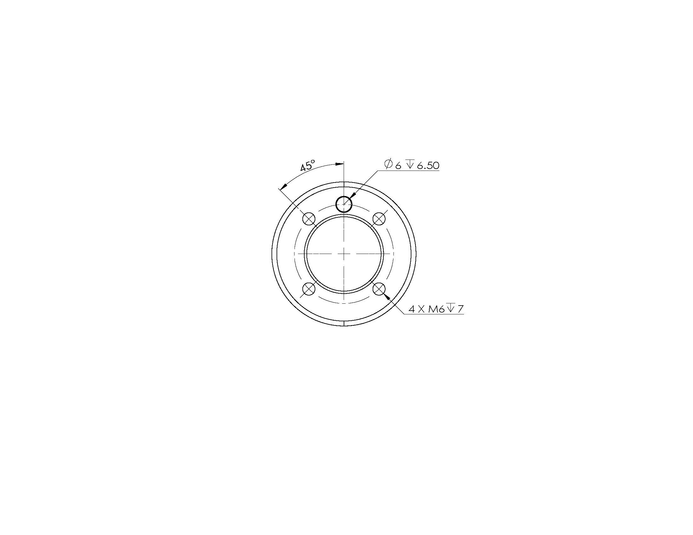

# Product specification parameter

## 1 Manipulator parameter

| Index        | Parameter                   |
| ------------ | --------------------------- |
| Name         | Baby Elephant Cooperative Robotic Arm |
| Model        | myCobot 320-M5              |
| Freedom      | 6                           |
| Working Radius | 350mm                     |
| Efficient Load | 1kg                       |
| Repeated Positioning Precision | ±0.5mm    |
| Weight      | 3。3kg                       |
| Power Input | 24V,9.2A                     |
| Operating Temperature | 0°~45°             |
| Communication Interface | Bluetooth   Type-C |
| Service life | 2000h                       |

## 2 Workspace

## 3 Motion Angles of Joints

| Joint      | Angle        |
| --------- | --------------|
| J1         | -165 ~ +165    |
| J2         | -165 ~ +165    |
| J3         | -165 ~ +165    |
| J4         | -165 ~ +165    |
| J5         | -165 ~ +165    |
| J6         | -175 ~ +175    |

## 4 Installation of Hole

* The base is mounted with flange and is compatible with both installation of LEGO and M6 screw.

- The end of the arm is compatible with both LEGO component holes and threaded holes.

## 5 Software basic function support

| Function/development environment | Usage situation |
| ------------ | -------- |
| Free Mobile  | Support |
| Joint Movement | Support |
| The Cartesian Movement | Support |
| Track Recording | Support |
| Wireless Control | Support |
| Emergency Stop | Support |
| Windows      | Support |
| Linux        | Support |
| MAC          | Support |
| ROS 1        | Support |
| Python       | Support |
| C++          | Support |
| C#           | Support |
| JavaScript   | Support |
| myblockly    | Support |
| Arduino      | Support |
| mystudio     | Support |
| Serial Control Protocol | Support |
| TCP/IP       | Support |
| MODBUS       | Support |

 ---

[← Previous Page](../2.1_320_M5_product/README.md)| [Next Page →](../2.1_320_M5_product/2.1.2-ControlCoreParameter.md)