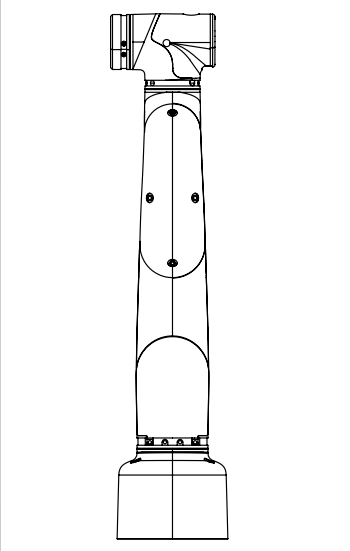
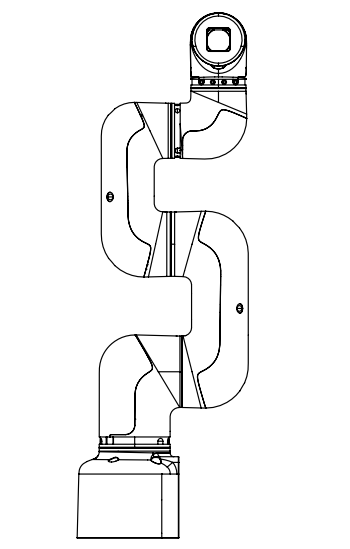
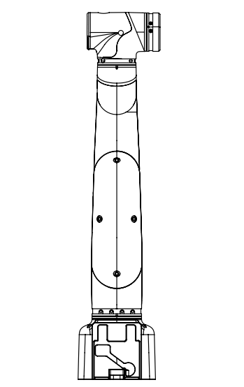
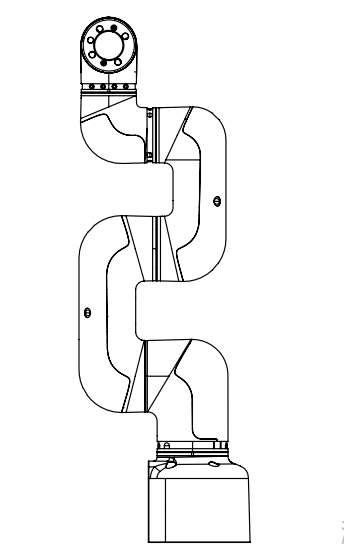
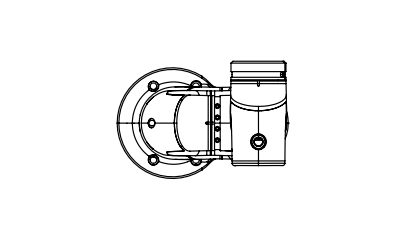
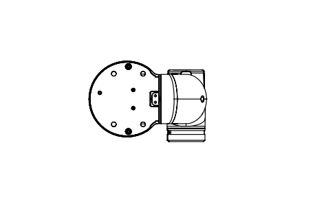

# Structural dimension parameter

> ❕This chapter uses millimeters as the unit of distance and degrees as the unit of angle.

## 1 Product size and working space

## 2 Mounting dimension of base

* The base is mounted with flange and is compatible with both installation of LEGO and M6 screw.

## 3 The end of the arm

- The end of the arm is compatible with both LEGO component holes and threaded holes.

## 4 Product six views

## 5 3D model download

Product 3D model can be provided to provide reference materials for customers.

Download link: [https://drive.weixin.qq.com/s?k=AHAAOwe9AA8SpcC12A](https://drive.weixin.qq.com/s?k=AHAAOwe9AA8SpcC12A)

---

[← Previous Page](../2.1_320_M5_product/2.1.2-ControlCoreParameter.md)| [Next Page →](../2.1_320_M5_product/2.1.4-ElectricalCharacteristicParameter.md)