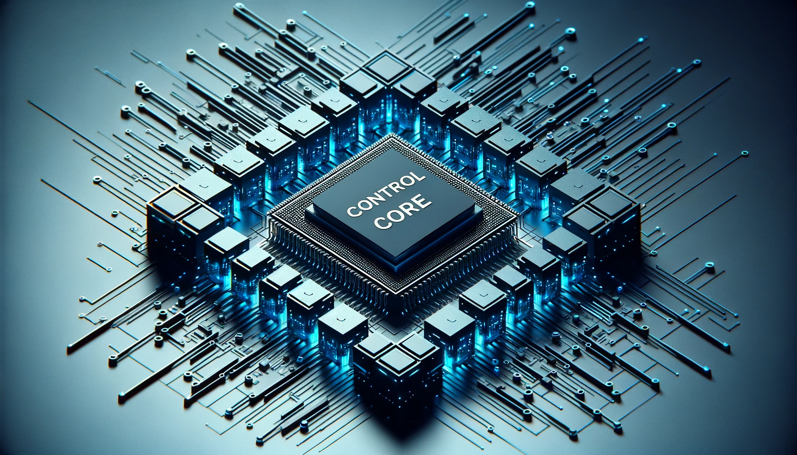

# 控制核心参数

## 1 主控制器规格表

| **指标**     | **参数**                                 |
| :----------- | :--------------------------------------- |
| 主控制       | 树莓派                                   |
| CPU          | Broadcom BCM2711，  64 位 1.5GHz 四核 |
| GPU          | 500 MHz VideoCore VI                     |
| 内存         | 4 GB                                     |
| 网络接口     | \*1                                      |
| 蓝牙         | 2.4G/5G                                  |
| 无线         | 802.11ac                                 |
| 核心视频接口 | microHDMI\*2                             |
| 音频接口     | 3.5mm Interface                          |
| 输入         | IN1, IN2, IN3, IN4, IN5, IN6             |
| 输出         | OUT1, OUT2, OUT3, OUT4, OUT5, OUT6       |

## 2 辅助控制器 1 规格表

| **指标**           | **参数**                                                    |
| :----------------- | :---------------------------------------------------------- |
| 辅助控制           | Atom                                                        |
| 辅助控制型号       | ESP32                                                       |
| 辅助控制器核心参数 | 240MHz 双核  600 DMIPS，520KB SRAM  Wi-Fi、双模式蓝牙 |
| 辅助控制器闪光灯   | 4MB                                                         |
| LCD 显示           | 2.0"@320\*240 ILI9342C IPS 面板，  最大亮度 853nit       |
| TypeC              | \*1                                                         |

### 3 辅助控制器 2 规格

| **指标**           | **参数**                                                          |
| :----------------- | :---------------------------------------------------------------- |
| 辅助控制           | Pico                                                              |
| 辅助控制型号       | ESP32                                                             |
| 辅助控制器核心参数 | 240MHz 双核  600 DMIPS，520KB SRAM   Wi-Fi、  双模式蓝牙 |
| 辅助控制器闪存     | 4MB                                                               |
| TypeC              | \*1                                                               |

---

[← 上一页](../2.2_320_PI_product/2.2.1-MachineSpecification.md) | [下一页 →](../2.2_320_PI_product/2.2.3-MechanicalStructureParameter.md)
