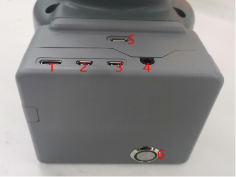
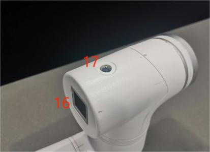

# 电气特性参数

## 1 底座电气接口概述

图 1 底座正视图

图 2 底座左侧

图 3 底座右侧

| 序号 |      接口名称       |       定义       |          功能           |        备注         |
| :--: | :-----------------: | :--------------: | :---------------------: | :-----------------: |
|  1   |       Type C        |     通信接口     |       与 PC 通信        |      开发使用       |
|  2   |      MircoHDMI      |      HDMI1       |      用于连接屏幕       |                     |
|  3   |        HDMI2        |                  |                         |                     |
|  4   |  扬声器，耳机插孔   | 扬声器、耳机插孔 |                         |                     |
|  5   |       Type C        |     通信接口     |       与 PC 通信        |      开发使用       |
|  6   |        开关         |     电源开关     |    控制输入电源通断     |  带灯（通电灯亮）   |
|  7   |     DC/IO 接口      |       GND        |           GND           |                     |
|      |                     |       IN6        |    数字输入信号 1~6     | 仅在 NPN 模式下输入 |
|      |                     |       IN5        |                         |                     |
|      |                     |       IN4        |                         |                     |
|      |                     |       IN3        |                         |                     |
|      |                     |       IN2        |                         |                     |
|      |                     |       IN1        |                         |                     |
|      |                     |       24V        |          DC24V          |                     |
|  8   |      急停接口       |       STOP       |      急停回路接口       |                     |
|  9   |       指示灯        | 主控制电源指示灯 |    反馈主站上电状态     |                     |
|  10  |      SD 卡插槽      |     SD 卡槽      |     用于更换 SD 卡      |                     |
|  11  |       USB2.0        |    USB2.0\*2     | 可与外部设备或 U 盘连接 |                     |
|  12  |       USB3.0        |    USB3.0\*2     |     外部设备或 U 盘     |                     |
|  13  |        网口         |     Ethenet      |        网口通信         |                     |
| 1 4  |   DC/IO 输出接口    |       24V        |          DC24V          |                     |
| OUT1 | 数字输出信号 1 至 6 |   仅 PNP 模式    |                         |                     |
| OUT2 |                     |                  |                         |                     |
| OUT3 |                     |                  |                         |                     |
| OUT4 |                     |                  |                         |                     |
| OUT5 |                     |                  |                         |                     |
| OUT6 |                     |                  |                         |                     |
| GND  |         GND         |                  |                         |                     |
|  15  |  电源 DC 输入接口   |      DC24V       |        电源输入         |                     |

#### 1.1 TypeC ：TypeC 接口用于与 PC 连接和通信，可供开发人员使用。

#### 1.2 MircoHDMI ：MircoHDMI 接口是一个 HDMI D 型接口，与显示器相连。建议使用 HDMI 接口 1，因为 HDMI 接口 2 具有优先权。

#### 1.3 电源开关：电源开关用于控制主电源输入。如果电源开关关闭，控制器也将断电。

#### 1.4 数字输入/输出：包括 6 路数字输入信号和 6 路数字输出信号，用于与其他设备进行交互，并与其他设备一起构成自动化系统的重要组成部分。

- 内置 I/O 电源，电压 24V，单路输出最大 0.2A。不支持外接电源。

- 需要注意的是，输出信号为 PNP 形式，输入信号为 NPN 形式，外部接线图如下：

#### 1.5 24V 输出 ：内置 DC24V，可供用户使用。

#### 1.6 急停电路端子与急停按钮盒相连，可用于控制机器人的急停。

> **注意**：使用机器人时必须连接急停开关，并确保急停开关电路始终处于连接状态。

#### 1.7 电源直流输入接口：采用 KPPX-4P R7BFDC 电源插座。制造商提供的 24V 9.2A DC 电源适配器也可用于为 myCobot320 供电。

#### 1.8 USB ：USB 接口是一种用于数据连接的接口，符合串行标准 2.0 和 3.0。用户可以使用 USB 接口复制程序文件，或使用 USB 接口连接鼠标和键盘等外设。

#### 1.9 网络端口 ：网络端口是用于连接网络数据的端口。用户可使用以太网接口进行电脑与机器人系统之间的通信和交互，以及与其他设备的以太网通信。

## 2 机器人手臂末端的电气接口

图 4 机械臂末端侧视图

图 5 机械臂末端侧视图

| 序号 | 接口名称    | 定义             | 功能              | 备注               |
| :--- | :---------- | :--------------- | :---------------- | :----------------- |
| 16   | Atom        | Led + 按钮       | 状态查看/拖动示教 |                    |
| 17   | M8 航空插座 | 末端工具 IO 接口 | 与外部设备交互    |                    |
| 18   | Type C      | 通信接口         | 与 PC 通信        | 更新 Atom 固件使用 |
| 19   | Grove       |                  |                   | 开发人员使用       |

#### 2.1 末端工具 IO 接口：

这是工具 I/O 图，myCobot 320 机器人提供一个输入和两个输出。

内置 I/O 电源，电压 24V，单路输出最大 0.2A。不支持外接电源。

各工具 I/O 端口的定义如下表所示。需要注意的是，工具 I/O 的输入和输出均为 PNP 类型，布线模式与底部输出接口相同。

| 序号 | 信号 | 说明           | 配套 M8 线颜色 |
| :--- | :--- | :------------- | :------------- |
| 1    | GND  | DC24V 负极     | 白             |
| 2    | OUT1 | 工具输出接口 1 | 褐             |
| 3    | OUT2 | 工具输出接口 2 | 绿             |
| 4    | 485A | 预留、未开发   | 黄             |
| 5    | 24V  | DC24V 正极     | 灰             |
| 6    | IN1  | 工具输入接口 1 | 粉             |
| 7    | IN2  | 不可用         | 蓝             |
| 8    | 485B | 预留、未开发   | 紫             |

#### 2.2 Atom：Atom 用于 5X5 RGB LED，显示机器人手臂状态和按键功能（机器人执行拖动示教时使用）

---

[← 上一页](../2.2_320_PI_product/2.2.3-MechanicalStructureParameter.md) | [下一页 →](../2.2_320_PI_product/2.2.5-CoordinateSystem.md)
