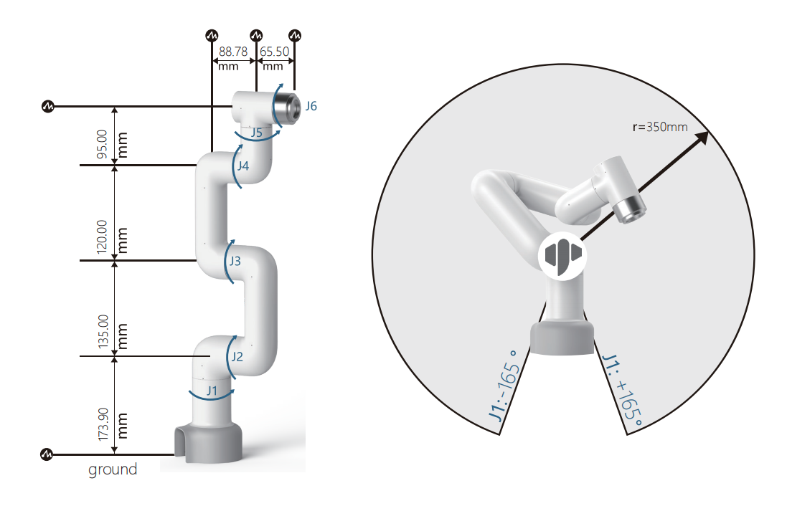
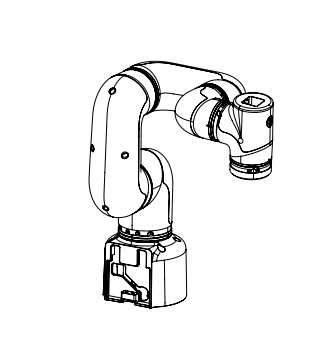
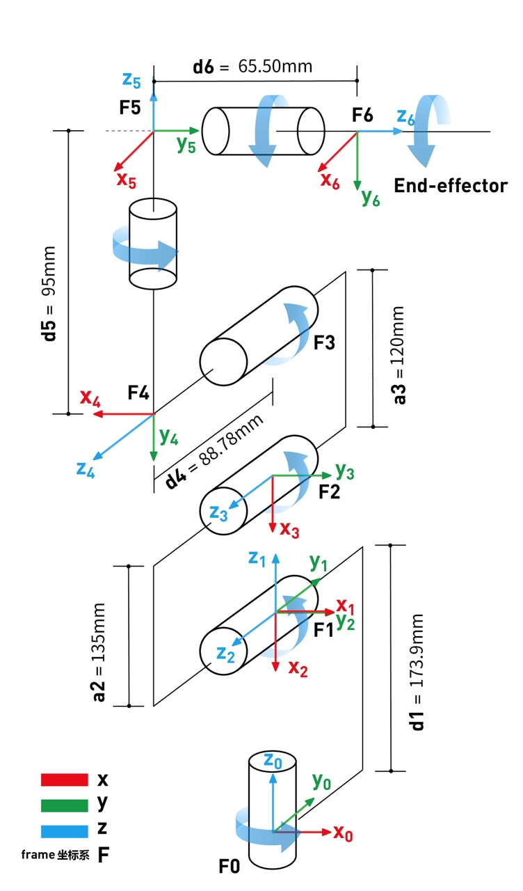

# 笛卡尔坐标系

## 1 关节坐标系

关节坐标系是根据每个移动关节确定的。所有关节都是旋转关节。运动范围如下

| 关节 | 范围        |
| :--- | :---------- |
| J1   | -165 ~ +165 |
| J2   | -165 ~ +165 |
| J3   | -165 ~ +165 |
| J4   | -165 ~ +165 |
| J5   | -165 ~ +165 |
| J6   | -175 ~ +175 |

## 2 用户坐标系

用户坐标系是用户自定义的工作台坐标系或工件坐标系，其原点和轴线方向可根据实际需要确定，便于测量工作区间内各点的位置和安排任务。默认的用户坐标系是以机械臂底座的中心点为基准确定的，Y 轴的正方向是重载线的方向。

## 3 工具坐标系

工具坐标系是定义工具中心点 (TCP) 位置和刀具姿态的坐标系，其原点和方向随最终工件的位置和角度不断变化。默认的刀具坐标系是根据刀具法兰中心点确定的，Y 轴的正方向与航空插口的方向相反。

## 4 关节连杆参数规格

### 4.1 DH 范围

对于旋转关节 n，设置 0=0.0，其中 X 轴与 X 轴方向一致，并选择坐标系的原点位置（N）以满足 d.=0.0。对于移动关节 n，设置 8 轴的方向，使其满足 0.=0.0。当 d.=0.0 时，将坐标系（N）的原点选择在 XN-1 轴与关节轴 n 的交点处。

联动坐标系中联动参数的归纳 如果根据上述规定将联动坐标系固定在联动装置上，则联动参数可定义如下：

- a_i-1：沿 x_i-1：从 z_i-1 到 z_i 的距离

- alpha_i-1：绕 x_i-1：从 z_i-1 到 z_i

- d_i: 表示沿 z_i 从 x_i-1 到 x_i 的距离

- θ_i：围绕 z_i：从 x_i-1 到 x_i 的角度

这里有一篇文章可供参考
[https://blog.csdn.net/hitgavin/article/details/104442034](https://blog.csdn.net/hitgavin/article/details/104442034)

### 4.2 DH 参数列表

| 关节 | alpha | a    | d     | theta   | offset |
| :--- | :---- | :--- | :---- | :------ | :----- |
| 1    | 0     | 0    | 173.9 | theta_1 | 0      |
| 2    | PI/2  | 0    | 0     | theta_2 | -PI/2  |
| 3    | 0     | -135 | 0     | theta_3 | 0      |
| 4    | 0     | -120 | 95    | theta_4 | -PI/2  |
| 5    | PI/2  | 0    | 87.78 | theta_5 | 0      |
| 6    | -PI/2 | 0    | 65.5  | theta_6 | 0      |

---

[← 上一页](../2.2_320_PI_product/2.2.4-ElectricalCharacteristicParameter.md) | [下一章 →](../../3-UserNotes/320_PI/README.md)
