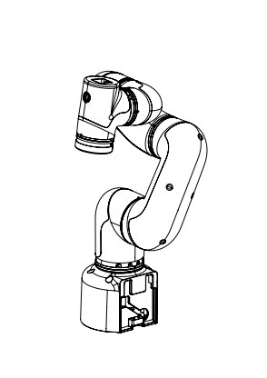

# Coordinate system

## 1 Joint coordinate system

The joint coordinate system is determined with reference to each moving joint. All joints are rotary joints. Range of motion is as follows:

| Joint      | Angle        |
| :---------: | :--------------:|
| J1         | -165 ~ +165    |
| J2         | -165 ~ +165    |
| J3         | -165 ~ +165    |
| J4         | -165 ~ +165    |
| J5         | -165 ~ +165    |
| J6         | -175 ~ +175    |

## 2 User coordinate system

The user coordinate system is a user-defined workbench coordinate system or workpiece coordinate system, whose origin and axis direction can be determined according to actual needs, which can easily measure the position of each point in the working interval and arrange tasks. The default user coordinate system is determined based on the center point of the robot arm base, and the positive direction of the Y axis is the direction of the heavy load line.

## 3 Tool coordinate system

The Tool coordinate system is a coordinate system that defines the position of the Tool Center Point (TCP) and the tool attitude, and its origin and direction are constantly changing with the position and Angle of the end workpiece. The default tool coordinate system is determined based on the center point of the tool flange, and the positive direction of the Y-axis is the opposite direction of the aviation socket.。

## 4 Joint connecting rod parameter specifications

### 4.1 DH definition

For the rotating joint n, set 0=0.0, where the X axis is in the same direction as the X axis, and select the origin position of the coordinate system (N) to satisfy d.=0.0. For the mobile joint n, set the orientation of the 8 axis so that it meets 0.=0.0. When d.=0.0, select the origin of the coordinate system (N) at the intersection of the XN-1 axis and the joint axis n.

Induction of linkage parameters in the linkage coordinate system If the linkage coordinate system is fixed to the linkage according to the above provisions, the linkage parameters can be defined as follows:

- a_i-1: The distance along x_i-1: from z_i-1 to z_i

- alpha_i-1: goes around x_i-1: goes from z_i-1 to z_i

- d_i: indicates the distance from x_i-1 to x_i along z_i:

- theta_i: around z_i: from the Angle of x_i-1 to x_i

Here is an article to refer to
[https://blog.csdn.net/hitgavin/article/details/104442034](https://blog.csdn.net/hitgavin/article/details/104442034)

### 4.2 DH Parameter List

| Joint | alpha |    a   |    d   |  theta  | offset |
| :-----: | :----: | :------: | :------: | :-------: | :------: |
| 1     | 0		| 0      | 173.9  | theta_1 | 0      |
| 2     | PI/2	| 0      | 0      | theta_2 | -PI/2  |
| 3     | 0		| -135   | 0      | theta_3 | 0      |
| 4     | 0		| -120   | 95     | theta_4 | -PI/2  |
| 5     | PI/2  | 0      | 87.78  | theta_5 | 0      |
| 6     | -PI/2	| 0      | 65.5   | theta_6 | 0      |

---

[← Previous Page](../2.2_320_PI_product/2.2.4-ElectricalCharacteristicParameter.md)| [Next Chapter →](../../3-UserNotes/320_PI/README.md)