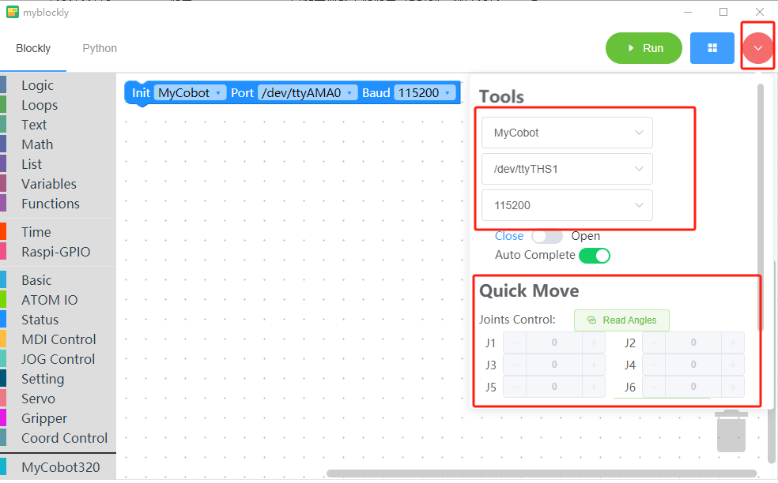

# Safety Instructions

## 1 Synopsis

  This chapter details general safety information for personnel performing installation, maintenance, and repair work on elephant robots. Read and understand the contents and precautions in this chapter before carrying, installing, and using it.

## 2 Hazard identification

  The safety of cooperative robots is based on the proper configuration and use of robots. Furthermore, injury or damage caused by the operator may occur even if all safety instructions are followed. Therefore, it is very important to understand the safety risks of robot use in order to prevent them.

  Table 1-1 to 3 lists the common security risks that may occur when robots are used∶

<center>Table 1-1 Risk level Security risks</center>

|<div align=center>| 
| :--- |
| 1 Personal injury or robot damage caused by improper handling of the robot. |
| 2 If the robot is not fixed as required, for example, the screw is missing or the screw is not tight, or the locking capacity of the base is insufficient to support the robot to move at high speed, the robot will fall over, resulting in personal injury or robot damage. |
| 3 The robot's safety function fails to play its role due to the incorrect configuration of safety functions or the lack of safety protection tools. |

<center>Table 1-2 Warning security risks</center>

| <div align=center>| 
| :--- |
| 1 Do not stay within the moving range of the robot when debugging the program. Improper safety configurations may not prevent collisions that may cause personal injury. |
| 2 The robot's connection to other devices may lead to new hazards, requiring a thorough re-assessment of the risk. |
| 3 Scratches and punctures are caused by sharp surfaces such as other equipment or robot end-effector in the working environment. |
| 4 The robot is a precision machine. Stepping on the robot may cause damage. |
| 5 If the clamping device is not in place, or the power supply of the robot is turned off, or the object is not removed before the air source (it is not determined whether the end-effector is firmly clamped because the object loses power), it may cause danger, such as damage to the end-effector and injuries to people. |
| 6 The robot is at risk of accidental movement. Do not stand under any axis of the robot under any circumstances! |
| 7 The robot is a precision machine, which may cause vibration and damage to the internal parts of the robot if it cannot be placed smoothly during handling. |
| 8 The robot is a precision machine, which may cause vibration and damage to the internal parts of the robot if it cannot be placed smoothly during handling. |

<center>Table 1-3 Potential safety hazards that may lead to electric shock</center>

| <div align=center>| 
| :--- |
| 1 Unknown hazards may arise when using non-original cables. |
| 2 Electrical equipment contact with liquid may cause leakage hazard. |
| 3 Electrical connection error may cause electric shock. |
| 4 Be sure to switch off the power supply of the controller and related devices and remove the power plug before replacement. If the operation is carried out with power on, it may cause electric shock or failure. |

## 3 Safety Precautions

**The following safety rules should be followed when using the manipulator:**

-  The mechanical arm belongs to live equipment. Non-professionals are not allowed to change the circuit at will, otherwise it may cause damage to the equipment or human body.
- When operating mechanical arms, comply with local laws and regulations. The safety precautions and dangers, Warnings, and precautions described in this manual are only supplements to the local safety regulations.
- Please use the mechanical arm within the specified environment. Exceeding the specifications and load conditions of the mechanical arm will shorten the service life of the product and even damage the equipment.
- The person installing, operating and maintaining the myCobot arm, anyway, has to be rigorously trained on safety precautions and the right way to operate and maintain the robot.
- Anyway, don't use the product in humid environments for long periods of time. This product is a precision electronic component, which will damage the equipment in damp environment for a long time.
- Anyway, don't use the product in humid environments for long periods of time. This product is a precision electronic component, which will damage the equipment in damp environment for a long time.
- Highly corrosive cleaning is not suitable for cleaning the mechanical arm, and anodized parts are not suitable for immersion cleaning.
- Unconsciously, do not use the device without installing a base to avoid damaging the device or accidents, instead use the device in a fixed environment without obstacles.
- Do not use other power adapters for power supply. If the equipment is damaged due to the use of non-standard adapters, the after-sales service will not be included.
- Do not disassemble, disassemble, or unscrew the screws or shell of the manipulator. If disassembled, no warranty service can be provided.
- Personnel without professional training are not allowed to repair the faulty products and dismantle the mechanical arm without permission. If the products fail, please contact myCobot technical support engineers in time.
- If the product is discarded, please comply with the relevant laws to properly dispose of industrial waste and protect the environment.
- A child uses a device at some point, forcing someone to monitor the process and switch it off when it's finished.
- When the robot is moving, do not extend your hand into the movement range of the robot arm, for fear of collision. 
- It is strictly prohibited to change, remove or modify the nameplate, description, icon and mark of the manipulator and related equipment.
-  Please be careful in handling and installation. Put the robot gently according to the instructions on the packing case and place it correctly in the direction of the arrow. Otherwise, the machine may be damaged.
- **Do not burn other product drivers from Atom terminal, or burn firmware using unofficial recommendations. If the equipment is damaged due to the user burning other firmware, it will not be in the after-sales service.**


**If you have any questions or suggestions about the contents of this manual, please log in the official website of Elephant Robot and submit relevant information：**

https://www.elephantrobotics.com

**Please do not use the mechanical arm for the following purposes：**

- Cost of healthcare in life-critical applications.
- Buying a bus can cause an explosion in an environment.
- Lent is used directly without a risk assessment.
- Cost of using a security function at a low level.
- Lo-fi does not conform to the use of robot performance parameters.

---

## **Robot Motion Control Guide and Usage Restrictions**

### **Basic Usage Guidelines**

**myCobot 320 Usage Guidelines**

- **Payload Capacity:** Please note that the myCobot 320 has a rated payload of 1 kilogram. To ensure the normal operation of the robotic arm, avoid exceeding the rated payload to prevent potential damage.
- **Power Supply:** For stable power supply to the robotic arm, use only the original matching power adapter. Do not replace or modify the power supply for safety reasons.
- **Disassembly and Maintenance:** When disassembling or performing maintenance on the robotic arm, strictly follow the guidance provided by the official after-sales support. Unauthorized modifications, such as connecting sensors, welding, or short-circuiting IO pins, are not recommended.
- **Operating Environment:** To ensure the normal functioning of the robotic arm, place it in a dry and temperature-appropriate environment. Avoid exposing the robotic arm to damp or high-temperature conditions.
- **Joint Limitations:** The robotic arm is equipped with joint limit functions. Avoid moving the robotic arm beyond its movable range to prevent potential damage or safety issues.
- **Fixation and Prevention of Falls:** Before operating the robotic arm, ensure it is securely fixed. During operation, be cautious to prevent falls or interference from unexpected situations.
- **Firmware Flashing:** Choose firmware carefully and only use firmware provided by the official source. Using unofficial firmware may lead to unnecessary issues.

**Note:** For your safety and the well-being of the robotic arm, it is recommended to adhere to the above usage guidelines. Any actions, such as overloading or modifying the robotic arm, that result in damage and are not guided by official after-sales support will not be covered by the robotic arm's warranty. If you have further questions, feel free to contact our official after-sales support.

### **Robot Motion Control Instructions**

myCobot 320
**Joint Limitations are as Follows:**

| **Joints** | **Range**(°) |
| ---------- | ------------ |
| J1         | ±165°        |
| J2         | ±165°        |
| J3         | ±165°        |
| J4         | ±165°        |
| J5         | ±165°        |
| J6         | ±175°        |

The range of Cartesian space (coordinates) is as follows:

| axis     | **Cartesian Space Range**(mm) |
| -------- | ----------------------------- |
| x        | -350~350                      |
| y        | -350~350                      |
| z        | -41~524                       |
| rx\ry\rz | +179°                         |

**Note: The above data is for reference only. During the actual operation of the robotic arm, certain positions or orientations may lead to self-interference due to the inherent structure of the robotic arm. For instance, at a specific position, while individual joints may not exceed their limits, it could result in a collision between the J2 and J3 joints of the robotic arm.**

### Robot Motion Control Tips:

**myCobot ##Motion Control Suggestions:**

- **Before controlling the robotic arm's motion, ensure you know the specific angles/coordinates of the target position. Exercise caution while controlling the robotic arm's motion.**
- **During the debugging phase, try to avoid running the robotic arm at high speeds to prevent potential harm to yourself and the robotic arm. It is recommended to use lower motion speeds.**
- **To prevent self-interference (collisions between the robotic arm's own joints), ensure that the robotic arm does not collide during its motion.**

**Note:** We recommend following the above motion control suggestions to minimize potential risks. Please be aware that if damage to the robotic arm is caused by personal use issues, warranty services will no longer apply. If you have any questions or need support, feel free to contact our official after-sales support. We will be happy to assist you in ensuring the safe operation of the robotic arm.

### How to Properly Perform Robot Motion Control

When unsure about the target position's angles/coordinates, you can use the following method:

Use a Python script to obtain:

```python
# Importing the Official Python API
from pymycobot.mycobot import MyCobot
# Importing the Time Module
import time

# Setting up Serial Connection, Serial Port, Baud Rate
# Raspberry Pi Version
mc = MyCobot('/dev/ttyAMA0', 1000000)
# M5 version, specific serial port number needs to be checked in Device Manager
mc = MyCobot('COM0', 1000000)
# Set a slight waiting time, 0.5 seconds
time.sleep(0.5)
# Release all joints of the robotic arm, please support the robotic arm by hand
mc.release_all_servos()
# Set waiting time, can be adjusted as needed; at this point, the robotic arm can be moved to the target position
time.sleep(5)
# Power on the robotic arm and fix it in the target position
mc.power_on()
# Read the coordinate information and angle information of the current position and output to the console
print('Coordinates:', mc.get_coords())
print('Angles:', mc.get_angles())
```

Obtained using [myBlockly](https://chat.openai.com/c/www.baidu.com):

By utilizing the rapid movement feature in myBlockly, you can explore the motion range of the robotic arm, confirming the operational workspace of the robotic arm.



----
[← Previous Page](../../320_M5/REMADE.md) | [Next Page →](../3.1.2-TransportandStorage/1-TransportandStorage.md)
